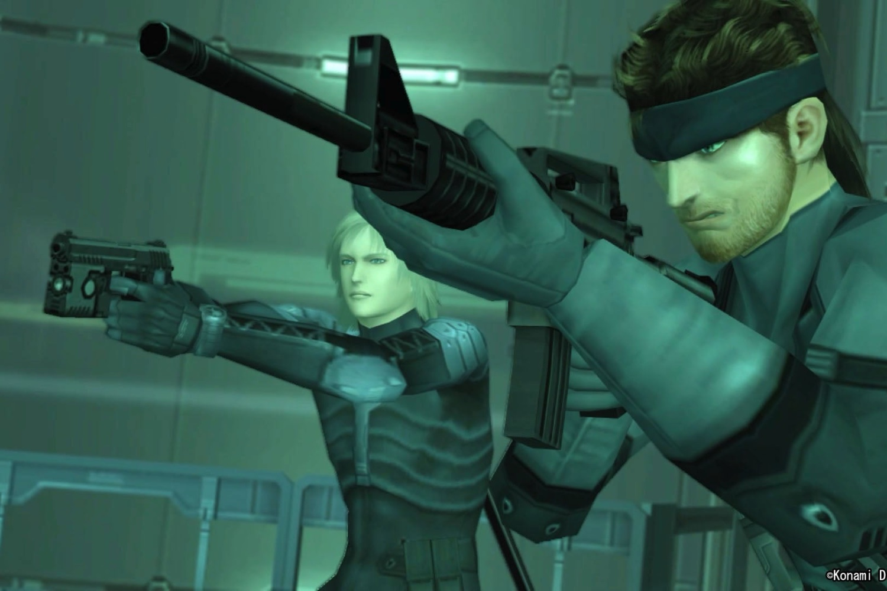

+++
title = "Ça risque d'être compliqué pour un remake du premier Metal Gear Solid"
date = 2024-10-03T10:47:32+01:00
draft = false
author = "Mickael"
tags = ["Actu"]
image = "https://nostick.fr/articles/vignettes/octobre/mgs-1998.jpg"
+++

Le remake de *Metal Gear Solid: Snake Eater* est une chose, mais celui du tout premier *Metal Gear Solid*, c'est encore très différent. Rien ne dit que Konami veuille se lancer à l'assaut de cette montagne. Le producteur Noriaki Okamura a [expliqué](https://www.famitsu.com/article/202410/19148) dans *Famitsu* (via [Genki](https://x.com/Genki_JPN/status/1841640650359656919)) qu'il serait difficile de refaire *MGS* 1 (et même les deux premiers *Metal Gear*) à la manière de *MGS Delta*.

Il faudrait en effet créer de tout nouveaux éléments qui ne sont pas présents dans le jeu original de 1998. C'est plus facile avec l'opus de 2004, qui est plus évident à retravailler. Si le  premier volet est dans le brouillard, en revanche les aventures suivantes de Solid Snake pourraient bien passer elles aussi au tapis du remake. Mais tout dépendra de l'accueil fait à *MGS Delta*, dont la date de sortie est encore à déterminer.

Tout n'est cependant pas perdu. Noriaki Okamura et Konami savent qu'ils ont de l'or entre les doigts. « *Avant que toutes les personnes impliquées dans l'original ne disparaissent, nous devons créer une voie pour préserver la série Metal Gear pour les 10 ou 50 années à venir* », explique le producteur. « *Je pense que c'est quelque chose que nous devons faire* ».

Cette volonté de préservation de la saga d'Hideo Kojima est louable, mais il faudra faire mieux que la première *Metal Gear Solid: Master Collection* pleine de bugs et de problèmes de performances. L'éditeur semble vouloir faire amende honorable en multipliant les correctifs et [en prenant son temps avant de lancer un volume 2](https://nostick.fr/articles/2024/septembre/1209-metal-gear-solid-volume-2-prendre-son-temps/).