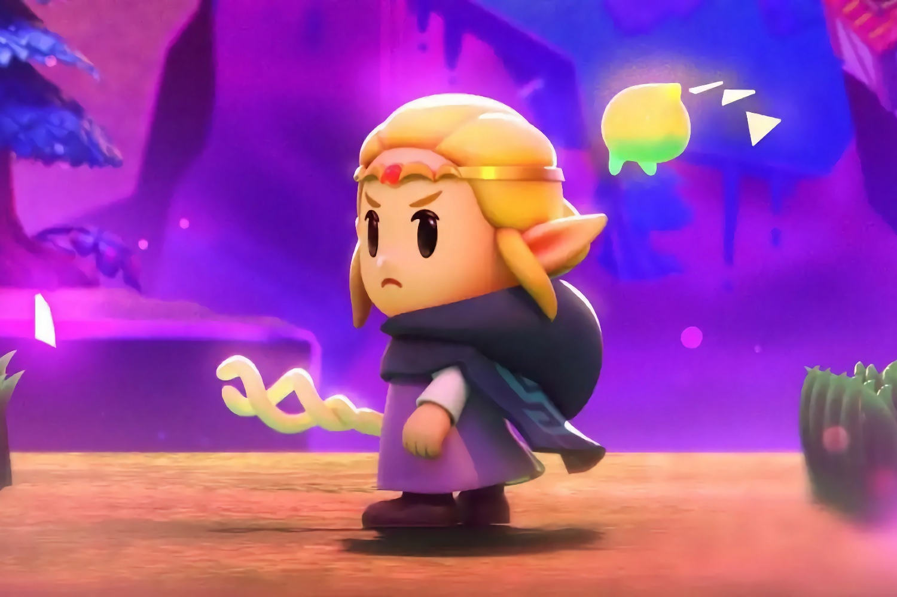

+++
title = "Zelda: Echoes of Wisdom en moins d'une heure, c'est possible, mais est-ce souhaitable ?"
date = 2024-10-03T09:00:32+01:00
draft = false
author = "Mickael"
tags = ["Actu"]
image = "https://nostick.fr/articles/vignettes/octobre/zelda-echoes-wisdom.jpg"
+++

*The Legend of Zelda: Echoes of Wisdom* est un jeu qui se déguste sans forcer. Il faut prendre le temps d'en piger les différents mécanismes pour les exploiter au mieux, sans oublier qu'il y a aussi une partie exploration et la résolution des donjons ! Bref, c'est un délicieux petit bonbon qui fond lentement sur la langue.

Enfin, sauf quand on est un gros bâtard de speedrunner ! Sur Reddit, xIceblue [révèle](https://www.reddit.com/r/speedrun/comments/1ft6tfr/echoes_of_wisdom_game_breaking_glitch_discovered/) l'existence d'un bug qui permet d'aller directement dans le dernier donjon, après avoir franchi les obstacles du tout premier. « *Nous avons trouvé le moyen de nous téléporter juste avant, d'affronter le boss, et d'avancer dans la zone finale* », explique-t-il. La bidouille consiste à créer des panneaux de signalisation au sommet des arbres jusqu'à faire apparaitre plusieurs menus les uns par dessus les autres. Il faut afficher la carte et téléporter Zelda tout près du donjon de fin.

La méthode réduit le temps de jeu à moins d'une heure, ce qui est un peu dommage car l'aventure vaut la peine d'être vécue. Le speedrunner Onaku essaie même de limiter encore la durée du jeu : il est arrivé à la fin en 52 minutes et 51 secondes, et tente de descendre sous les 50 minutes.

 

Évidemment, ne regardez pas la vidéo ci-dessus si vous ne voulez pas vous faire divulgâcher *Echoes of the Wisdom*.