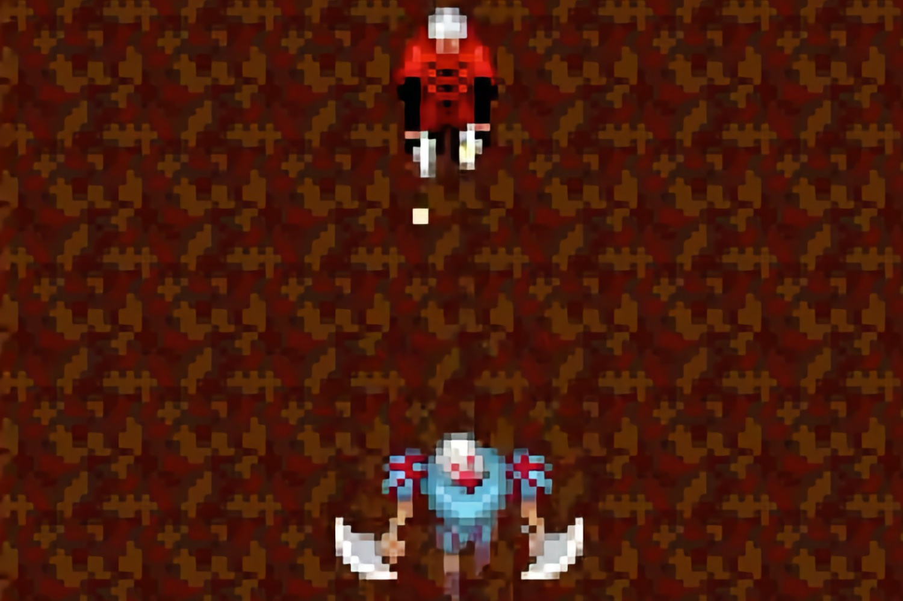

+++
title = "Découverte surprise de plusieurs jeux i-mode oubliés de Capcom, dont un Devil May Cry"
date = 2024-10-04T14:07:32+01:00
draft = false
author = "Mickael"
tags = ["Actu"]
image = "https://nostick.fr/articles/vignettes/octobre/devil-may-cry.jpg"
+++

Le i-mode, ça vous dit peut-être quelque chose si vous étiez client Bouygues Telecom au début des années 2000. Il s'agissait d'un service d'accès à internet mobile, une première étape avant l'avènement des technologies Edge et 3G en quelque sorte, qui permettait d'accéder à des sites web, d'envoyer des e-mails et de télécharger du contenu sur les téléphones compatibles de l'époque.

Si Bouygues a été l'un des premiers opérateurs occidental à embarquer dans l'aventure i-mode en 2002, c'est surtout au Japon que ce service a connu un gros succès, il a en effet été lancé dès 1999 par l'opérateur NTT DoCoMo. À l'époque, de nombreux éditeurs se sont précipités sur ce nouveau marché, dont évidemment Capcom qui a lancé plusieurs jeux mobiles. Malheureusement, bon nombre d'entre eux sont tombés aux oubliettes : le réseau n'existe plus, et les infrastructures non plus.

Il est donc impossible de télécharger les jeux i-mode. Le seul moyen pour remettre la main sur ces perles est de trouver de vieux téléphones sur lesquels les jeux sont présents. Et c'est exactement la trouvaille faite par l'archéologue du jeu vidéo Yuvi ! 

Le bidouilleur a donc [dégotté](https://x.com/YuviApp/status/1841972683845881952) 9 jeux oubliés de l'éditeur, des portages de titres existants mais aussi des titres complètement originaux, comme le rapporte *[Time Extension](https://www.timeextension.com/news/2024/10/9-capcom-mobile-games-n-including-a-devil-may-cry-spin-off-n-have-been-saved-from-digital-oblivion)*. Notamment deux RPG exclusifs pour « feature phones » (keitai), les ancêtres des smartphones : *[Your Planet](https://x.com/RockmanCosmo/status/1841949714281066647)* et *[Hajimari no Doukutsu](https://x.com/RockmanCosmo/status/1841949820791226567)*.



Le premier remonte à 2005, on se retrouve à explorer des petites planètes sphériques pour collecter des fragments d'étoiles, le tout dans une 3D certes primitive, mais impressionnante pour le type d'appareils sur lesquels on pouvait y jouer. *Hajimari no Doukutsu* est plus classique avec son univers 2D et ses combats au tour par tour.



La pépite, c'est un *Devil May Cry* oublié ! Sorti en 2003, *Devil May Cry Deadshot* met le joueur dans la peau de Dante, normal jusqu'à présent, mais ce qui est plus original c'est la  vue 2D de haut. Inédit, mais pas forcément formidable. Mais enfin, c'est pour la beauté du geste. Un autre *DMC* original est dans le coffre au trésor, *Devil May Cry Dante x Vergil*, sur lequel on a encore peu d'information.

Il n'est pas sûr que ces jeux enflamment les foules aujourd'hui, par contre du point de vue de la préservation et de l'histoire du jeu vidéo, ce sont de très belles découvertes.