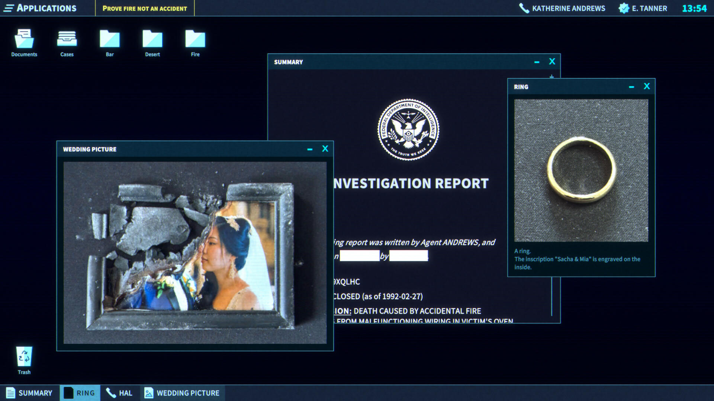

+++
title = "Nos lecteurs ont du talent : mini-test de The Operator"
date = 2024-10-04T15:00:32+01:00
draft = false
author = "La rédaction"
tags = ["Actu"]
image = "https://nostick.fr/articles/vignettes/octobre/pokemon-unite.jpg"
+++

**« Nos lecteurs ont du talent » est une nouvelle rubrique dans laquelle vous pourrez trouver des tests et autres articles écrits par des membres de la communauté Nostick. Si vous vous sentez critique dans l’âme, n’hésitez pas à [nous envoyer vos textes](https://nostick.fr/about/) et on verra ce qu’on peut faire. Aujourd’hui, Asetbu revient sur *The Operator*, un jeu indé français qui a fait du bruit cet été.**

La vie d'adulte, c'est plus de moyens et moins de temps, l'opposé de mon début de carrière en tant que joueur. De ce fait, j'évite les RPG à plus de 30 heures et me tourne plutôt vers des projets d'envergures plus raisonnables : c’est dans ce contexte et au travers de recommandations que j'ai découvert ***The Operator***.
 
Cette œuvre est un jeu d'enquête narratif développé par un studio français, nous plaçant dans la peau d'un nouvel agent du FDI (l’équivalent du FBI de nos amis américains) qui démarre un nouveau job après avoir été pistonné par un ami d'enfance, lui-même directeur de cette entité.
 
La particularité du gameplay réside dans l'interface de jeu : vous êtes un employé devant votre ordinateur. Votre première mission consiste à déverrouiller celui-ci avec vos identifiants, et vous pourrez alors parcourir l'interface et découvrir votre quotidien au bureau où l’on parle de meurtres et autres faits divers. Dès les premières minutes, un agent vous contactera et vous demandera de l'aider dans une affaire d'homicide en analysant les caméras de surveillance et en rapprochant divers indices des bases de données de l'agence. 

Bref, vous serez en quelque sorte le « geek de service » dans *Les Experts*, sauf que le scénario va s'élargir et qu’une tournure mystérieuse va prendre le pas… L'aspect narratif est assez présent, on parle ici d'un jeu qui vous guide dans le déroulé. Vous aurez des énigmes à résoudre (décoder des mots de passe par exemple), mais tout est toujours bien cadré.

C'est peut-être l'un des défauts du jeu, on ne sort que très peu des limites de l'histoire qui nous est racontée. Malgré ce léger inconvénient, nous avons passé, ma femme (fan d'enquête) et moi même, deux soirées à nous prendre au jeu. C’était notre série ou notre film de fin de journée, sauf que cette fois nous étions les acteurs. C'est bien là la force de *The Operator*, pouvoir rassembler un ou plusieurs joueurs pour quelques heures autour d'une histoire intrigante, avec son lot d'émotions, de surprises et de réflexions tout en les laissant médusés quand la fin arrive.

*The Operator* est disponible [sur Steam](https://store.steampowered.com/app/1771980/The_Operator/) au prix de 13,79€.



