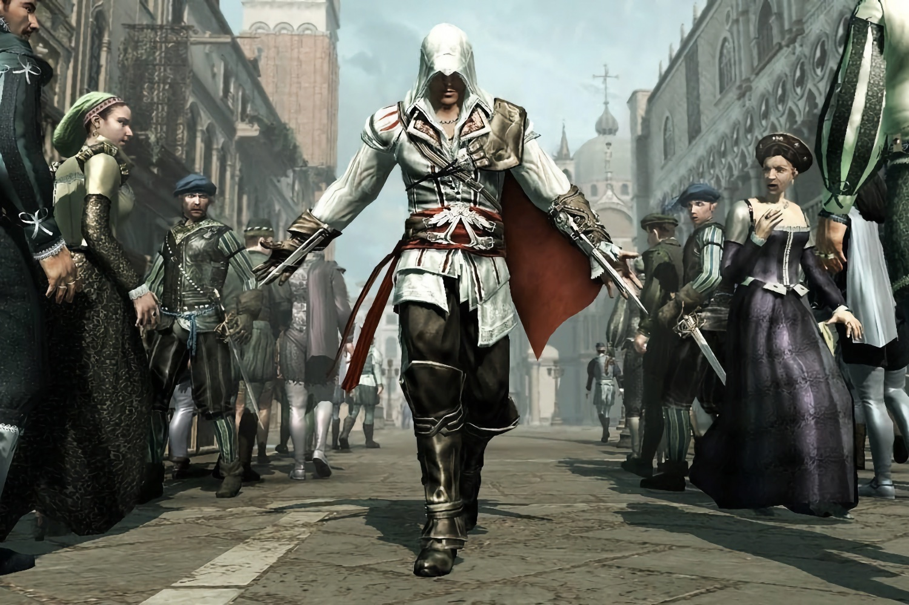

+++
title = "Ubisoft envisage de sortir de la Bourse pour redresser la situation"
date = 2024-10-04T14:44:32+01:00
draft = false
author = "Mickael"
tags = ["Actu"]
type = "telex"
+++

Pour sauver le soldat Ubisoft, toutes les solutions sont sur la table. [L'éditeur français est à la peine ces derniers temps](https://nostick.fr/articles/2024/septembre/2809-backlog-assassins-creed-shadows-frostpunk-2-musee-nintendo-tcg-card-shop-simulator/#la-grosse-info-de-la-semaine--comment-ça-va-mal-ubisoft-), et la direction vit sous la pression d'actionnaires qui voient d'un mauvais œil le plongeon de 50 % de la valeur du titre. Selon *[Bloomberg](https://www.bloomberg.com/news/articles/2024-10-04/tencent-guillemot-family-are-said-to-consider-buyout-of-ubisoft?embedded-checkout=true)*, la famille Guillemot, qui possède 20 % des droits de vote, épaulée par Tencent (10 %), envisagent plusieurs options. En particulier celle du retrait de la Bourse.

Un tel mouvement permettrait à l'entreprise de ne plus être soumis aux mêmes obligations de transparence financière… et de retrouver un peu d'air, loin de la nécessité de produire du rendement à court terme pour satisfaire les actionnaires. Mais cela coûte cher, il faut racheter toutes les actions (qui certes, ne valent plus grand chose). Les deux partenaires en sont au début de leur réflexion, et rien ne dit que cela aboutira ; des alternatives sont aussi envisagées.