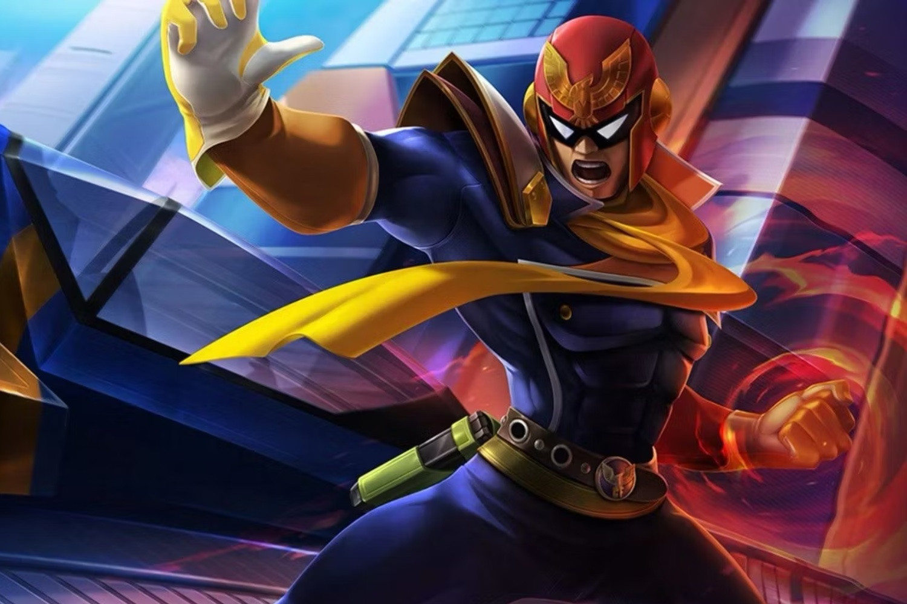
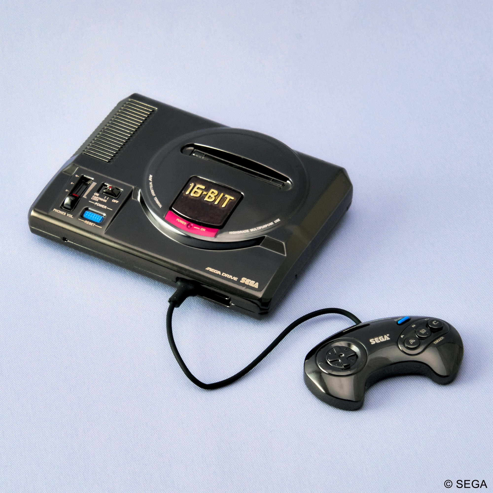
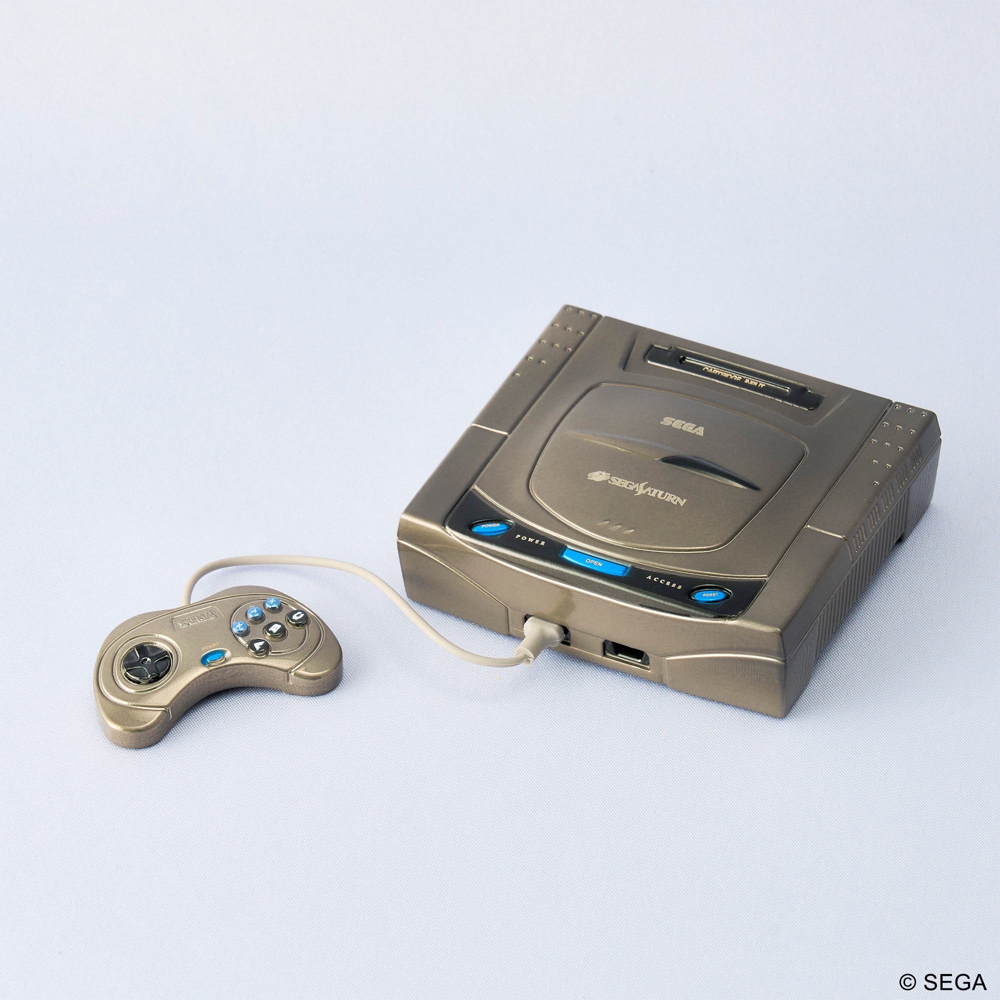
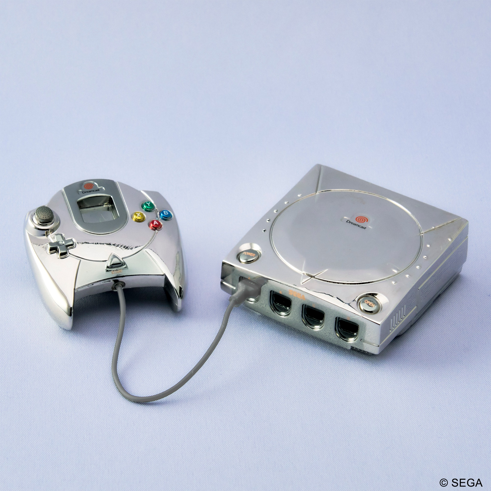
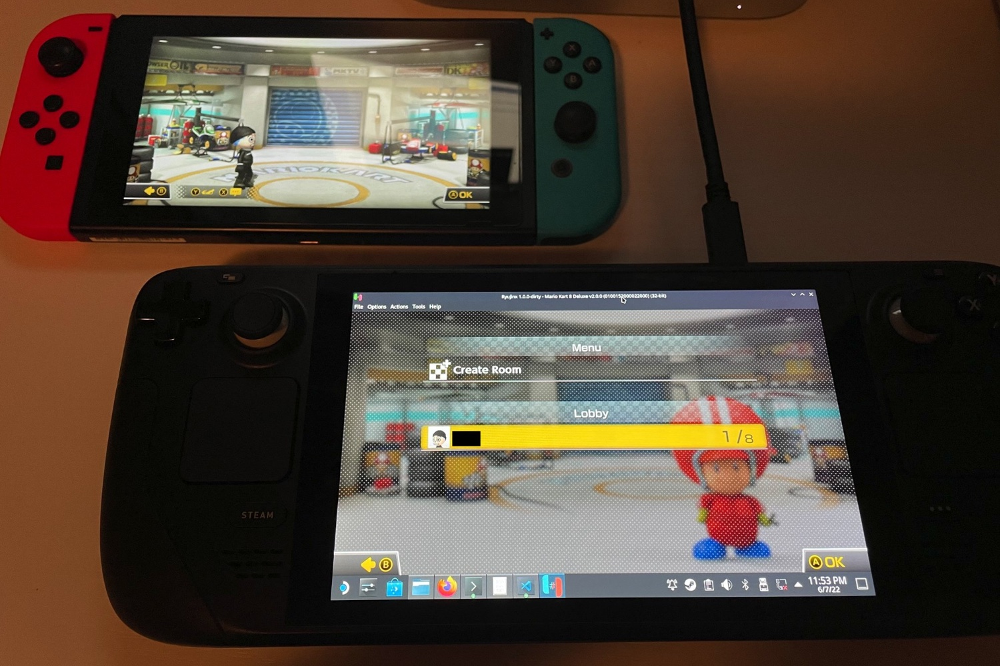
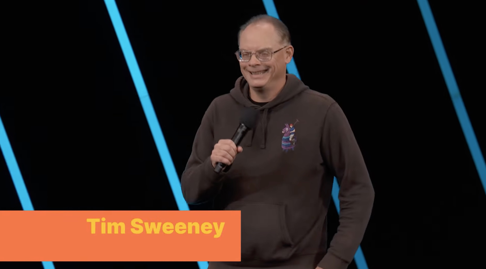
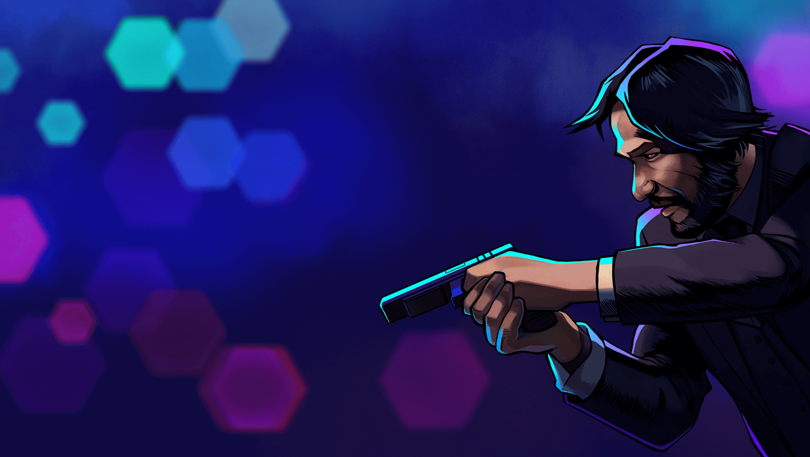

+++
title = "On vide le backlog de la semaine : Ryujinx, F-Zero, Fortnite, Les Sims 4…"
date = 2024-10-05T07:50:01+01:00
draft = false
author = "Mickael"
tags = ["XXL"]
image = "https://nostick.fr/articles/2024/octobre/0510-backlog-nintendo-fortnite-emulation-f-zero-sims-4/captain-falcon.jpg"
+++

L’actualité du jeu vidéo ne s’arrête pas à la poignée d’articles publiés sur *Nostick* ! Histoire de rattraper le retard accumulé, voici un retour rapide sur quelques unes des infos les plus importantes (ou insignifiantes) de la semaine.

## Les images de la semaine : des modèles réduits de consoles rétro chez Square Enix

Pour une raison qui nous échappe, Square Enix [lance](https://x.com/SQEX_MD_GOODS/status/1839179179620970851) au Japon une collection de modèles réduits en métal reproduisant fidèlement d'anciennes consoles. Il y a même les manettes toutes petites… Six consoles sont disponibles dans la gamme « Bright Arts » : la Mega Drive, la Saturn et sa version blanche, et trois Dreamcast US, EU et Japon.

Square assure que ces modèles ont été reproduits avec un grand soin du détail et qu'ils imposent « *une présence impressionnante* ». Dommage, on ne peut pas jouer avec ! Ces consoles pour fourmis seront commercialisées à partir du 25 janvier prochain, pour l'équivalent de 30 € environ par tête de pipe.

## La bonne nouvelle de la semaine : F-Zero de retour en force chez Nintendo

L'espoir renaît chez les fans de *F-Zero* ! Le jeu de course futuriste de Nintendo s'est en effet rappelé à leur bon souvenir cette semaine, avec l'apparition de deux « nouveaux » jeux GBA sur le NSO : *F-Zero: GP Legend* (2003) et surtout, *F-Zero: Climax* (2004) sorti uniquement au Japon… et désormais disponible partout dans le monde, sur le Switch Online avec Expansion Pack.

 

Et comme si cela ne suffisait pas, Nintendo a également mis à jour son excellent *F-Zero 99*. Au [menu](https://x.com/NintendoAmerica/status/1841308628441014717) : un mode entraînement amélioré, des cosmétiques supplémentaires pour décorer son bolide… et 5 circuits supplémentaires qui étaient jusqu'à présent cantonnés à la Satellaview ! 

Ces circuits proviennent de l'Ace League, jouable dans *BS F-Zero Grand Prix*. Ils n'étaient jamais sortis du Japon et surtout, plus grand monde ne pouvait y jouer depuis la fin de [cette expérimentation étrange de Nintendo](https://nostick.fr/articles/2024/juillet/2307-sattelaview-console-oubliee-nintendo/). Pour l'occasion, Nintendo a fait appel aux services des historiens du jeu vidéo [Mori](https://x.com/morimotes_/status/1841673972888568039) et [Nider](https://x.com/NiderQueen/status/1841872517092507670). 

Le *battle royale* du NSO est sorti en septembre 2023, il a été le premier *F-Zero* depuis *Climax*, justement. Alors évidemment, les fans de vieilleries seront aux anges, mais toute cette agitation autour de la franchise *F-Zero* laisse espérer qu'un nouveau vrai gros opus est dans les tuyaux de Nintendo ! À moins qu'il s'agisse de faire monter la sauce autour d'un remaster de l'incroyable *F-Zero GX* de la GameCube, développé par un des studios Sega (Amusement Vision). On entend sporadiquement des rumeurs sur le sujet, alors croisons les doigts fort sur le volant.

## La mauvaise nouvelle de la semaine : nouvelle offensive de Nintendo contre l'émulation

Nintendo sympa et Nintendo pas sympa, on a vu les deux facettes du constructeur japonais cette semaine. C'était en effet la rentrée pour les avocats-ninjas de la firme de Kyoto, et ils ne font aucun prisonnier. On a d'abord appris que l'entreprise n'appréciait plus que ses jeux apparaissent dans les vidéos d'émulateurs sur les chaînes YouTube spécialisées.

[Retro Game Corps](https://retrogamecorps.com/) a en effet fait l'objet d'une « strike » pour avoir publié une vidéo consacrée à la Wii U. De peur de voir ses autres contenus visés par une demande de retrait de Nintendo, la chaîne a décidé de [flouter tout ce qui avait trait aux jeux Nintendo](https://nostick.fr/articles/2024/octobre/0110-nintendo-frappe-chaine-youtube-emulation/) dans ses futures vidéos.

Cette procédure pourrait bien effrayer d'autres créateurs de contenus qui testent des émulateurs ou des appareils servant à émuler des jeux rétro. C'est tout un pan de la communauté de l'émulation agissant en faveur de la préservation du jeu vidéo qui est en danger ici, plus que les pirates finalement : ils trouveront toujours un moyen de choper des ROMs et de les faire fonctionner.

Mais ce n'était qu'un avant-goût de la nouvelle offensive de Nintendo contre l'émulation. Le constructeur a en effet eu [la peau de Ryujinx cette semaine](https://nostick.fr/articles/2024/octobre/0110-nintendo-termine-yuzu-ryujinx/) ! L'émulateur open-source pour Switch était à peu près le dernier représentant sur le marché, après la disparition de Yuzu au printemps — là encore une victoire du département juridique de Nintendo.

S'il ne fait aucun doute que des successeurs vont émerger, la volatilisation de Ryujinx marque une rupture symbolique alors que la Switch vit ses derniers mois. Contrairement aux émulateurs de consoles rétro qui ne font guère de mal, l'existence même de ces deux émulateurs Switch portait ombrage à l'activité principale de Nintendo : la console hybride est toujours en vente, et ces logiciels représentaient de sérieux concurrents pas très légitimes.

## La grosse info de la semaine : la fin des jeux solo est proche, selon le patron d'Epic 

Est-ce la fin irrémédiable des aventures solo AAA ? Tim Sweeney, le fondateur et patron d'Epic, le pense très sérieusement. À l'occasion de l'Unreal Fest, le dirigeant à grande gueule s'est [félicité](https://www.youtube.com/live/KYGEfQJPqW8) du carton interplanétaire de *Fortnite* : le jeu a atteint un pic à plus de 110 millions d'utilisateurs actifs pendant les dernières vacances de Noël, comme le rapporte *[PC Gamer](https://www.pcgamer.com/gaming-industry/the-games-industry-is-undergoing-a-generational-change-says-epic-ceo-tim-sweeney-a-lot-of-games-are-released-with-high-budgets-and-theyre-not-selling/)*.

Pour lui, cela ne fait aucun doute : l'industrie du jeu vidéo est en train de vivre un « *changement générationnel* » qui s'incarne par les flops à répétition des jeux à gros budgets. « *Une des manifestations [de ce changement] que nous observons actuellement est que beaucoup de jeux sortent avec des budgets élevés, mais ils ne se vendent pas aussi bien que prévu* », affirme-t-il… non sans raison.

La litanie des déceptions et des accidents industriels est en effet longue : *Concord*, *Suicide Squad* et *Star Wars Outlaws* rien que pour cette année, dans une moindre mesure *Final Fantasy 7 Rebirth*, et j'en oublie. La solution pour Sweeney : « *Ce que nous voyons, c'est une véritable tendance où les joueurs se tournent vers les très grands jeux où ils peuvent jouer avec davantage de leurs amis* ». Au détriment des expériences solo, donc.

Certes, *Concord* et *Suicide Squad* font techniquement partie des jeux multi, mais ils ont été conçus avec des moyens et une ambition dignes d'un AAA solo. Et il ne suffit pas de jouer. « *[La valeur d'un jeu] augmente en proportion du nombre d'amis avec lesquels vous pouvez vous connecter, que ce soit pour jouer ensemble, discuter en audio, regarder des concerts virtuels, ou faire d'autres types d'activités virtuelles en ligne* », décrypte le patron d'Epic.

Évidemment, Tim Sweeney prêche pour sa paroisse : cela fait longtemps que *Fortnite* n'est plus uniquement un *battle royale*, c'est une plateforme de divertissement en tout genre. Et même un « métavers », même si « *nous ne sommes pas tous d'accord sur ce que cela signifie* ». Mais peu importe le qualificatif donné à *Fortnite*, car il se passe toujours quelque chose de « *nouveau et d'excitant* » grâce aux mises à jour en continu et « *la participation de toutes les marques mondiales* ». Le jeu sait en effet parfaitement surfer sur les tendances pop culture du moment, ce qui lui rapporte beaucoup d'argent.

Ce cocktail de jeu service, de happening perpétuel, de nouveautés permanentes peut faire tourner les têtes — le *Fortnite* d'il y a 7 ans n'a plus grand chose à voir avec celui d'aujourd'hui. Mais cette recette ne peut pas s'appliquer à tous les jeux, et elle ne peut pas non plus satisfaire tous les joueurs. Il est d'ailleurs singulier d'annoncer la mort des jeux solo après les succès de *Black Myth Wukong* et de *Baldur's Gate 3* !

La vérité, c'est qu'il y aura probablement toujours des jeux solo, qu'ils soient indés, AA ou AAA, des jeux multi en coop (comme *Helldivers 2*), des MMOs, des *battle royale*, et des plateformes sociales comme *Fortnite* et *Roblox*. L'industrie chasse certes les tendances, mais elle est aussi diverse : pour un Epic, il y aura toujours un Larian, et c'est bien ainsi.

## On n'a pas eu le temps cette semaine, mais on pense à eux

Nos petits chouchous de Devolver ont créé un nouveau label, [Big Fan Games](https://www.bigfangames.com), qui va s'occuper d'éditer des jeux sous licences. Le catalogue est déjà bien fourni avec *Reigns: Game of Thrones*, *Hellboy Web of Wyrd* et *John Wick Hex*. Comme on le voit, il ne s'agit pas de jeux-prétexte intégrés de manière servile dans le plan marketing d'un film ou d'une série télé, mais de « vrais » jeux avec des gameplays originaux et inventifs. Et c'est exactement ça que Big Fan veut promouvoir.

 

Monolith Soft est une des acquisitions les plus futées de Nintendo. Le studio japonais est l'auteur de la saga *Xenoblade Chronicles*, il a également donné un coup de main pour le développement des derniers Zelda 3D. Autant dire, des petits gars en or que Nintendo a salué cette semaine, Monolith fêtant ses [25 ans](https://www.monolithsoft.co.jp/special/anniversary25th/) ! Fondé en 1999 sous l'égide de Namco, le studio a lancé *Xenosaga Ep 1* sur PS2 trois ans plus tard. En 2003, il livre *Baten Kaitos* en exclu sur la GameCube, ce qui a amené chemin faisant jusqu'au chèque de Nintendo en 2007.

## osef

Dans l'extension « [À la vie, à la mort](https://www.youtube.com/watch?v=TgQK1qO1WIc) » des Sims 4, on peut devenir la Faucheuse elle-même. Pas un mauvais job quand on y pense.

## Dans le reste de l'actu déchaînée

- *Death Stranding 2* arrivera bien en 2025, mais quand exactement ? C'est la question sur toutes les lèvres et malheureusement, Hideo Kojima n'a rien voulu dire. Bon, il a dit aussi beaucoup d'autres choses et surtout des trucs barrés. [C'est à découvrir par ici](https://nostick.fr/articles/2024/septembre/2909-death-stranding-2-pas-de-date/).
- Nettoyer des choses dans *PowerWash Simulator*, ça fait du bien à l'humeur et vu le bordel en ce moment, sortons les seaux et les balais ! Ce n'est pas le moi qui dis, [mais la science](https://nostick.fr/articles/2024/septembre/3009-powerwash-simulator-etude-humeur/).
- *Anger Foot* est un FPS avec les pieds, ce qui est tout de même assez étonnant. Et plutôt réussi, [à lire le test de Félix](https://nostick.fr/articles/2024/septembre/3009-test-anger-foot-devolver-pieds-dans-le-plat/) !
- Notre excellent lecteur Asetbu s'est fendu d'un mini-test de *The Operator*, un très bon jeu d'enquête à découvrir à plusieurs… [et dans cet article](https://nostick.fr/articles/2024/octobre/0410-nos-lecteurs-ont-du-talent-the-operator/) !
- Ubisoft n'est [pas dans la meilleure des formes](https://nostick.fr/articles/2024/octobre/0410-ubisoft-sort-bourse-redresser-situation/) en ce moment, et malheureusement les mauvaises nouvelles ont tendance à s'empiler : l'éditeur a en effet confirmé que ça n'allait pas fort du côté de *XDefiant*. [On s'en reparle dans cette actu](https://nostick.fr/articles/2024/septembre/3009-pas-la-grande-forme-xdefiant/).
- Les joueurs belges et néerlandais seront bientôt privés de *Pokémon Unite*, ce qui n'est pas très gentil. Mais pourquoi ? [Jetez un œil par ici](https://nostick.fr/articles/2024/octobre/0110-pokemon-unite-fermeture-belgique-pays-bas/).
- Sony a transformé l'écran d'accueil de la PS5 en panneau publicitaire. C'était un bug, mais qui sait ? [Peut-être aussi un ballon d'essai](https://nostick.fr/articles/2024/octobre/0110-sony-bonne-idee-remplace-artworks-jeux/)… 
- Allez, faites pas la tête les petits gars de la Xbox, *Final Fantasy XVI* finira bien par arriver chez vous aussi. [Reste à savoir quand](https://nostick.fr/articles/2024/octobre/0110-final-fantasy-xvi-arrivera-bien-xbox/) !
- Avant que Xbox ferme le studio Tango, ce dernier avait déjà bien commencé le développement de *Hi-Fi Rush 2*. Au plus grand bonheur du repreneur Krafton, qui veut faire vivre la franchise. [On s'en réjouit dans cette actu](https://nostick.fr/articles/2024/octobre/0110-des-nouvelles-dhifi-rush/).
- Sony a trouvé une solution qui a le mérite d'exister pour contrer les scalpers qui se sont précipités sur les PS5 Pro 30e anniversaire. [Mais uniquement au Japon](https://nostick.fr/articles/2024/octobre/0210-patte-blanche-sony-ps5-pro-30e-anniversaire-japon/)…
- La Xbox n'est pas la console préférée des développeurs, et ça commence à se voir. Microsoft veut savoir pourquoi et demande aux principaux intéressés de lui dire ce qui cloche. [À lire par ici](https://nostick.fr/articles/2024/octobre/0210-microsoft-savoir-cloche-entre-xbox-devs/).
- Après le carton de *Baldur's Gate 3*, le studio Larian est attendu au tournant. Mais quand ? [Il donne une petite idée dans cette actu](https://nostick.fr/articles/2024/octobre/0310-baldurs-gate-3-prochain-jeu-larian-2029/).
- Les speedrunners fous ont trouvé un moyen, ou plutôt un glitch, pour terminer le dernier Zelda en moins d'une heure. [À découvrir par ici](https://nostick.fr/articles/2024/octobre/0310-zelda-echoes-wisdom-moins-une-heure-speedrun/).
- *Metal Gear Solid Delta* s'annonce plutôt bien, mais pour la suite des remakes, Konami n'est pas certain de vouloir s'attaquer aux opus plus anciens de la saga. [Découvrez pourquoi par là](https://nostick.fr/articles/2024/octobre/0310-remake-difficile-premier-metal-gear-solid/).
- lol. La meilleure Xbox risque bien d'être la PS5 Pro : *Diablo 4* va en effet être optimisé pour la future console de Sony ! [On en rigole par ici](https://nostick.fr/articles/2024/octobre/0410-diablo-4-optimise-ps5-pro-meilleure-xbox-playstation/).
- Des jeux i-mode, déjà, c'est pas banal. Mais des jeux i-mode signés Capcom ? En voilà quelques uns de redécouverts, dont un spin-of de *Devil May Cry* ! [À retrouver dans cette actu](https://nostick.fr/articles/2024/octobre/0410-decouverte-jeux-capcom-oublies-i-mode-devil-may-cry/).