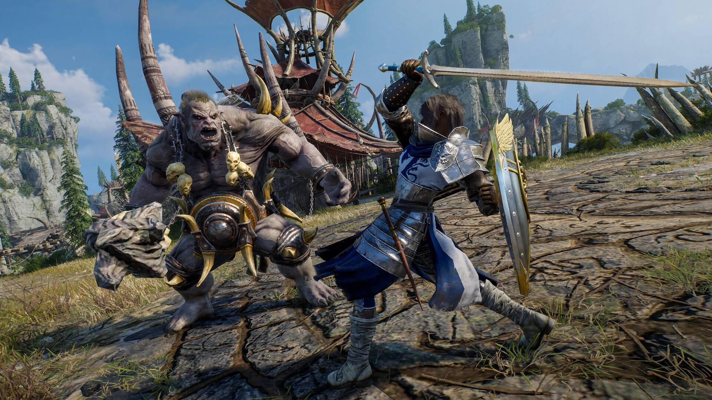

+++
title = "Zoochosis, un premier DLC pour Starfield : le récap des sorties de la semaine (06/10)"
date = 2024-10-06T07:00:02+01:00
draft = false
author = "Félix"
tags = ["C’est dispo"]
image = "https://nostick.fr/articles/2024/octobre/0610-les-sorties-de-la-semaine/zoo.jpg"
+++

Entre la garderie, les courses et ce petit rhume de merde qui a ruiné votre fin de semaine, vous n’avez peut-être pas eu le temps de vous intéresser aux nouveautés du moment. Qu’à cela ne tienne : voici les sorties de ces derniers jours qui ont retenu notre attention.

## Drôles de zozos 

La petite sensation de la semaine était sans doute ***Zoochosis***, qui repose sur un pitch alléchant : on y incarne un gardien en charge de surveiller un zoo rempli d’animaux mutants, allant de la girafe-araignée au kangourou à doubles mâchoires. Il va s’agir de soigner les vrais animaux, de nettoyer les enclos ou de préparer la nourriture sans se faire bouffer par les « mauvaises » bestioles. Ça a l’air rigolo en trailer, ça l’est apparemment moins en vrai. Les critiques sur Steam sont moyennes et décrivent un jeu court, pétri de bugs et au gameplay très répétitif. Certains ont apprécié le concept, mais au vu du tarif musclé [de 24,50 €](https://store.steampowered.com/app/2458560/Zoochosis/) sur Steam, vous pouvez sans doute passer votre tour en attendant de voir quel suivi les développeurs comptent assurer. Uniquement dispo sur PC, mais visiblement les consoleux ne loupent pas grand-chose. 

## Entre constellation et consternation

Vous vous souvenez de ***Starfield*** ? Vous peut être pas mais Bethesda oui, le studio venant de lancer son premier DLC intitulé ***Shattered Space***. Le moins que l’on puisse dire, c’est que cela n’a pas l’air terrible : j’ai peiné à trouver des tests deux jours après sa sortie, ce qui montre bien que la plupart des joueurs s’en foutent (ou que Microsoft n’a pas envoyé de code aux journalistes, ce qui n’est jamais bon). Dans l’idée, le DLC nous invite à explorer Va'ruun'kai, une planète faite main à l’opposé de celles procédurales du jeu de base. Il s’agit de la terre d’origine d’un culte venant de subir un cataclysme, un prétexte pour que le joueur se ramène en héros pour filer un coup de main (c’est original). Si la nouvelle map est sympa, la mayonnaise ne prend pas : les missions sont apparemment peu inspirées et il ne faut pas s’attendre à de nouveaux ennemis, biomes ou à une tonne d'armes exclusives. L’aventure dure une quinzaine d’heures avec une histoire qui se laisse suivre, mais la plupart des critiques évoquent une occasion manquée ainsi qu’un un contenu bien maigre au vu [des 30 € demandés](https://store.steampowered.com/app/2721670/Starfield__Shattered_Space/). Bref, c’est la même soupe qu’il y a un an resservie tiède avec à peine une pincée de sel et [de nombreux bugs](https://www.purexbox.com/news/2024/09/getting-a-lookup-failed-error-in-starfield-shattered-space-youre-not-alone) : pfff.

 

## Amazon vise le trône du MMORPG

Amazon Games retente la carte MMORPG avec ***Throne and Liberty***, un free-to-play qui a l’air joli à défaut d’être original vu le cocktail châteaux-gobelins-squelettes-épées qui orne [la page Steam](https://store.steampowered.com/app/2429640/THRONE_AND_LIBERTY/). Nous sommes donc invités à explorer le monde de Solisium, qui se démarque par ses environnements détaillés et sa partie technique bien rodée. Les combats semblent fun et le titre très axé sur les interactions en groupe, mais rien qui ne réinvente la roue ou qui devrait capter l’attention de ceux qui n’y voient que le MMORPG générique n°93482. Certains regrettent une histoire peu inspirée et des mécaniques pay-to-win assez agressive, mais bon, on va dire que c’était attendu. Ça n’a pas l’air d’être le pire des choix si vous voulez vous remettre aux MMORPG, mais entre nous, vous méritez mieux que de farmer des loups dans une clairière avant de refaire des donjons en boucle jusqu’au niveau 50 sur un machin que tout le monde aura peut être lâché dans 3 semaines. Dispo sur PC, PS5 et Xbox, on notera que les serveurs sont un peu à la ramasse en cette période de lancement et que la localisation est [à chier](https://www.pcgamer.com/games/mmo/none-of-this-makes-any-sense-amazons-latest-mmo-import-is-a-localization-disaster/).

## Tender is the Knight

***Kill Knight*** est sorti cette semaine, un jeu de tir et d'action isométrique qui a l’air pas mal du tout. On y incarne un chevalier avec une épée et de gros flingues qui va devoir vider des niveaux remplis de monstres. Comme le laisse présager le trailer, c’est nerveux et bien bourrin : on peut tuer à l’arme blanche pour récupérer des munitions, et notre héros dispose de plusieurs capacités spéciales pour vider la map. Faire de bons scores permet de gagner de l’argent pour acheter de nouvelles armes et morceaux d’équipement. Le jeu est divisé en 5 zones que l’on pourra parcourir dans 4 niveaux de difficulté. Ça a l’air très fun pour peu que vous soyez client de l’ambiance et du gameplay nerveux, les testeurs notant tous entre 8 et 9/10. Si le concept simple vous botte, vous ne devrez pas regretter vos 15 balles. Dispo sur [Steam](https://store.steampowered.com/app/2694420/KILL_KNIGHT/) et toutes les consoles (même les vieilles ou la Switch).
 
 

## En rab

C’était plutôt peinard cette semaine. On a évidemment eu un remake avec ***‌Until Dawn***, un slasher narratif que Sony nous ressert en version Unreal Engine 5 [pour 70 balles](https://store.steampowered.com/app/2172010/Until_Dawn/) sur PC et PS5. Le mignon ***Victory Heat Rally*** est dispo un peu partout [pour 20 balles](https://store.steampowered.com/app/1594060/Victory_Heat_Rally/) et pourrait intéresser ceux qui cherchent un jeu de course arcade et coloré. ***Hell of an Office*** est un plateformer en vue FPS dans lequel on va devoir speedruner les niveaux : les images donnent envie et il y a une démo, alors pourquoi pas ([14,79 €](https://store.steampowered.com/app/1640890/Hell_of_an_Office/)). Notons enfin la sortie de ***‌Rogue Waters***, un roguelite tour par tour avec des pirates [qui a l’air chouette](https://store.steampowered.com/app/1691190/Rogue_Waters/) et de ***[‌Pinball Spire](https://store.steampowered.com/app/2601940/Pinball_Spire/)***, qui mélange habilement metroidvania et… flipper ? On arrête pas le progrès.