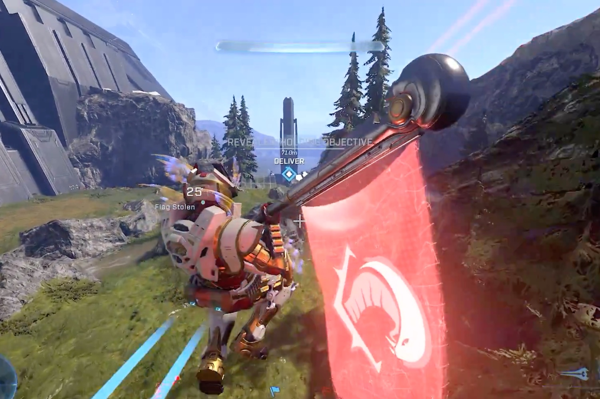

+++
title = "Halo Infinite va ajouter une vue à la troisième personne, une première"
date = 2024-10-07T08:07:32+01:00
draft = false
author = "Mickael"
tags = ["Actu"]
image = "https://nostick.fr/articles/vignettes/octobre/halo.jpg"
+++

 

Il n'y a donc plus rien de sacré dans ce bas monde. Pensez donc, des gens mettent le lait *avant* les céréales dans leur bol, et oui, c'est ainsi, et après on comprend mieux pourquoi la civilisation va à vau-l'eau. Autre exemple : il sera bientôt possible de jouer en en vue TPS dans *Halo Infinite* !

343 Industries, le studio qui gère la franchise pour le compte de Microsoft, a annoncé la nouvelle sur ~~cette merde de~~ Twitter, le tout accompagné d'une courte vidéo. Cette option est un changement majeur pour Halo, qui n'a jamais proposé autre chose qu'une vue à la première personne dans toute sa longue histoire.



« *C'est une manière amusante de jouer, on est davantage conscient de ce qui se passe* », [explique](https://www.vgchartz.com/article/462653/halo-infinite-adding-third-person-mode-in-november/) John Junyszek, responsable de la communauté Halo, auprès de *VGChartz*. « *Vous pouvez voir votre Spartan, c'est super cool. En interne, les gens adorent* », ajoute-t-il. Il a toutefois fallu abattre un gros boulot pour s'assurer que la visée était tout aussi précise qu'en vue FPS.

« *Normalement, la caméra est dans votre tête, et là où vous regardez, c'est là que vous tirez* », ajoute Junyszek. « *Maintenant, avec cette caméra à la troisième personne où la caméra est derrière vous, vous devez prendre en compte deux entrées différentes dans le système de visée, et cela a demandé beaucoup de travail pour y parvenir* ». Les habitués de *Fortnite* n'auront pas trop de mal à s'y retrouver.

L'option, qui sera proposée en novembre, ne permettra pas de basculer manuellement entre les vues, on comprend qu'il faudra en choisir une au début de chaque partie. On ne sait pas encore si la vue TPS sera dispo pour la campagne solo ou uniquement pour le multi.