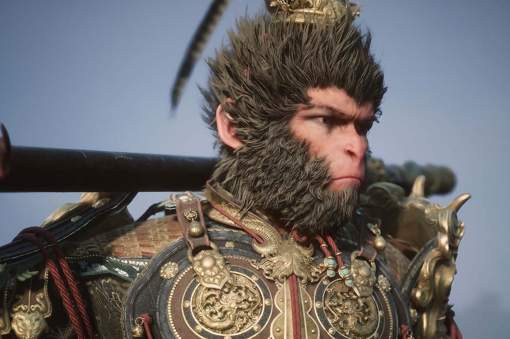
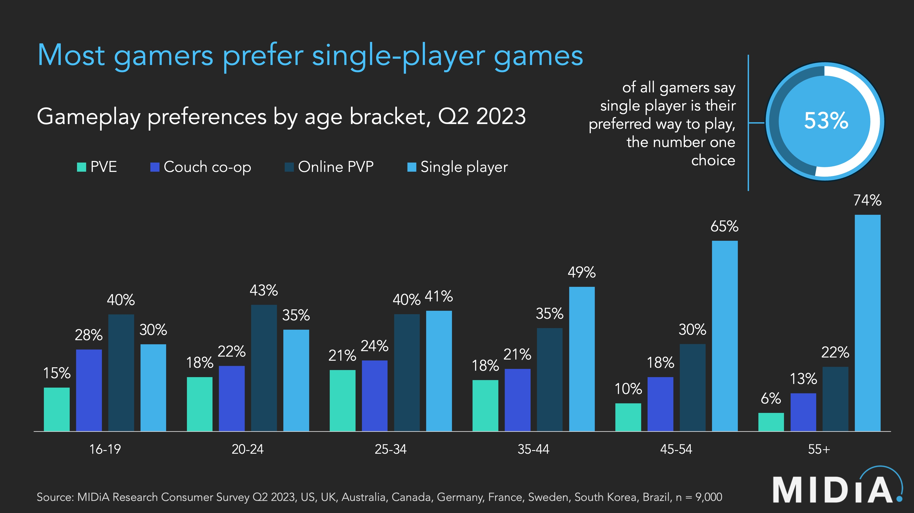

+++
title = "La majorité des joueurs veut des jeux solo"
date = 2024-10-07T10:00:32+01:00
draft = false
author = "Mickael"
tags = ["Actu"]
image = "https://nostick.fr/articles/vignettes/octobre/black-myth-wukong-solo.jpg"
+++

 

Beaucoup d'appelés, bien peu d'élus. Tous les gros éditeurs cherchent à reproduire le carton galactique de *Fortnite*, *Roblox*, *Overwatch* ou encore *Destiny 2* : des jeux en ligne mis à jour pendant des années et des années, et qui engrangent un pognon de dingue. Mais dans les faits, les places sont chères au Panthéon des jeux service et le cimetière déborde de prétendants.

Alors que bon sang de bois, ce sont des jeux solo que les joueurs veulent ! Du moins ceux qui ont un peu de bouteille, comme le montre cette [étude](https://www.midiaresearch.com/blog/most-gamers-prefer-single-player-games)[^1] de Midia Research. C'est entendu, les 16-24 ans ont une préférence marquée pour les jeux PvP (joueur contre joueur) en ligne, à la *Fortnite* et consorts. 

 

Mais à partir de 25 ans, ce sont les jeux solo qui l'emportent (41 %), et le pourcentage va grandissant au fil des ans, jusqu'à 74 % pour les joueurs de 55 ans et plus. Ce qui tombe assez bien au bout du compte : ces catégories d'âge sont aussi celles qui ont davantage les moyens d'acheter du matos et des jeux. 

Ces joueurs ont aussi moins le temps de s'adonner à leur passion dévorante, à cause du boulot et de la famille, ce qui les pousse plus naturellement vers des expériences solo aux contours bien définies. Ce qui n'empêche pas, évidemment, certains titres de dépasser les 50 heures, voire les 100 heures de jeu. Dans leur ensemble, 53 % des joueurs préfèrent les jeux solo, un chiffre qui devrait faire réfléchir l'industrie.

Contrairement à [ce que pense Tim Sweeney](https://nostick.fr/articles/2024/octobre/0510-backlog-nintendo-fortnite-emulation-f-zero-sims-4/#la-grosse-info-de-la-semaine--la-fin-des-jeux-solo-est-proche-selon-le-patron-depic), le patron d'Epic (et donc de *Fortnite*), il y a de l'espoir dans les jeux solo, qu'ils soient indés, double A ou triple A… Et il y a aussi de l'argent à se faire, malgré des budgets qui se montent parfois à plusieurs centaines de millions de dollars. 

Mais les jeux services coûtent tout aussi cher : le budget annuel pour fourrer *Genshin Impact* de nouveaux contenus se monterait à 200 millions de dollars.

[^1]: Réalisée au deuxième trimestre 2023 auprès de 9 000 joueurs américains, anglais, australiens, canadiens, allemands, français, suédois, coréens et brésiliens.