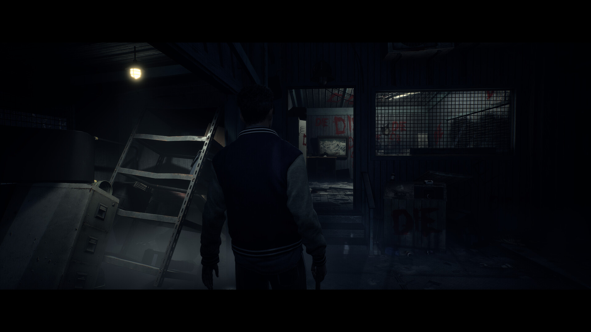

+++
title = "Vendu 70 balles, le remake d’Until Dawn peine à trouver son public"
date = 2024-10-08T17:25:00+01:00
draft = false
author = "Félix"
tags = ["Actu"]
image = "https://nostick.fr/articles/2024/octobre/0810-remake-until-dawn-peine-a-trouver-son-public/untildawn.jpg"
+++

 

Lancement difficile pour le remake d’*Until Dawn*, un jeu d’horreur sorti en 2015 et de retour sur PC et PS5. Il faut bien dire que la proposition n’est pas très intéressante, même pour les fans : le jeu a été refait sous l’UE5 et l’histoire a eu droit à quelques maigres changements, mais c’est à peu près tout… pour 70 balles, sans geste commercial pour ceux ayant déjà le jeu original. Forcément, les joueurs ne se jettent pas dessus.

Cette édition 2024 a attiré [2 607 curieux](https://steamdb.info/app/2172010/charts/) sur Steam le jour de son lancement, ce qui n’est pas terrible. En comparaison, 6 000 personnes sont en train de jouer à *Ghost of Tsuchima* [ce soir](https://steamdb.info/app/2215430/charts/) alors que le jeu est sorti en mai, et il avait appâté 77 000 joueurs à sa sortie. Le récent *‌God of War Ragnarök*, arrivé sur PC le mois dernier et qui avait eu un lancement « [moyen bof](https://nostick.fr/articles/2024/septembre/2309-god-of-war-ragnarok-pc-moyen-lancement/) », a quand même réussi à dépasser les 35 000 joueurs en simultané.

*Until Dawn* étant un slasher interactif sans trop de rejouabilité, ce remake passe sans doute au-dessus de la tête des joueurs l’ayant fait à l’époque. De plus, la qualité n’est pas forcément au rendez-vous : *Push Square* a testé le jeu [sur PS5](https://www.pushsquare.com/reviews/ps5/until-dawn) et note que le titre peine à garder le cap des 30 FPS, là où l’original tourne à 60 sur PS5. Ça sera sûrement mieux sur PS5 Pro, mais 70 balles pour un jeu vieux de 9 ans qui se termine en 8 heures et qui rame, c’est quand même audacieux. 

De leur côté, les joueurs Steam [râlent](https://store.steampowered.com/app/2172010/Until_Dawn/#app_reviews_hash) sur différents crashs et l’obligation d’avoir un compte PSN pour jouer. Les développeurs ont confié avoir repéré « *quelques problèmes qui reviennent régulièrement* » concernant le HDR, le FSR d’AMD ou encore liés aux sauvegardes/chargements. Un patch est en cuisine, on espère qu’il arrivera à temps pour Halloween.

