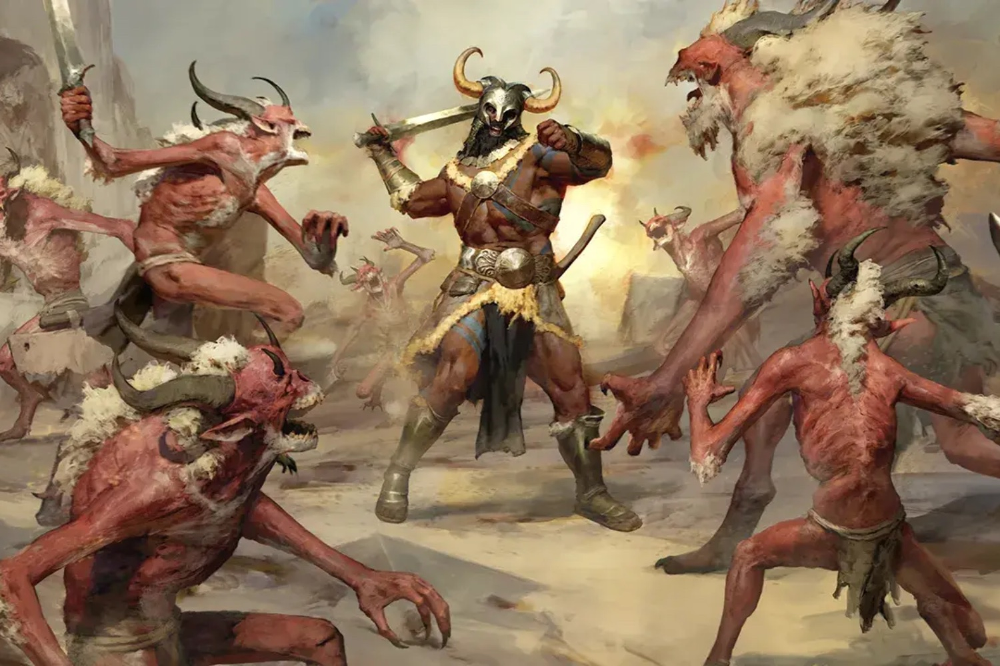

+++
title = "Diablo IV aurait pu avoir des faux airs de Batman Arkham"
date = 2024-10-09T08:07:32+01:00
draft = false
author = "Mickael"
tags = ["Actu"]
image = "https://nostick.fr/articles/vignettes/octobre/diablo-iv-batman.jpg"
+++

*Diablo IV* aurait pu être très différent du jeu sorti l'an dernier. Le directeur de *Diablo III*, Josh Mosqueira, avait en effet en tête quelque chose de complètement différent pour la suite de la saga. Exit la vue isométrique : l'idée de « Hades », le nom de code du jeu, était de positionner la caméra… derrière le joueur, à la manière d'un TPS. Et de s'inspirer du système de combat de *Batman Arkham* !

La [révélation](https://www.wired.com/story/play-nice-book-excerpt-blizzard-diablo-iv/) de Jason Schreier, actuellement en tournée promo pour son bouquin « *Play Nice: The Rise and Fall of Blizzard Entertainment* », ajoute que ce concept avait été imaginé après la sortie de l'extension « Reaper of Souls » de *Diablo III*, autour de 2014 donc. À l'époque, la direction de Blizzard cherchait un moyen de créer une source de revenus en continu pour la franchise ; autrement dit, plus question de se contenter des sous générés par l'achat du jeu ou d'un DLC.

Le studio a annulé le développement d'une seconde extension, et c'est là que Josh Mosqueira s'est pointé avec son idée bizarre. En plus de tout le reste, il avait aussi imaginé un système de *permadeath* : une fois le héros passé de vie à trépas, le nouveau personnage créé par le joueur pouvait hériter d'une capacité issue de son prédécesseur. 

L'idée de cet héritage après la mort n'est pas complètement mauvaise, mais ce qui a surtout coincé vis à vis des développeurs, c'est la description du jeu en elle-même : ça n'a effectivement plus rien à voir *Diablo* ! Et un gros souci se serait posé avec le multijoueur, alors que le gameplay des bastons dans *Arkham* repose sur le ralenti qui permet à ~~Bruce Wayne~~ Batman de taper tous les méchants.

Heureusement (ou malheureusement ?), on n'a rien vu de tout ça. Josh Mosqueira a quitté Blizzard en 2016 et le studio a conservé le type de jeu qu'on connait.