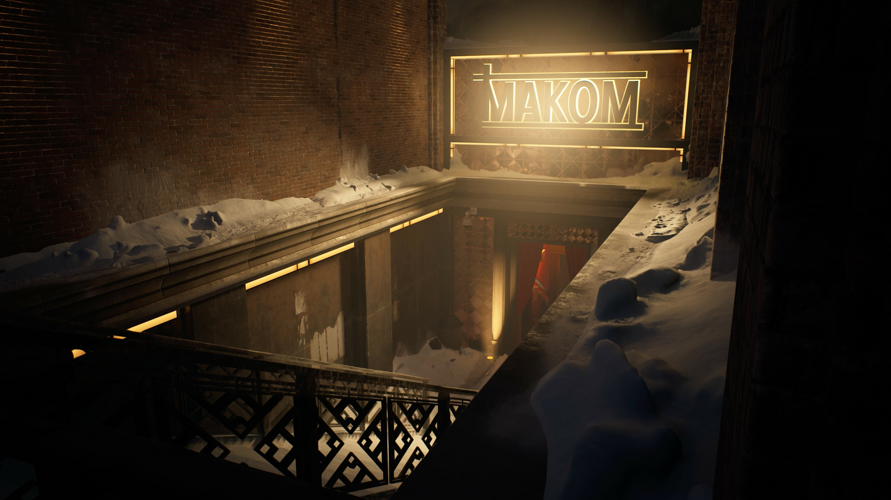
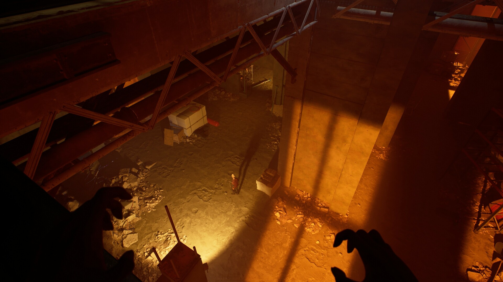

+++
title = "Paradox ne veut pas s’occuper de Vampire Bloodlines 3"
date = 2024-10-09T18:45:00+01:00
draft = false
author = "Félix"
tags = ["Actu"]
image = "https://nostick.fr/articles/2024/octobre/0910-paradox-ne-veut-pas-soccuper-bloodlines-3/vtmb2.jpg"
+++

 

Cela fait maintenant 5 ans qu’a été annoncé *‌Bloodlines 2*, une suite au formidable *Vampire: The Masquerade - Bloodlines* que personne n’avait vraiment demandé. Le titre a été repoussé de nombreuses fois avant d’échouer [sur le bureau de The Chinese Room](https://nostickreloaded.substack.com/i/136870327/vampire-bloodlines-arrivera-a-pied-par-la-chine) et devrait (aux dernières nouvelles) sortir début 2025. *[PCGamer](https://www.pcgamer.com/games/rpg/paradox-wants-to-get-out-of-the-rpg-business-if-bloodlines-2-god-willing-is-successful-bloodlines-3-will-be-done-by-someone-else/)* a été tailler le bout de gras avec Mattias Lilja, directeur général adjoint de Paradox. Sans trop de surprise, la boîte n’a pas spécialement envie de s’occuper d’un éventuel troisième volet.

« *Ce n'est pas dans notre orientation stratégique de faire ce genre de jeu* », a-t-il déclaré avant d’ajouter que « *si Bloodlines 2 est un succès, Bloodlines 3 sera réalisé par quelqu'un d'autre, sous notre licence*». Il faut bien se dire qu’à l’échelle de Paradox, *Bloodlines 2* est un gros projet… dont le succès est loin d’être assuré. Le développement a été chaotique et la licence ne parle sans doute plus à grand monde à l’exception d’une poignée de fans très méfiants vis-à-vis de cette suite.

Mattias Lilja n’a pas l’air très motivé à l’idée de proposer de multiples DLC et extension. « *Même dans le meilleur des cas, Bloodlines n’est pas un jeu à la durée de vie très longue* [en termes de ventes]*. Ce n'est pas ainsi que ces jeux se portent. Vous avez un afflux de joueurs, il y a un peu de bouche à oreille, ils ont un pic, puis ils s'essoufflent. Ce n'est pas le type de jeu qui se développe le plus au fil du temps. Je pense donc que c'est en partie pour cela que ces types de jeux ne nous intéressent pas vraiment* ». Il nuance cependant en garantissant que Paradox n’est pas du genre à lancer un jeu à moitié fini sur le marché avant de tourner la tête et de serrer les dents. « *Nous nous assurons qu'ils fonctionnent. Nous nous assurons qu'ils tiennent leurs promesses. Le reste dépend des joueurs* ».

D’humeur bavarde, le directeur général adjoint de Paradox ne s’est pas arrêté là et a également accordé une interview à *[Rock Paper Shotgun](https://www.rockpapershotgun.com/bloodlines-2-is-more-spiritual-successor-than-sequel-to-a-a-competently-good-game-by-2004-standards-say-paradox)*. Il assure avoir donné beaucoup de liberté à The Chinese Room, qui a repris le projet de Hardsuit Labs en vol. « *Nous avons une grande confiance en The Chinese Room, compte tenu de ce qu'ils ont fait* », explique-t-il. « *Je suis assez confiant dans le fait que cela va fonctionner. J'ai vu le jeu maintenant. The Chinese Room s’est investie dans ce projet. Ils prennent beaucoup d'initiatives. Ils aiment certaines choses que Hardsuit a faites, ils en changent d'autres, et ils font leur propre jeu, ce qui correspond toujours à la vision que nous avions.* ».

Paradox cherche tout de même à se distancer du premier jeu, désormais considéré comme un classique, mais qui est sorti dans un état catastrophique et qui fonctionne encore bien mal aujourd’hui sans patchs des fans. « *Il s'agit de fixer les bonnes attentes* », explique Lilja. « [La suite est] *un RPG d'action avec un scénario qui est plus fixe. Ce n'est pas la simulation ouverte à laquelle on ne devrait peut-être pas le comparer* ». Il précise vouloir proposer « *un successeur spirituel, et non un jeu du même type* ».

Ce *Bloodlines 2* sera-t-il un bon jeu ? The Chinese Room sait créer des ambiances, mais a plutôt l’habitude des *walking-sim*. Son récent *Still Wakes the Deep* a été tièdement accueilli à cause de son gameplay pas terrible et limité. Le dernier trailer du jeu datant du début d'année ne donnait [pas particulièrement envie](https://www.youtube.com/watch?v=ja1rtSS4YlI). En tant qu’indécrottable optimiste je continue de croiser les doigts très forts parce que merde, *Bloodlines 1* c’était quand même vachement bien.