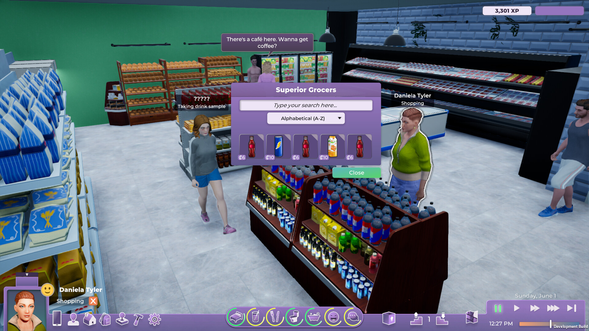

+++
title = "Malgré l'abandon de Life By You, Paradox n'écarte pas le retour d'une simulation de vie"
date = 2024-10-09T07:47:32+01:00
draft = false
author = "Mickael"
tags = ["Actu"]
image = "https://nostick.fr/articles/vignettes/octobre/lifebyyou.jpg"
+++

Il existe un espace aujourd'hui pour une nouvelle simulation de vie, à côté du mastodonte *Les Sims 4*. Certes, [Electronic Arts met le paquet](https://nostick.fr/articles/2024/septembre/2109-backlog-xbox-ps5-pro-concord-sims-4-gta-online/#la-grosse-info-de-la-semaine--lunivers-des-sims-4) pour que son jeu demeure au top et continue d'attirer des kilotonnes de joueurs, mais au bout de 10 ans, les amateurs du genre peuvent avoir envie d'autre chose. L'engouement autour de *[la démo d'inZOI](https://nostick.fr/articles/2024/aout/2008-premier-demo-inzoi/)*, qui permet de créer un avatar étrangement réaliste, démontre l'appétit des joueurs pour quelque chose d'autre.

 

Paradox Interactive aurait pu les rassasier avec *Life By You*, mais malheureusement [l'éditeur suédois a arrêté les frais en juin dernier](https://nostick.fr/articles/2024/juin/1806-surprise-paradox-annule-life-by-you-son-alternative-aux-sims/), alors que le jeu semblait bien avancé. Le développement du projet a représenté un investissement de quasiment 19 millions d'euros sans que cela rapporte rien, et coûté la fermeture du studio Paradox Tectonic.

Tout n'est cependant pas perdu. À l'occasion d'une rencontre avec la presse pour retisser des liens distendus[^1], l'éditeur suédois n'a pas rejeté l'idée de tenter de nouveau sa chance dans le genre de la simulation de vie. C'est un « *projet stratégiquement pertinent* », explique Mattias Lilja, le directeur général adjoint de Paradox, à *[RockPaperShotgun](https://www.rockpapershotgun.com/paradox-still-want-to-make-a-sims-competitor-after-life-by-you-but-we-need-to-start-smaller)*. « *Je pense que nous devrions essayer à nouveau si nous avons une opportunité similaire* ». Mais en évitant les écueils de la première tentative.

« *Nous devons procéder différemment. Nous devons commencer avec une plus petite équipe. Nous devons prolonger la préproduction,* » explique le dirigeant. « *Nous devons faire beaucoup de prototypes avant de passer à une grande production, car lorsqu'on a une équipe de développement complète, honnêtement, cela coûte cher, donc tout changement de direction entraînera des coûts importants* ».

C'était le problème majeur de *Life By You* : « *Nous n'obtenions pas le jeu que nous voulions, et le rythme des coûts étaient vraiment élevés (…) Les développeurs ont fait tout ce qu'ils pouvaient, mais ils étaient nombreux, donc tout changement majeur aurait simplement aggravé la situation financière* ». Et il fallait arrêter rapidement !

Henrik Fåhraeus, le directeur créatif de Paradox, est allé plus loin dans la même interview : l'expérience du jeu allait-elle être meilleure que les Sims 4 « *d'une certaine manière au moins* » ? La réponse était non. « *Et les autres personnes qui l'ont testé étaient plus ou moins du même avis* », ajoute-t-il. D'où la nécessité de multiplier les prototypes pour trouver le bon gameplay. Et pour le moment, l'éditeur est trop occupé par ailleurs pour s'y pencher de nouveau.

[^1]: Paradox Interactive a mauvaise réputation auprès des joueurs : outre l'abandon de *Life By You*, l'éditeur a aussi sorti un *Cities Skylines 2* catastrophique et ne cesse de repousser le lancement de *Prison Architect 2* et de *Vampire: The Masquerade - Bloodlines 2*.