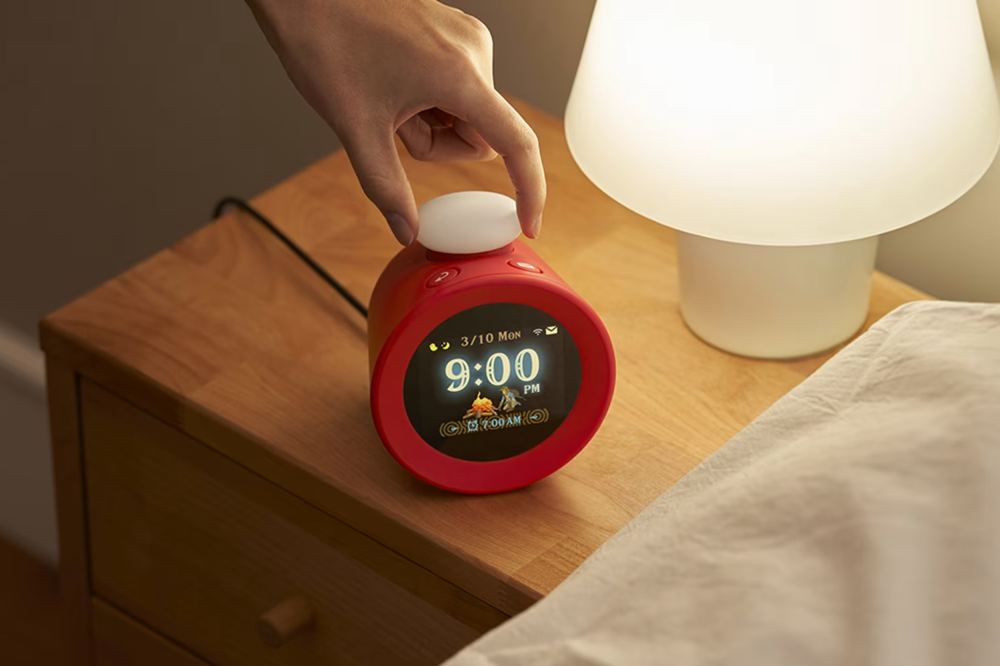
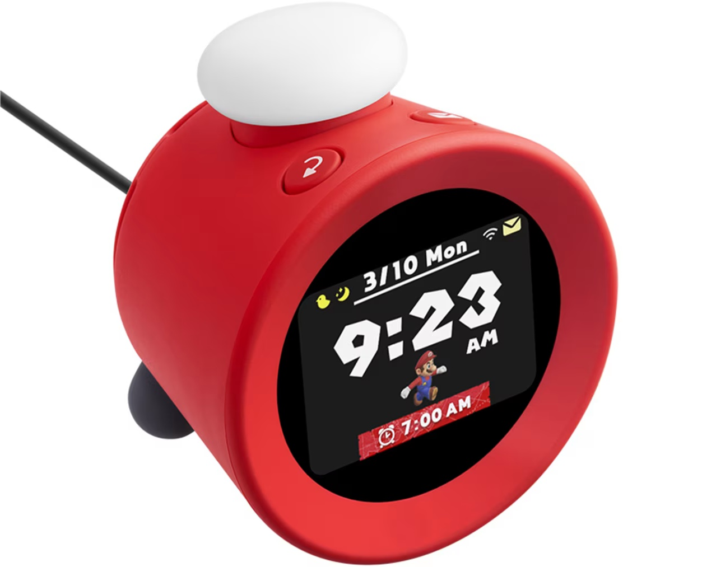

+++
title = "Oubliez la Switch 2, Nintendo lance un… réveil"
date = 2024-10-09T14:47:32+01:00
draft = false
author = "Mickael"
tags = ["Actu"]
type = "une"
image = "https://nostick.fr/articles/vignettes/octobre/alarmo-nintendo.jpg"
+++

Nintendo annonce enfin un nouveau produit… mais ce n'est pas celui qu'on espérait ! Le constructeur a en effet dévoilé, attention les yeux, l'Alarmo. Il s'agit d'un réveil (!) doté d'un écran qui affiche 35 séquences tirés de 5 jeux Nintendo : *Super Mario Odyssey*, *Breath of the Wild*, *Splatoon 3*, *Pikmin 4* et *Ring Fit Adventure* (des thèmes supplémentaires seront proposées via des mises à jour gratuites). Et bien sûr, ça fait aussi du bruit.

 

Lorsque l'alarme retentit, on peut arrêter le vacarme avec des gestes ou en se levant du lit : l'engin embarque en effet un capteur de mouvement. C'est en fait tout simplement [le produit qu'avait révélé le FCC américain](https://nostick.fr/articles/2024/septembre/2309-nintendo-appareil-mystere-switch-2/) il y a quelques semaines. Si on traîne trop longtemps à éteindre l'alarme, le réveil va commencer à intensifier le son et « *quelqu'un de plus persuasif* » (genre Bowser) va venir taper à l'écran.

Lorsqu'on parvient à se réveiller, l'alarme s'arrête donc, mais pas avant une « *brève fanfare de la victoire* ». Franchement ? Du génie. L'appareil surveille aussi le sommeil, et permet de consulter son historique. Le capteur de l'Alarmo ne fait pas de miracle : il pourra se tromper et détecter des mouvements provenant d'un animal de compagnie, ou de la personne qui dort à côté de soi. Dans ce cas, un « mode bouton » plus classique est disponible pour éviter les faux positifs.

Le réveil ne fera pas qu'assurer le réveil chaque matin. Il pourra aussi diffuser des sons relaxants avant de tomber dans le sommeil, ou encore produire un carillon toutes les heures. Des personnages Nintendo réagiront aussi aux mouvements tout au long de la journée.

L'appareil sera commercialisé début 2025, mais les abonnés NSO aux États-Unis et au Canada peuvent d'ores et déjà le commander au prix de 100 $ et probablement la même chose en €. L'Alarmo sera dispo dans le courant de la semaine sur le [Store français](https://www.nintendo.com/fr-fr/Hardware/Le-reveil-musical-de-Nintendo-Alarmo/Le-reveil-musical-de-Nintendo-Alarmo-2670177.html), là aussi en exclusivité pour les abonnés Switch Online.
