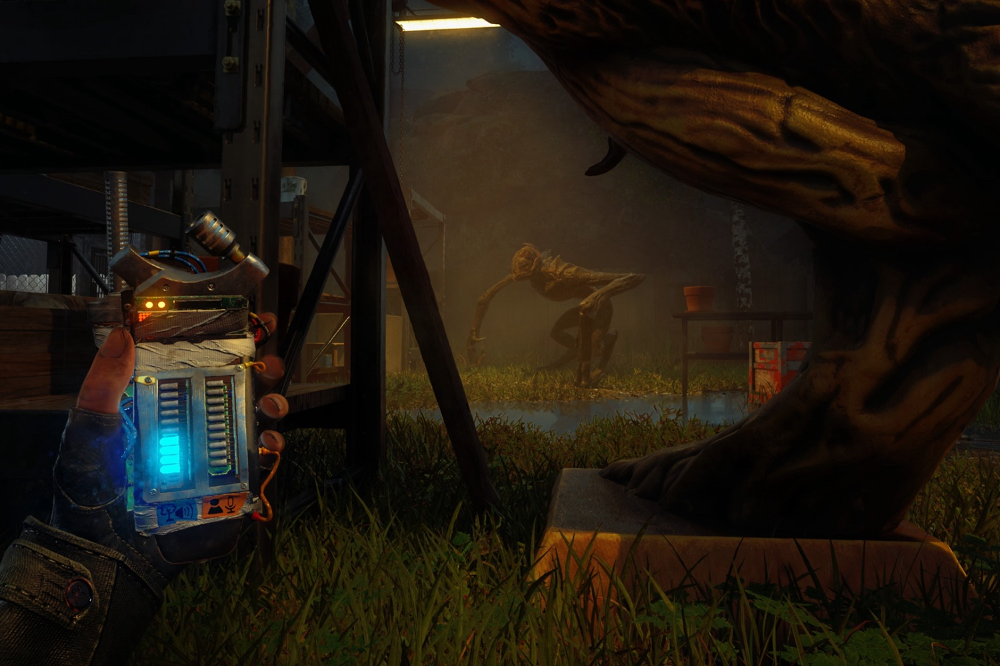

+++
title = "Ne dites pas un mot dans A Quiet Place, non mais vraiment"
date = 2024-10-10T08:01:32+01:00
draft = false
author = "Mickael"
tags = ["Actu"]
image = "https://nostick.fr/articles/vignettes/octobre/a-quiet-place.jpg"
+++

Personne ne vous oblige à aimer les films « Sans un bruit » de ce cul-bénit de John Krasinski, en revanche le jeu qui s'inspire de la saga, *A Quiet Place: The Road Ahead*, a l'air tout à fait fréquentable. Le titre, édité par Saber Interactive, s'annonce comme un bon petit AA d'horreur où le but, vous l'imaginez, sera de se mouvoir sans faire aucun bruit.

 

Et les développeurs ont poussé le bouchon assez loin, puisqu'une fonction permet de franchir le quatrième mur. On peut ainsi activer le micro de sa console/son PC pour que le jeu puisse « écouter » les bruits autour de soi. Et au moindre bruit — éternuement, discussion… —, les bestioles extra-terrestres rappliqueront… uniquement dans le jeu, bien sûr !

Cette fonction purement optionnelle « *permet aux créatures (…) de détecter chaque son que vous faites dans la vie réelle, apportant ainsi l'horreur directement dans votre salon* », expliquent les développeurs. « *Découvrez ce que cela fait quand n'importe quel bruit peut vous trahir* »… Sympa !

Voilà qui rappellera de bons (ou d'effrayants) souvenirs à tous ceux qui ont joué à *Alien Isolation* sur Xbox One à l'époque : le jeu proposait déjà une telle fonction de reconnaissance des sons ambiants, mais ça passait par le Kinect dont c'était à peu près le seul usage pertinent. *A Quiet Place: The Road Ahead* sera dispo sur Steam, PS5 et Xbox Series S/X le 17 octobre, pour une trentaine d'euros.