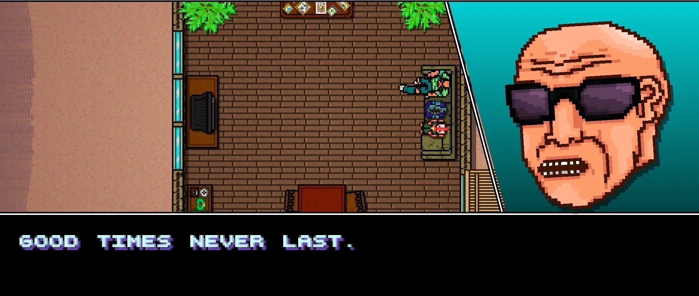

+++
title = "L'Australie ne veut vraiment pas de Hotline Miami 2"
date = 2024-10-10T08:47:32+01:00
draft = false
author = "Mickael"
tags = ["Actu"]
image = "https://nostick.fr/articles/vignettes/octobre/hotline-miami-2.jpg"
+++

L'Australie a manifestement un gros problème avec *Hotline Miami 2: Wrong Number*. Le jeu édité par Devolver, sorti en 2015, n'a jamais été autorisé par l'Australian Classification Board (le PEGI local) en raison d'une scène de violence sexuelle simulée. De fait, les joueurs de l'autre bout du monde n'ont jamais pu y jouer ; à tel point que Jonatan Söderström, designer et cocréateur de la saga, leur conseillait à l'époque de [pirater le jeu](https://www.reddit.com/r/pcmasterrace/comments/2si0b2/i_contacted_jonatan_söderström_hotline_miami_2/), tout simplement !

De l'eau a coulé sous les ponts, mais l'ACB continue de surveiller l'affaire comme le lait sur le feu. En 2019, la version Switch du jeu a brièvement fait son apparition dans l'eShop du pays, avant que l'autorité n'exige son retrait ce qui fut fait promptement.

Et aujourd'hui, c'est PlayStation qui rembourse les joueurs australiens ayant acheté *Hotline Miami 2*. Le jeu est sorti discrètement dans la boutique de la console dans une version native PS5 il y a pile un an, sans que personne s'en émeuve. Fort heureusement, l'ACB veillait au grain et a obtenu le retrait du titre !

Le jeu, qui était aussi distribué dans l'abonnement PlayStation Plus Extra, en a été retiré en Australie. Et cette fois, les joueurs n'y ont plus du tout accès. Devolver a pris la chose avec philosophie, comme le montre la capture d'écran [partagée](https://www.eurogamer.net/playstation-suddenly-pulls-hotline-miami-2-from-aussie-ps5-owners-after-realising-countrys-ratings-board-denied-games-release-a-decade-ago) avec *Eurogamer* ci-dessus.