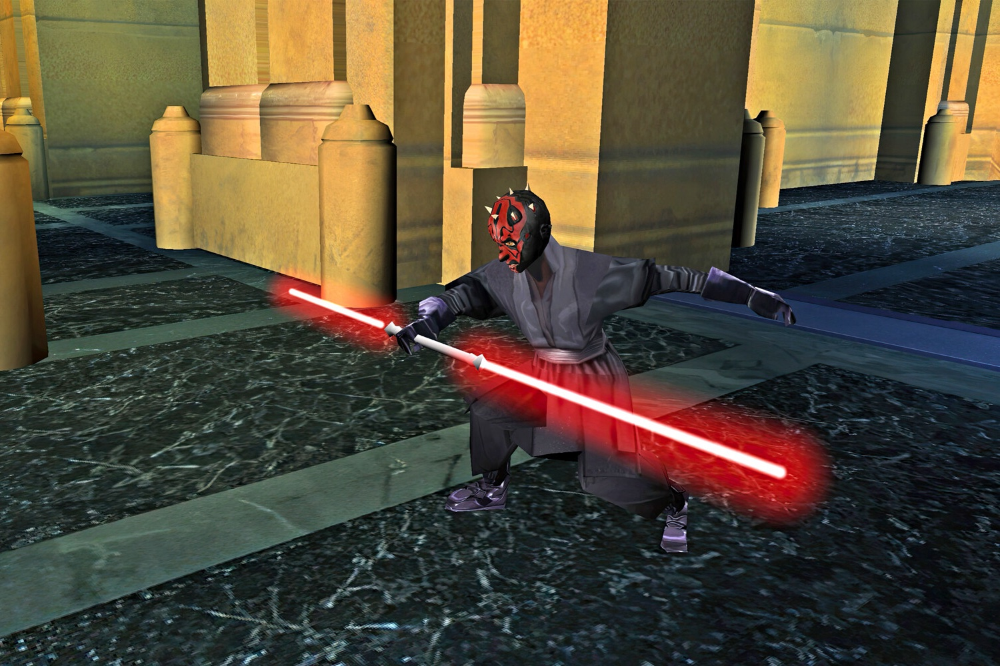

+++
title = "Personne ne l'avait demandé, mais voici un remake de Star Wars Episode I: Jedi Power Battles"
date = 2024-10-10T12:47:32+01:00
draft = false
author = "Mickael"
tags = ["Trailer"]
image = "https://nostick.fr/articles/vignettes/octobre/star-wars-1.jpg"
+++

C'est bien connu, les fans de Star Wars sont insatiables, ils peuvent s'enfiler les mauvaises séries Disney+ et les films catastrophiques de cette andouille de JJ Abrams sans barguigner et avec le sourire — et ils en redemandent ! Rayon jeux, ils ont eu droit à *Jedi: Survivor* l'an dernier, au sympathique *Outlaws* cette année, et début 2025 les petits écrans accueilleront *Star Wars Episode I: Jedi Power Battles*.

 

Les ~~vieux de la vieille~~ plus nostalgiques se souviendront qu'il s'agit d'un jeu PS1 et Dreamcast sorti en 2000, ce qui ne rajeunira personne. Ce remake réalisé par Aspyr conserve les graphismes « gros polygones » de l'époque et les différentes séquences du titre inspirées du film : il y a de plateforme, de la baston, des duels, et même du shoot'em up. Le mode co-op en local est toujours de la partie.

L'éditeur promet 13 persos jouables (contre 5 dans le jeu de 2000) qui iront au-delà du casting. Aspyr a également amélioré certains éléments de gameplay, comme les sauts et le rééquilibrage de la difficulté (le jeu est notoirement difficile). Un bouton permettra aussi de modifier la couleur des sabres laser : le titre original ne respectait pas les couleurs des armes. Celui de Mace Windu est normalement violet, mais il était bleu dans le jeu. Sacrilège !

Le remake sortira le 23 janvier prochain, au prix de 20 € sur toutes les consoles ainsi que sur PC.