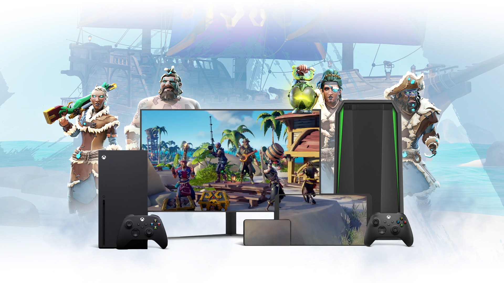

+++
title = "Les abonnés Xbox Cloud Gaming vont bientôt pouvoir streamer leurs propres jeux"
date = 2024-10-11T21:00:00+01:00
draft = false
author = "Félix"
tags = ["Actu"]
image = "https://nostick.fr/articles/2024/octobre/1110-abonnes-xbox-cloud-gaming-stream-jeux/xboxx.jpg"
+++

Bonne nouvelle pour nos lecteurs fortunés qui raquent 18 balles par mois pour le Game Pass Ultimate : ils vont bientôt pouvoir streamer les autres jeux de leur bibliothèque Xbox, et pas seulement ceux actuellement au catalogue du service. Un équivalent de GeForce Now made-in-Microsoft et seulement pour les jeux achetés sur la boutique Xbox, en quelque sorte.

*[The Verge](https://www.theverge.com/2024/10/11/24268038/xbox-cloud-gaming-project-lapland-game-library)* affirme que Microsoft est en train de fignoler ses serveurs pour prendre en charge cette nouvelle fonction à partir de novembre. Celle-ci sera dans un premier temps proposée en test aux abonnés Xbox Insiders, avant d’être déployée au reste des abonnés par la suite. Si cela sera réservé aux clients voulant le pack complet, on peut aussi imaginer une nouvelle formule « à la GeForce Now » moins chère mais permettant uniquement de streamer les jeux de sa bibliothèque par la suite. 

Cette fonction connue sous le nom de Project Lapland aura pris son temps à arriver. Elle aurait dû être disponible au lancement de 2020 avant d’être repoussée à 2022. Selon *The Verge*, la tâche a été rendue compliqué par la nécessité de préparer les serveurs pour des milliers de jeux, au lieu des centaines qui existent actuellement sur le Xbox Game Pass. Le Game Pass Ultimate est déjà bien garni avec ses 505 jeux consoles et 463 sur PC, mais cette nouveauté devrait offrir un peu plus de flexibilité aux joueurs se sentant à l’étroit. En espérant qu'elle ne soit pas repoussée une fois de plus d'ici la fin du mois…