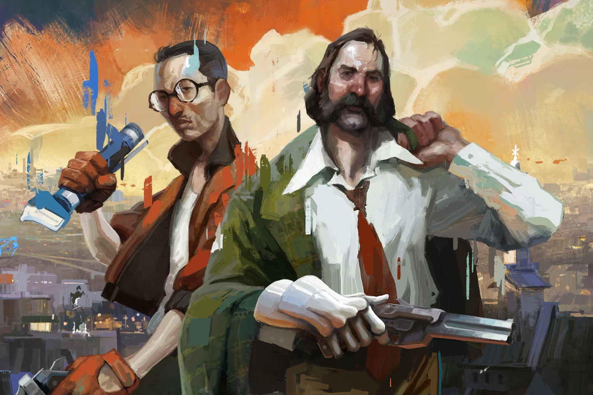

+++
title = "~~Deux~~ Trois successeurs spirituels à Disco Elysium sont dans les tuyaux"
date = 2024-10-11T11:47:32+01:00
draft = false
author = "Mickael"
tags = ["Actu"]
image = "https://nostick.fr/articles/vignettes/octobre/disco-elysium.jpg"
+++

Hasard du calendrier (ou peut-être pas…), deux successeurs spirituels à *Disco Elysium* viennent d'être annoncés coup sur coup… par deux studios composés d'anciens de ZA/UM, le créateur du jeu ! *XXX Nightshift*, développé par Dark Math Games, veut offrir aux joueurs une « *expérience RPG solo profonde avec beaucoup d'outils et de couches de gameplay* ». On sera accompagné d'un compagnon, dont la « *dynamique unique* » proposera différents chemins pour résoudre les énigmes.

 

Beaucoup de mots empilés les uns sur les autres, et malheureusement le trailer ci-dessus ne nous avancera pas tellement — même si les dialogues sont enlevés.

L'autre studio Longdue Games ne cache pas sa volonté de créer un véritable successeur de *Disco Elysium* (qui ne portera pas ce nom, évidemment), autrement dit un jeu « *qui résonne émotionnellement et intellectuellement [avec le joueur]* ». Le titre qualifié de « *jeu de rôle psychogéographique* » explorera « *l'interaction délicate entre le conscient et le subconscient, le visible et l'invisible* ». Nous voilà bien avancé.

Le studio ZA/UM a licencié un quart de ses effectifs en début d'année : plusieurs de ces ex-salariés ont donc décidé de poursuivre l'aventure en créant deux nouvelles entreprises. Du côté de ZA/UM, ce n'est toujours pas la joie : le groupe a annulé le développement d'une extension à *Disco Elysium*, après avoir annulé une suite directe et un jeu de science-fiction.

**Mise à jour —** Trois, c'est toujours mieux que deux, alors voici venir le studio Summer Eternal qui a également annoncé sa propre vision de ce que devrait être un successeur spirituel à *Disco Elysium* ! Au moins il y a un [site web](https://summereternal.com) avec plein de citations bizarres à se mettre sous les yeux, mais pas de nom pour le jeu. Bonne ambiance visiblement chez les anciens de ZA/UM.