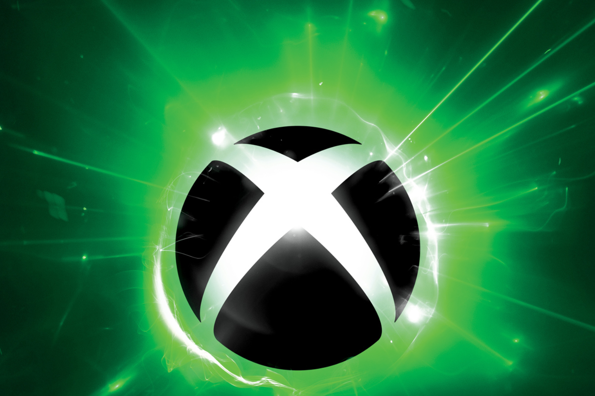

+++
title = "Microsoft va vendre des jeux Xbox sur Android"
date = 2024-10-11T08:30:32+01:00
draft = false
author = "Mickael"
tags = ["Actu"]
image = "https://nostick.fr/articles/vignettes/octobre/xbox-dead.jpg"
+++

 

Le Play Store, la boutique d'apps Android de Google, doit s'ouvrir à la concurrence en vertu d'une décision de la justice américaine qui s'est rangée au côté d'Epic. L'éditeur de *Fortnite* avait porté plainte contre le moteur de recherche il y a quatre ans. 

Le Play Store exerce donc un monopole illégal et à partir du mois prochain, Google est censé distribuer pendant trois ans des boutiques alternatives au sein même de son propre magasin, et cesser d'imposer son système de facturation aux développeurs, entre autres exigences.

Tout cela fait saliver les grands éditeurs bien sûr, au premier rang desquels Microsoft. Sarah Bond, la présidente de Xbox, a [annoncé](https://x.com/BondSarah_Bond/status/1844506029599707255) qu'à compter de novembre, les joueurs seront en mesure d'acheter des jeux Xbox directement depuis l'application Xbox sur Android, et d'y jouer (probablement via le Xbox Cloud Gaming, mais la dirigeante ne le précise pas).

C'est une victoire nette pour les joueurs, mais il faut tout de même relativiser : d'une part, Google a fait appel du jugement, ce qui repoussera sa mise en œuvre pendant des mois, voire des années. Et d'autre part, rien n'empêche Microsoft de vendre des jeux Xbox dès à présent dans son app Android — après tout, c'est ce que font Steam et le PlayStation Store, sans verser de commission à Google.

Microsoft travaille aussi, toujours, sur [sa propre boutique mobile](https://nostick.fr/articles/2024/juillet/3107-microsoft-ne-devrait-plus-trop-tarder-boutique-mobile/) pour iOS et Android, qui devrait vendre dans un premier temps des objets et des gemmes à consommer dans ses jeux mobiles. Il y en a un petit paquet grâce à l'acquisition d'Activision : *Call of Duty Mobile*, *Candy Crush*, *Diablo Immortal*…