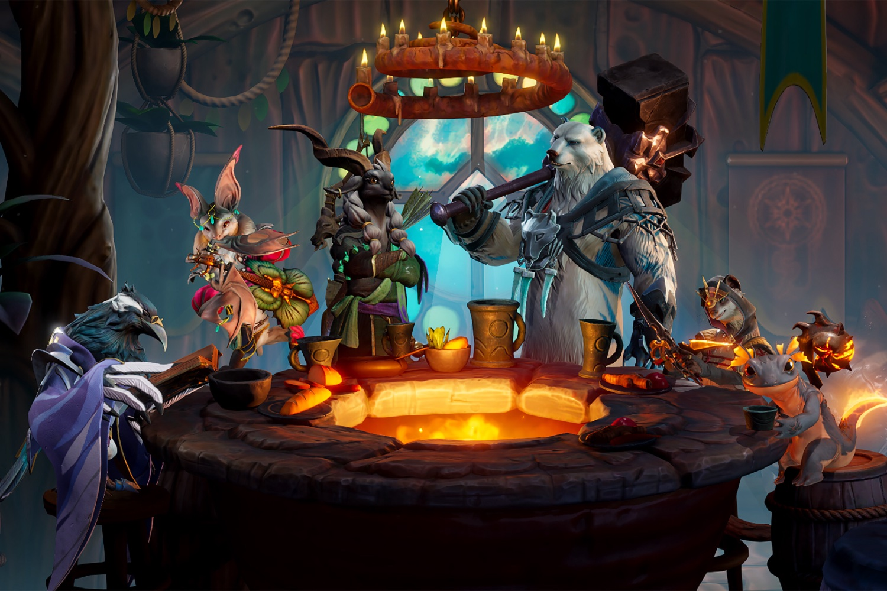

+++
title = "Sunderfolk : un jeu de plateau presque à l'ancienne, mais avec des smartphones"
date = 2024-10-11T08:00:32+01:00
draft = false
author = "Mickael"
tags = ["Trailer"]
image = "https://nostick.fr/articles/vignettes/octobre/Sunderfolk.jpg"
+++

Les jeux de plateau sont bien sympathiques, mais il faut de la place sur la table de la salle à manger ou de la cuisine, il y a des pièces qui finissent toujours dans l'estomac du chat, et puis niveau animations et effets spéciaux spectaculaires, ce n'est pas tout à fait. C'est là qu'interviennent les petits gars de Secret Door, un des deux studios qui forment Dreamhaven.

 

Leur premier jeu *Sunderfolk* se présente comme une « *alternative simplifiée à l'expérience traditionnelle des jeux de société* ». Pas d'installation compliquée, pas de manuel bourré de règles, pas de matos, mais un gameplay qui s'affiche sur la télé du salon, et qui reprend les principes d'un jeu de plateau, avec 6 héros dont on contrôlera les mouvements et les actions avec l'aide de son smartphone.

Ce jeu de rôle tactique au tour par tour est « *facile à prendre en main tout en restant difficile à maîtriser* », explique Chris Sigaty, le patron du studio. Ce dernier est un ex de chez Blizzard, tout comme le fondateur de Dreamhaven, Mike Morhaime (qui a aussi cofondé Blizzard). L'entreprise, qui compte aussi dans ses rangs le studio Moonshot, a été créée en 2020.

*Sunderfolk* sera dispo l'année prochaine sur PC, PS5, Xbox Series S/X et Switch.