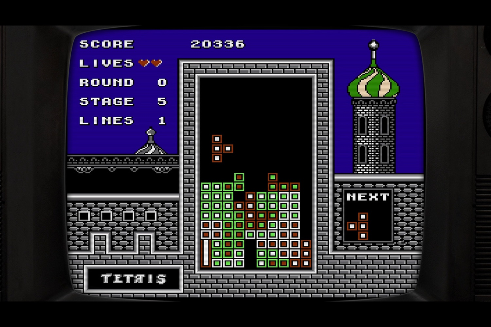

+++
title = "Tetris Forever, la collection ultime des psychopathes des tétrominos"
date = 2024-10-11T07:30:32+01:00
draft = false
author = "Mickael"
tags = ["Actu"]
image = "https://nostick.fr/articles/vignettes/octobre/tetris-forever.jpg"
+++

Quand on a joué à un *Tetris*, on a joué à tous les *Tetris*. Si c'est ce que vous pensez, Digital Eclipse et la Tetris Company veulent vous montrer le contraire avec sa compile *Tetris Forever* qui contient une quinzaine de variations (!) du diabolique casse-tête d'Alexey Pajitnov. Plusieurs d'entre eux n'étaient n'ont jamais été distribués en dehors du Japon.

 

La vaste majorité des titres sont sortis entre 1988 et 1998 sur des consoles Nintendo (Game Boy, NES et Super NES) comme *Tetris*, *Hatris*, *Tetris 2 + Bombliss*, *Tetris Battle Gaiden*, *Super Tetris 2 + Bombliss Genteiba*, *Bombliss*… Le catalogue comprend aussi le *Tetris* sorti en 1988 sur Apple II. Un jeu inédit sera de la partie : *Tetris Time Warp*, qui modifie les règles et les styles à la volée, un peu comme dans certains niveaux de *Tetris Effect*.

La compilation offre aussi une partie « musée » avec tout un tas de bazar à consulter comme des vieilles pubs et des photos, il y aura aussi une section vidéo avec 90 minutes de documentaire. *Tetris Forever* avait été présenté lors d'un Direct de Nintendo en août dernier, mais le jeu sera disponible sur toutes les consoles et sur PC d'ici la fin de l'année.

Ce n'est pas la première fois que Digital Eclipse se lance dans un tel projet. On doit à l'éditeur *[The Making of Karateka](https://www.digitaleclipse.com/media/goldmasterseries)* qui combine le jeu à des rappels historiques et à des documentaires. *Tetris Forever* fait d'ailleurs partie de la même collection « Gold Master Series ».