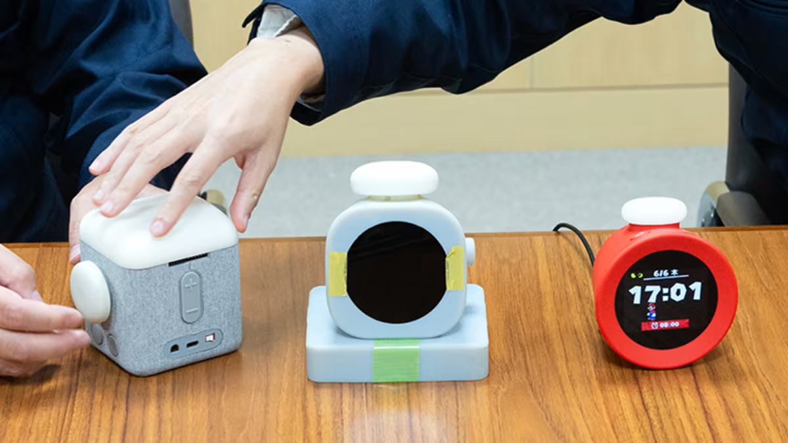

+++
title = "On vide le backlog de la semaine : Silent Hill 2, Roblox, Little Big Planet 3, Alarmo, Balatro…"
date = 2024-10-12T07:50:01+01:00
draft = false
author = "Mickael"
tags = ["XXL"]
image = "https://nostick.fr/articles/2024/octobre/silent-hill-4x4.jpg"
+++

L’actualité du jeu vidéo ne s’arrête pas à la poignée d’articles publiés sur *Nostick* ! Histoire de rattraper le retard accumulé, voici un retour rapide sur quelques unes des infos les plus importantes (ou insignifiantes) de la semaine.

## L'image de la semaine : Silent Hill, charmante bourgade baignée de soleil

Si le remake de *Silent Hill 2* « *fout les chocottes* » comme me l'a confié Félix en claquant des dents caché sous son lit, c'est en grande partie grâce à l'atmosphère lugubre de la ville plongée dans une purée de pois macabre. Quel dommage pourtant, je suis sûr que Silent Hill est bien plus agréable sous un joli soleil d'été. Et c'est exactement ce que propose le mod [Sunny Hills](https://www.nexusmods.com/silenthill2/mods/47) qui supprime le brouillard, tout simplement.

Les parties qui se déroulent la nuit ne sont pas concernées, et on peut conserver le brouillard ou le supprimer histoire de voir la différence. Le développeur, Francis Louis, précise toutefois qu'une fois activé, le mod a tendance à éclairer très fort le brouillard si on décide de le garder.

## La mauvaise nouvelle de la semaine : triste fin pour Little Big Planet 3

*Little Big Planet 3* est le meilleur opus de la série de jeux de plateformes avec le bondissant Sackboy. Non seulement le jeu de base est super, mais les joueurs ont aussi la possibilité de créer leurs propres niveaux et même des mini-jeux, qu'ils peuvent partager avec le reste du monde.

 

Mais enfin ça, c'était avant le début de l'année : Sony a en effet annoncé que les serveurs hébergeant le contenu des fans, fermés temporairement en janvier pour des raisons techniques, le resteraient finalement pour toujours et à jamais. Et maintenant, *Little Big Planet 3* et tous les DLC [disparaitront](https://x.com/LittleBigPlanet/status/1843652568389480651) du PlayStation Store à compter du 31 octobre. 

Tous ceux qui ont acheté le titre pourront continuer d'y jouer (encore heureux), et le télécharger à nouveau sur une autre console. Les niveaux de fans ne peuvent plus être récupérés en raison de la fermeture des serveurs, mais ils restent jouables en local.

Le jeu de plateformes trop choupi est actuellement [proposé](https://www.playstation.com/en-us/games/littlebigplanet-3/) pour une vingtaine d'euros, alors profitez-en avant qu'il ne soit trop tard. Sony ne donne aucune explication à cette extinction qui s'annonce définitive pour le titre, sorti sur PS3 et PS4 en 2014.

## Le chiffre de la semaine : 1 million…

… comme 1 million de dollars, le montant [généré](https://www.pocketgamer.biz/balatro-approaches-1-million-in-seven-days-on-mobile/) par les versions iOS et Android de *Balatro* ! [Sorti sur les plateformes mobiles le 26 septembre dernier](https://nostick.fr/articles/2024/septembre/2609-balatro-mobile-disponible-aujourdhui/), l'hypnotique jeu de poker à la sauce roguelite a atteint le million après 7 jours sur les boutiques de l'App Store et du Play Store, selon les données d'AppMagic. 

Ce chiffre est d'autant plus étonnant que le jeu est vendu assez cher (10 $/€) au vu des critères tarifaires habituels sur les plateformes mobiles, où les utilisateurs ont l'habitude de jouer gratis en échange de réclames ou de micro-transactions. Il n'est même pas possible de tester le jeu avant d'acheter. À noter toutefois que *Balatro* fait partie du catalogue d'Apple Arcade, ce qui en fait une des rares raisons qui justifient l'abonnement au service.

## Les chelous de la semaine : pédophilie et chiffres bidonnés, Roblox sous le feu des critique

*Roblox* est dans la sauce. La plateforme de jeux et de création de jeux a fait l'objet d'un [rapport](https://hindenburgresearch.com/roblox/) dévastateur de Hindenburg Research qui lui reproche essentiellement trois choses. La première et la plus effarante, c'est que *Roblox* fermerait les yeux sur la protection des enfants qui sont ses premiers utilisateurs.

Après avoir créé un compte enfant (moins de 13 ans), les chercheurs de Hindenburg disent avoir trouvé des contenus à caractère sexuel et pédophile dans les espaces de discussion et dans les jeux distribués par la plateforme. *Roblox* mettrait la priorité sur sa croissance et ses revenus, au détriment de la sécurité des mineurs. 

L'entreprise aurait aussi gonflé les chiffres de ses utilisateurs actifs quotidiens, et bidonné les temps d'engagement depuis son entrée en Bourse en 2021. Selon le rapport, le nombre d'utilisateurs serait exagéré de 25 à 42 %, les heures d'engagement de 100 %. Enfin, *Roblox* aurait tendance à compter les bots parmi les utilisateurs, tout comme les comptes multiples créés par une seule personne.

Fin juin, la plateforme avait comptabilisé 79,5 millions d'utilisateurs actifs au quotidien, pour 17,4 milliards d'heures de jeu. Pour appuyer ses accusations, Hindenburg a engagé des consultants techniques qui ont mis au point un système de surveillance des serveurs des jeux hébergés par *Roblox*. Certains d'entre eux restaient ainsi actifs pendant plus de 24 heures d'affilée sans interruption.

Des accusations très graves donc, mais il faut rappeler que Hindenburg est une société spécialisée dans la vente à découvert : il est dans son intérêt de faire baisser les actions des entreprises cotées. Néanmoins, cette firme est connue pour ses enquêtes approfondies qui dénoncent les fraudes financières et les irrégularités des sociétés en Bourse.

Dans un [communiqué](https://s27.q4cdn.com/984876518/files/doc_news/2024/Oct/08/hindenburg-statement-final.pdf), *Roblox* a qualifié le rapport de trompeur. La société a investi « *massivement* » dans la prévention et la sécurité, assure-t-elle. Elle rappelle aussi qu'en tant qu'entreprise cotée, elle doit fournir des rapports financiers transparents. 

Le bras de fer est maintenant engagé, et la plateforme de jeux n'aura pas forcément la partie facile : elle a déjà été ciblée par des groupes de défense des enfants pour ne pas avoir fait suffisamment d'efforts pour les protéger. En août dernier, la Turquie bloquait *Roblox* en raison de contenus exploitant les mineurs…

## La grosse info de la semaine : Nintendo sonne l'alarme

S'il faut toujours s'attendre à tout avec Nintendo, personne n'a su prédire [l'annonce de l'Alarmo cette semaine](https://nostick.fr/articles/2024/octobre/0910-pas-de-switch-2-reveil-alarmo-nintendo/) ! Ce « réveil interactif » n'est absolument pas la Switch 2 (à moins que… ?) qu'on n'en peut plus d'attendre. Le constructeur a décidément l'art du contre-pied ! Et ça se paie plutôt cher : à 100 € le réveil, il vaut mieux que l'engin se montre efficace et bien fichu.

 

Toujours prêt aux efforts les plus insensés pour remplir sa glorieuse mission d'information, *Nostick* ne manquera pas de vous proposer un test complet dans quelques jours. Mais on sait déjà ce que l'Alarmo n'est pas : un jeu. Très tôt dans la conception de l'appareil, les équipes de Nintendo ont décidé d'exclure la possibilité que l'on puisse jouer avec. « *Si nous avions implémenté des éléments de type jeu, on peut supposer que les utilisateurs auraient continué à jouer avec en restant au lit* », explique Yosuke Tamori, producteur de l'Alarmo dans une [interview](https://www.nintendo.com/us/whatsnew/ask-the-developer-vol-14-nintendo-sound-clock-alarmo-part-1/) publiée sur le site de Nintendo.

« *Cela aurait pu perturber [le] sommeil [des utilisateurs]* », poursuit-il. « *Nous souhaitions que les utilisateurs se réveillent en étant reposés. Nous avons donc décidé dès le départ d'exclure ces éléments ludiques* ». Son collègue, Tetsuya Akama, directeur du projet, rebondit dans le même entretien : « *si nous avions créé un système où vous recevez une récompense à chaque fois que vous vous réveillez, cela pourrait vous motiver tant que vous recevez une récompense. Mais une fois que les récompenses cessent, vous pourriez perdre cette motivation* ».

Il craignait aussi que si le système de récompenses disparaissait, les utilisateurs se disent : « *Eh bien, s'il n'y a pas de récompense, alors je n'ai pas besoin de me lever* ». Pour Yosuke Tamori, Nintendo aurait pu proposer de tels incitatifs, « *où les utilisateurs reçoivent une médaille d'or pour s'être réveillés avant l'heure de l'alarme et une médaille de bronze pour s'être réveillés plus tard* ». 

Mais il n'était pas question d'imposer l'idée que se réveiller tôt est bon pour la santé : « *C'est peut être vrai pour certaines personnes, mais en ce qui concerne Alarmo, nous voulions qu'il soit un outil qui vous soutient en douceur* ». Des récompenses auraient pu stresser les utilisateurs, alors que le but est quand même de les aider à mieux dormir et mieux se réveiller.

L'Alarmo embarque pourtant tout ce qu'il faut pour devenir une sorte de console pour table de nuit. D'abord un écran LCD bien sûr, dont Nintendo cache d'ailleurs habilement la forme rectangulaire alors qu'il donne l'impression d'être circulaire. La présence d'un tel écran n'avait rien d'évident : un des premiers prototypes intégrait une grille de LED. Mais les équipes de Tamori et d'Akama se sont rendus compte assez vite que ça ne serait pas suffisant pour ce qu'elles avaient en tête, à savoir une utilisation sans avoir à ouvrir de mode d'emploi. Un écran LCD s'imposait donc.

Mais surtout, la grande nouveauté technologique de l'Alarmo reste son capteur de mouvements particulièrement sophistiqué. Placé sous l'écran, il détecte les mouvements de l'utilisateur grâce à des ondes radio. « *Les voitures autonomes, les drones et les robots sont équipés de capteurs comme celui-ci pour éviter les collisions* », détaille Akama. Ce capteur peut reconnaitre des mouvements très subtils et il fonctionne dans des pièces sombres (forcément). Autre avantage : « *[le capteur] n'a pas besoin de filmer des vidéos, donc la confidentialité est mieux protégée par rapport aux caméras* ».

Ce capteur traine chez Nintendo depuis des années. En 2014, Satoru Iwata le regretté président de l'entreprise [détaillait](https://www.wired.com/2014/10/nintendo-sleep-qol-health/) devant des investisseurs un appareil pouvant mesurer le sommeil, et qui devait sortir deux ans plus tard (c'est raté). Sur une des diapositives, on pouvait déjà voir un capteur de mouvements à radio-fréquence :

Dans l'interview, une vidéo [montre](https://www.nintendo.com/us/whatsnew/ask-the-developer-vol-14-nintendo-sound-clock-alarmo-part-4/) une bulle colorée qui réagit aux mouvements de la main. On est loin d'une manette évidemment, mais ce genre de manipulation pourrait donner des idées de gameplay ! L'Alarmo n'offrira pas ce genre d'expérience, mais qui sait, peut-être qu'un tel capteur trouvera sa place dans une future console…

## osef

Le jeu *La Roue de la Fortune* sera [disponible](https://apps.apple.com/us/app/wheel-of-fortune-daily/id6469643458) sur Apple Arcade le 7 novembre.

## Dans le reste de l'actu déchaînée

- Grosse semaine pour *Halo* et pour Xbox ! *Halo Infinite* va ainsi [accueillir un mode d'affichage à la troisième personne](https://nostick.fr/articles/2024/octobre/0710-halo-infinite-vue-tps-premiere/), du jamais vu dans l'histoire de la saga. Surtout, on a appris que 343 Industries, qui développe la franchise depuis le départ de Bungie, change de nom pour devenir tout simplement Halo Studios. Plus important encore, les développeurs ont décidé d'[utiliser le moteur Unreal Engine 5](https://nostick.fr/articles/2024/octobre/0710-halo-passe-a-lue5/) dans le but d'attirer les talents… et peut-être aussi pour porter les jeux plus facilement sur PS5 ?
- Sega ne veut ostraciser personne. Possesseur de Switch ou de PS5 Pro, vous aurez droit aux jeux Sonic ! Pas question de snober qui que ce soit, et puis c'est mieux pour les finances. [Un engagement à lire dans cette actu](https://nostick.fr/articles/2024/octobre/0710-sonic-sega-vendre-anciennes-consoles/).
- Allons bon, malgré ce que l'industrie essaie de nous faire avaler, les joueurs sont majoritairement demandeurs de jeux solo ! On a peine à y croire (non), alors [allez lire cette actu](https://nostick.fr/articles/2024/octobre/0710-majorite-joueurs-veulent-jeux-solo/).
- Vu que Bethesda ne veut pas faire son boulot, il revient aux joueurs de créer eux-mêmes de nouveaux jeux *Fallout* ! Et pourquoi pas faire un tour à Mexico avec ce futur mod [à découvrir par ici](https://nostick.fr/articles/2024/octobre/0810-vamos-fallout-nuevo-mexico-mod/) ?
- 14 ans après son lancement du PS3 et Xbox One, *Red Dead Redemption* va enfin sortir sur PC ! [On s'en réjouit par ici](https://nostick.fr/articles/2024/octobre/0810-red-dead-redemption-pc-dispo/).
- *Sonic Rumble*, le prochain jeu mobile à base de hérisson bleu, sera presque fréquentable : Sega a en effet annoncé renoncer aux loot box. [Propagez la joie dans cette actu](https://nostick.fr/articles/2024/octobre/0810-sega-croix-loot-box-sonic-rumble/).
- Personne n'attendait vraiment le remake d'*Until Dawn* sur PS5 et PC, et c'est confirmé : le jeu d'horreur a bien du mal à attirer les foules, sans oublier qu'il est pétri de bugs. [On le déplore dans cette actu](https://nostick.fr/articles/2024/octobre/0810-remake-until-dawn-peine-a-trouver-son-public/).
- *Life By You*, l'ex-rival des *Sims 4*, ne sortira jamais. Mais ça ne veut pas dire que son éditeur Paradox a complètement abandonné le terrain des simulations de vie, comme [on le lira par ici](https://nostick.fr/articles/2024/octobre/0910-paradox-retour-life-by-you/).
- Restons encore un moment avec Paradox : l'éditeur suédois a fait savoir cette semaine qu'il n'était pas question de s'occuper de *Bloodlines 3*. Il faut dire que *Bloodlines 2* n'est toujours pas sorti… [C'est à lire dans cette actu](https://nostick.fr/articles/2024/octobre/0910-paradox-ne-veut-pas-soccuper-bloodlines-3/).
- *Diablo 4* aurait pu être très différent du jeu sorti l'an dernier. En fait, il aurait pu avoir des accents de roguelite mélangés avec… *Batman Arkham*. Oui, c'est bizarre, et [c'est à découvrir par là](https://nostick.fr/articles/2024/octobre/0910-diablo-4-faux-airs-batman-arkham/).
- Le jeu *A Quiet Place* brise le quatrième mur en proposant d'activer le micro de sa console ou de son PC pendant le jeu. Au moindre bruit dans la maison, bim les créatures vont débouler ! [C'est plutôt rigolo](https://nostick.fr/articles/2024/octobre/1010-a-quiet-place-pas-un-mot/).
- Nintendo a fait feu de tout bois cette semaine : après le réveil Alarmo, on a eu droit à la mise en route d'un mystérieux test pour le Switch Online ouvert aux joueurs. [Mais de quoi s'agit-il ?](https://nostick.fr/articles/2024/octobre/1010-mysterieux-test-nintendo-switch-online/)
- L'Australie a décidément un problème avec *Hotline Miami 2*, constamment interdit malgré des tentatives discrètes de revenir à la vente. [On s'en amuse ici](https://nostick.fr/articles/2024/octobre/1010-australie-veut-pas-hotline-miami-2/).
- Personne ne se rappelait plus vraiment de *Star Wars Episode I: Jedi Power Battles*, mais c'est pas grave, Aspyr remet le jeu de 2000 au goût du jour. [Mais pourquoi ?](https://nostick.fr/articles/2024/octobre/1010-personne-demande-star-wars-episode-i-jedi-power-battles/)
- Un jeu de plateau, mais sur la télé du salon et jouable avec des smartphones ? C'est tout le programme de *Sunderfolk* et [ça a l'air intéressant](https://nostick.fr/articles/2024/octobre/1110-sunderfolk-jeu-plateau-ancienne-smartphones/).
- Plus de 15 variations de *Tetris*, c'est le programme chargé qu'offrira *Tetris Forever*, une compile à [découvrir dans cette actu](https://nostick.fr/articles/2024/octobre/1110-tetris-forever/).
- Allons bon, Microsoft veut maintenant vendre des jeux Xbox sur Android pour que les utilisateurs puissent y jouer en cloud gaming. [Plus d'explications (nécessaires) par ici](https://nostick.fr/articles/2024/octobre/1110-microsoft-jeux-xbox-android/).
- *Disco Elysium* n'est pas mort, la preuve : deux successeurs spirituels sont en développement. [À lire dans cette actu](https://nostick.fr/articles/2024/octobre/1110-disco-elysium-deux-successeurs/).