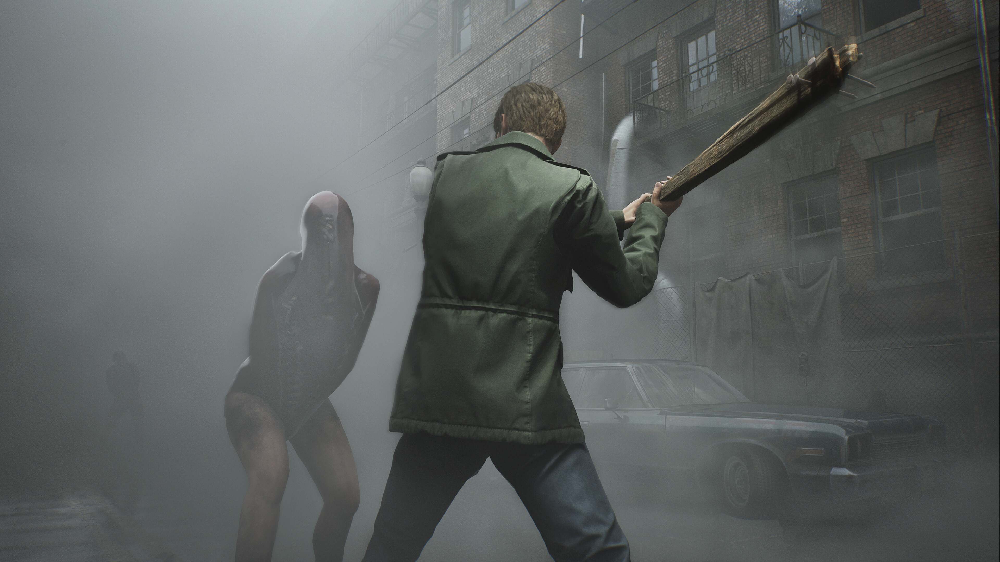
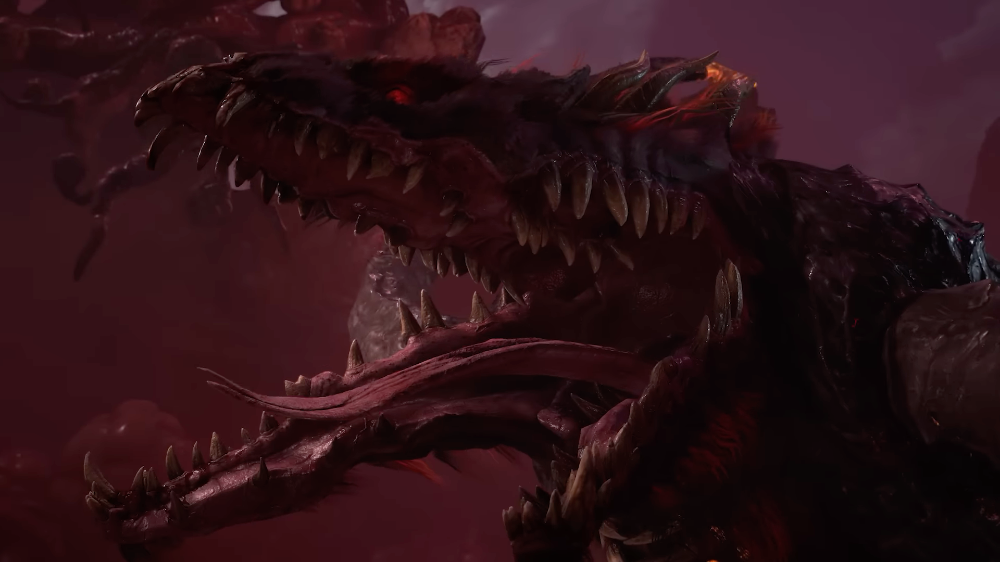

+++
title = "Silent Hill 2 Remake, Metaphor: ReFantazio : le récap des sorties de la semaine (13/10)"
date = 2024-10-13T07:00:02+01:00
draft = false
author = "Félix"
tags = ["C’est dispo"]
image = "https://nostick.fr/articles/2024/octobre/1310-les-sorties-de-la-semaine/silent.jpg"
+++

Entre la garderie, les courses et l’ordi du salon qui a rendu l’âme, vous n’avez peut-être pas eu le temps de vous intéresser aux nouveautés du moment. Qu’à cela ne tienne : voici les sorties de ces derniers jours qui ont retenu notre attention.

## Du brouillard en HD

Les gens de chez Bloober Teams ont dû souffler un ouf de soulagement en voyant tomber les premiers tests de leur remake de ***Silent Hill 2*** : tout est globalement positif. Il faut dire qu’on avait de quoi s’inquiéter, le studio s’attaquant à un monument du genre avec à son actif une poignée de jeux oscillant entre le sympathique (*Layers of Fear*) et le très moyen (*‌Blair Witch*). Heureusement, les tests décrivent une refonte sous UE5 très joli et fidèle à l’original. Bloober a enrichi la ville maudite de nouvelles zones et énigmes sans perdre l’esprit d’origine en route. Tout n’est pas parfait et certains dénotent quelques séquences un peu bof ou une expérience globale qui diffère un peu de celle de 2001, mais globalement ça passe large. Le réalisateur du jeu d’origine Masashi Tsuboyama a [adoubé](https://x.com/tsuboyama2024/status/1842186818718142712) cette relecture, alors franchement, vous ne devriez pas regretter votre argent si vous êtes client des jeux d’horreurs psychologique. 70 balles [sur PC](https://store.steampowered.com/app/2124490/SILENT_HILL_2/) et PS5.

## En attendant Persona 6

L’autre grosse sortie de la semaine était ***‌Metaphor: ReFantazio***, le nouveau gros JRPG d’Atlus. Le studio derrière la saga *Persona* s’éloigne du milieu scolaire pour proposer un univers de Fantasy baroque inspiré des tableaux de Bosch. Le roi a été assassiné et une élection se prépare pour choisir le futur souverain : notre personnage va devoir partir à la recherche du prince du royaume, touché par une malédiction et considéré comme mort. Bref, un pitch que l’on sent rempli de trahison et autre retournement de situations prétexte à nous faire visiter un univers fortement stylisé. Comme d’hab’ chez Atlus, les journées sont dédiées à améliorer ses stats et à papoter avant d’aller taper des monstres colossaux la nuit. Les combats sont un mélange d’action classique et de tours par tour qui a l’air réussi, et les testeurs saluent la bande-son ainsi que l’interface très léchée. Bref, ça a l’air d’être de la bonne came si vous accrochez à l’univers fantastique et que vous avez une centaine d’heures à occuper. 70 € [sur PC](https://store.steampowered.com/app/2679460/Metaphor_ReFantazio/), PS5, PS4 et Xbox Series. Notons qu’une démo est disponible qui permet de continuer sa sauvegarde dans le jeu complet.

 

## Vous reprendrez bien un peu de Diablo IV ?

La première extension pour ***Diablo IV*** est sortie cette semaine. Baptisée ***Vessel of Hatred***, celle-ci apporte tout un tas de contenus, à commencer par une campagne inédite commençant à la fin du titre original. On y suit un de nos compagnons de voyage à travers la jungle de la région de Nahantu, que l’on explorera pendant une douzaine d’heures. Les mercenaires de *Diablo* 2 et 3 signent leur grand retour tandis qu’arrive la nouvelle classe des Sacresprit. Ces sortes de moines spécialisés dans les arts martiaux seront bien utiles pour venir à bout des différents nouveaux ennemis qui se cachent dans la jungle. Les avis sont plutôt bons : les testeurs louent une campagne sympathique et une nouvelle classe fun, regrettant cependant une fin en demi-teinte et un certain manque de contenu au vu du prix. À vous de voir si vous avez envie de vous y remettre, auquel cas il faudra lâcher 40 € pour l’édition standard [sur Steam](https://store.steampowered.com/app/3043530/Diablo_IV_Vessel_of_Hatred/) et console.

## Point n’ think

Côté jeu indé nous avons pu voir arriver cette semaine ***Phoenix Springs***, un point n’ click futuriste qui a l’air assez bizarre. On y incarne une journaliste à la recherche de son frère qui finit par se retrouver à Phoenix Springs, une oasis du désert abritant une bien étrange communauté. Sans surprise il va falloir papoter et cliquer partout pour faire progresser l’intrigue, mais il y a un twist : l’inventaire de notre héroïne ne se remplit pas d’objets, mais d’idées, qu’il va être possible de combiner avec différents éléments de l’environnement. Le jeu est décrit comme très surréaliste, l’ambiance étant servie par un style BD très sympa mêlant 2D et 3D. Malgré son chouette univers et sa bonne réalisation, certains testeurs évoquent tout de même des énigmes parfois frustrantes qui risquent de laisser ceux qui cherchent juste un jeu relax sur le carreau. Si vous aimez vous remuer les méninges, les histoires ouvertes à l’interprétation, les films de Lynch ou les jeux comme *Kentucky Route Zero*, vous devriez y trouver votre bonheur. [19,50 €](https://store.steampowered.com/app/1973310/Phoenix_Springs/) sur Mac et PC.

 

## En rab’

La semaine dernière, j’ai oublié de vous parler de la sortie de ***‌Diplomacy is Not an Option*** : ce mélange de jeu de stratégie et tower defense a été très bien accueilli et mérite sans doute le coup d’œil si son univers féodal rigolo vous intéresse, d’autant plus qu’il n’est [qu’à 18,84 €](https://store.steampowered.com/app/1272320/Diplomacy_is_Not_an_Option/) pour fêter le lancement. Mis à part ça il y a un nouveau jeu ***Dragon Ball*** qui n’a pas l’air exceptionnel, mais qui devait faire le taf pour les fans de la série (ça sent le 6 ou 7 sur 10). Comptez 70 € [sur PC](https://store.steampowered.com/app/1790600/DRAGON_BALL_Sparking_ZERO/?l=french), Xbox ou PS5. Du côté des indés, l’action-RPG au style évoquant les créations Ghibli ***Europa*** a écopé de quelques bonnes notes. Il est désormais disponible [sur Steam](https://store.steampowered.com/app/2214880/Europa/) et sur Switch pour 15 €. Terminons en notant la sortie d’***Extra Coin*** ([5 €](https://store.steampowered.com/app/1290980/Extra_Coin/)) et de ***Last Time I Saw You*** ([17 €](https://store.steampowered.com/app/1909750/Last_Time_I_Saw_You/)), deux jeux narratifs visiblement réussis sur lesquels j’adorerais passer une dizaine d’heures si la vie n’était pas aussi courte.

