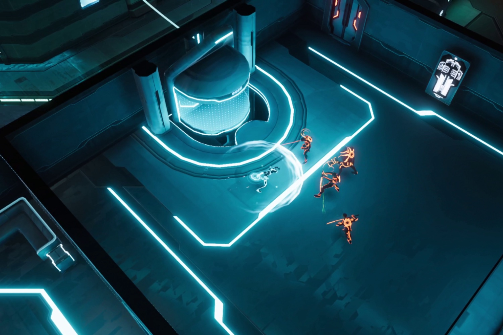

+++
title = "De la baston et des boucles temporelles pour Tron: Catalyst"
date = 2024-10-14T12:47:32+01:00
draft = false
author = "Mickael"
tags = ["Actu"]
image = "https://nostick.fr/articles/vignettes/octobre/tron-catalyst.jpg"
+++

On ne pourra pas enlever à Disney l'envie de tester des trucs avec la licence Tron. Après le visual novel (!) *Tron: Identity*  l'an dernier, les fans de néon retrouveront en 2025 *[Tron: Catalyst](https://www.bigfangames.com/games/tron-catalyst)* qui est cette fois un jeu d'action en vue isométrique qui n'a pas l'air mal du tout.

 

Le joueur incarnera Exo, un programme au cœur de l'Arq Grid, ce monde virtuel qui a prospéré loin des humains. Elle devra déterrer les sales petits secrets des maîtres de la grille, avec  à sa disposition son fameux disque-frisbee de la mort, sa super-moto du futur, et aussi un glitch qui lui permet de « revivre » des segments temporels. Un système de boucle qui rappelle celui de *Deathloop* et d'une myriade d'autres jeux, mais si c'est bien fait pourquoi pas.

La baston en elle-même a un petit côté *Hades*, avec des attaques au corps à corps et à distance, et tout un arbre de capacités pour le disque. Il faudra également mener l'enquête avec des choix de dialogue pour faire avancer le scénario. *Tron: Identity* ne sera pas en monde ouvert, mais les niveaux seront tout de même suffisamment gros pour laisser place à l'exploration.

Ce nouveau jeu *Tron* est une sorte de suite à *Indentity*, même s'il ne sera pas nécessaire d'y avoir joué au préalable. *Catalyst* est développé par Bithell Games et édité par Big Fan, le nouvel éditeur de Devolver pour les jeux à licence ambitieux. Il sortira sur PC, Switch, PS5 et Xbox Series S/X en 2025 donc.