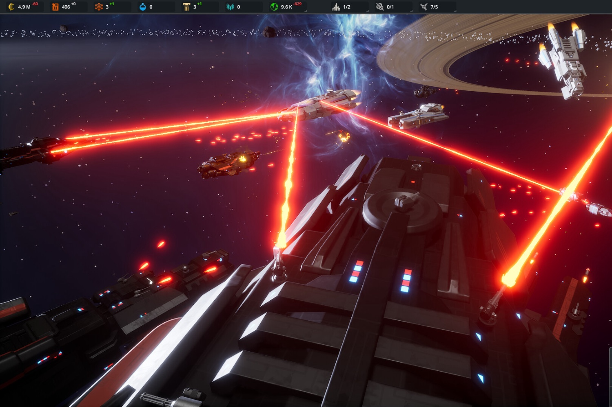

+++
title = "Beyond Astra : le 4X pour explorer d'étranges nouveaux mondes"
date = 2024-10-14T08:07:32+01:00
draft = false
author = "Mickael"
tags = ["Actu"]
image = "https://nostick.fr/articles/vignettes/octobre/beyond-astra.jpg"
+++

Je vais vous dire, c'est déjà bien compliqué de devenir le maître du monde, alors maître de la galaxie ? C'est pas une vie. Et c'est pourtant ce que propose *Beyond Astra*, un 4X développé par Nebule Games. Le joueur partira de son coin de planète à faire évoluer, puis viendra le temps de la conquête spatiale avec tout ce que cela implique de rencontres et de bagarres.



Le gameplay permet de basculer de l'infiniment petit (la surface d'une planète) à l'infiniment grand (l'univers tout entier). Gestion de l'économie, de la recherche, de la politique, de la culture, du soutien militaire… Oui, les 4X sont toujours assez exigeants et peuvent se transformer en un passe-temps dévorant, mais quand c'est bien fait, le plaisir est au rendez-vous. 

Le plus remarquable dans toute cette histoire, c'est que *Beyond Astra* est conçu par une équipe composée… d'un seul développeur, le frenchie Valentin Simonelli ! Il a voulu rendre hommage à toutes ses influences, comme les jeux *Age of Empires* et *Civilization* bien sûr, mais aussi des films comme *2001* et *Metropolis*.

Une démo gratuite du jeu est dispo sur [Steam](https://store.steampowered.com/app/2669060/Beyond_Astra/), tandis que la version finale est prévue pour l'année prochaine. Un [Kickstarter](https://www.kickstarter.com/projects/nebulegames/beyondastra) a été fraîchement lancé pour tous ceux qui voudront donner un coup de main et repartir avec des goodies (dont une collector's box).