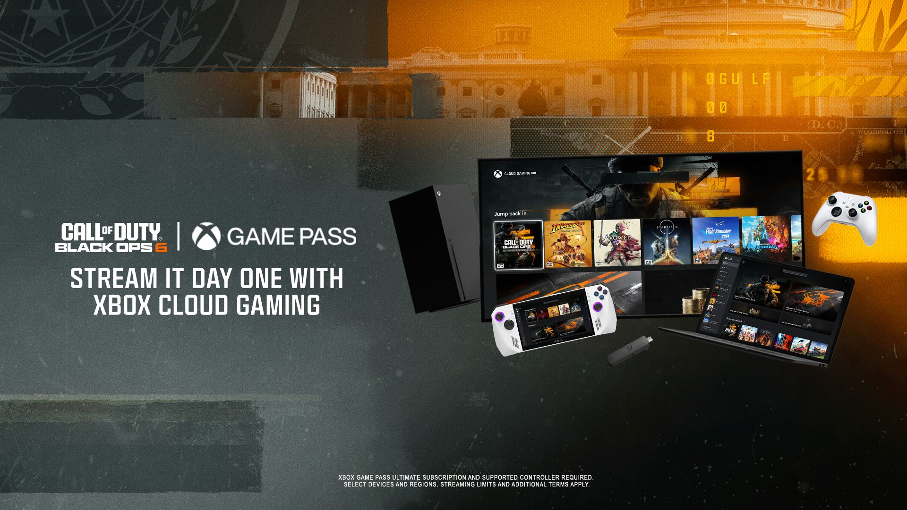

+++
title = "Le dernier Call Of arrive sur le Xbox Cloud Gaming avec Warzone et MW3"
date = 2024-10-14T18:30:32+01:00
draft = false
author = "Félix"
tags = ["Actu"]
type = "telex"
+++

*Pan pan ratatatata BANG paf*. Vous avez reconnu ? Mais oui, c’est bien le bruit de 3 opus de *Call of Duty* qui débarquent en même temps sur le Xbox Cloud Gaming ! *Modern Warfare III*, *‌Warzone* et même le futur *Black Ops 6* seront disponibles le 25 octobre en streaming sur le service de Microsoft. Hasard du calendrier (non), c’est à cette date que sortira le 21e opus de cette célèbre saga qui revient chaque automne depuis 2005.

« *C'est une première pour la franchise Call of Duty et une victoire pour la communauté* », a déclaré une cadre Xbox dans [un communiqué](https://news.xbox.com/en-us/2024/10/14/call-of-duty-coming-to-cloud-october-25/). Le dernier *Call of* sera donc disponible sur tout un tas de plateformes à son lancement comme les casques Quest, les Steam Deck-like et certaines TV connectées. L’annonce tombe alors que Microsoft s’apprête à vendre [des jeux Xbox sur Android](https://nostick.fr/articles/2024/octobre/1110-microsoft-jeux-xbox-android/) tout en lançant un équivalent maison [de GeForce Now](https://nostick.fr/articles/2024/octobre/1110-abonnes-xbox-cloud-gaming-stream-jeux/). Pour les curieux, le Game Pass Ultimate est facturé 18 balles par mois dans l’Hexagone. 