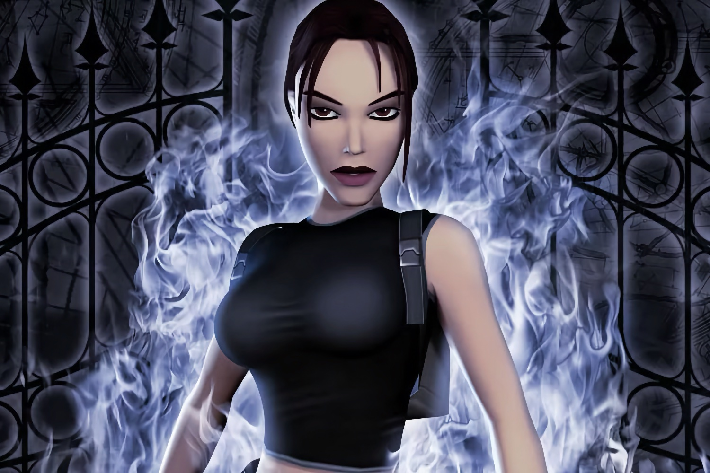

+++
title = "Surprise (non) : il y aura bien un remaster de la deuxième trilogie Tomb Raider"
date = 2024-10-14T08:47:32+01:00
draft = false
author = "Mickael"
tags = ["Trailer"]
image = "https://nostick.fr/articles/vignettes/octobre/lara-croft-angel-darkness.jpg"
+++

On aurait pu parier gros sur cette annonce (sans gagner grand chose vu que tout le monde aurait vu juste) : Aspyr va lancer le 14 février prochain une nouvelle compilation de remasters *Tomb Raider* ! Après la première trilogie *Tomb Raider I-III Remastered Starring Lara Croft* (oui c'est le nom au complet) sortie en début d'année, voici venir *Tomb Raider IV-VI Remastered* — et on espère que Lara Croft sera bien de la partie !

 

Cette deuxième trilogie comprend *Tomb Raider: The Last Revelation* (1999), *Tomb Raider: Chronicles* (2000) et *Tomb Raider: The Angel Of Darkness* (2003). Si les deux premiers s'inscrivent dans la lignée des précédents titres, le cas d'*Angel of Darkness* est intéressant : Core Design avait tenté quelque chose d'un peu différent histoire de donner un second souffle à une licence complètement lessivée. Il s'agissait aussi de lancer Lara Croft dans le grand bain de la PS2.

Le résultat a été catastrophique, avec des gros morceaux du jeu retirés au dernier moment pour tenir la date de lancement, des tas de bugs et de sérieux problèmes de gameplay. Aspyr va-t-il faire des miracles ? On aura en tout cas droit à des graphismes améliorés et à une jouabilité modernisée (dans les deux cas, il sera possible de choisir l'expérience originelle).

Après le four d'*Angel of Darkness*, Crystal Dynamics reprend le flambeau, Core Design ayant fermé ses portes en 2006 (les deux studios appartenaient au groupe Eidos). Une troisième trilogie a été développée sous l'égide de Crystal Dynamics (*Legends*, *Anniversary* et *Underworld*). Sera-t-elle également portée sur nos machines modernes par Aspyr ? Prenons les paris.