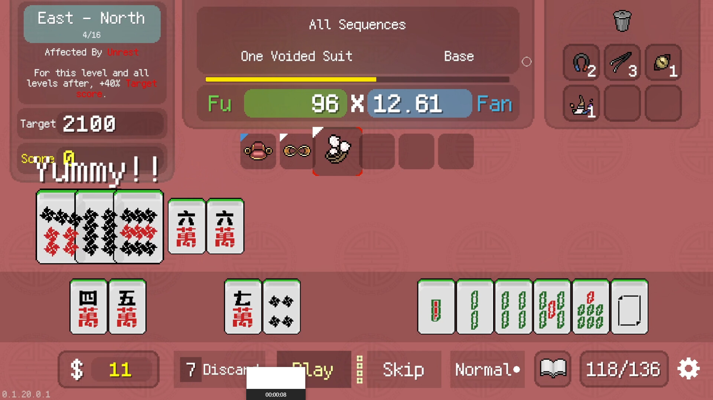
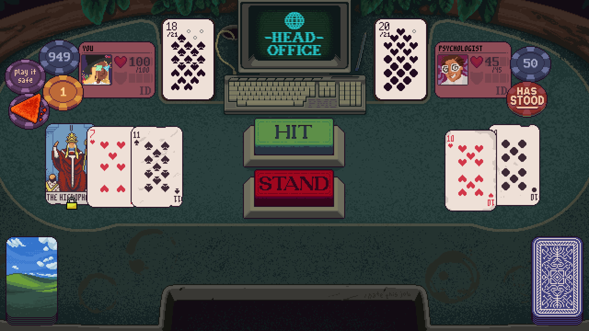
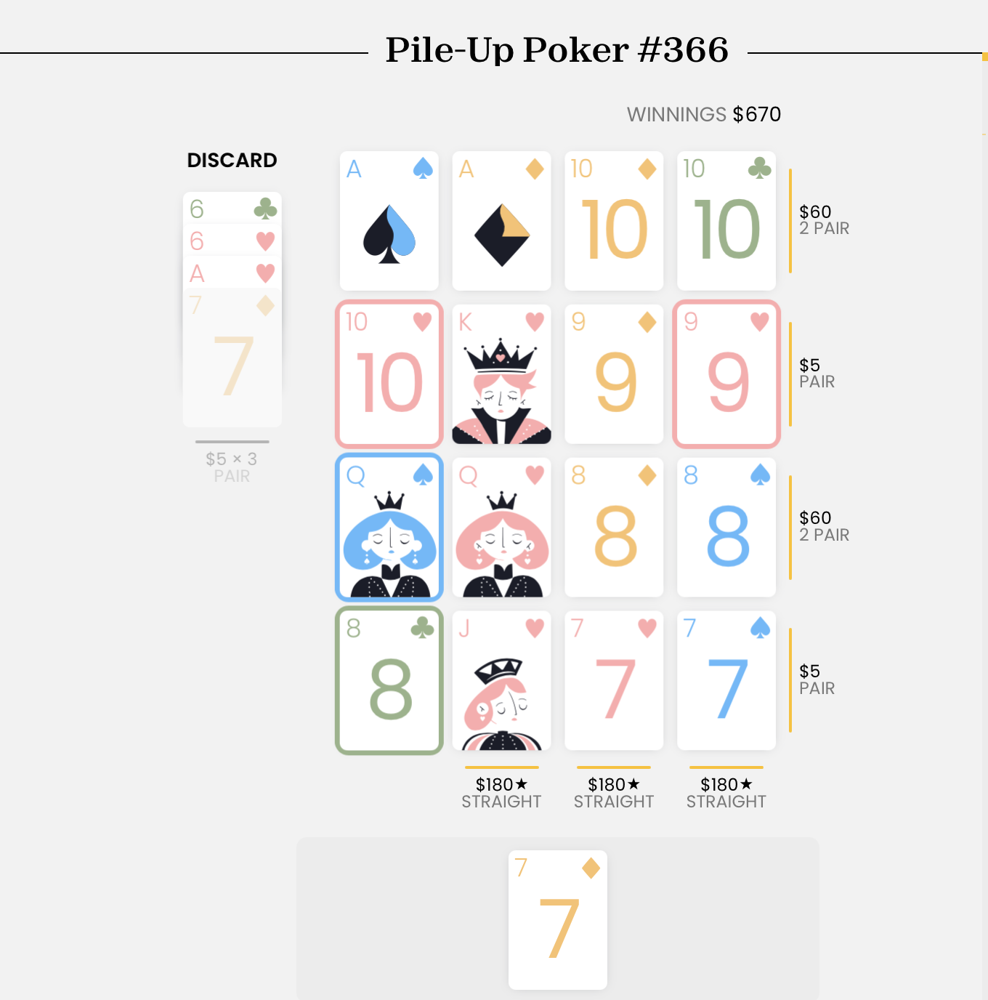

+++
title = "Mah-Jong, Pachinko, Blackjack : quand Balatro inspire les développeurs"
date = 2024-10-15T19:25:00+01:00
draft = false
author = "Félix"
tags = ["Actu"]
image = "https://nostick.fr/articles/2024/octobre/0810-remake-until-dawn-peine-a-trouver-son-public/untildawn.jpg"
+++

 

Rançon de la gloire, *Balatro* a eu le droit à [plusieurs clones](https://nostick.fr/articles/2024/mai/3105-non-balatro-nest-pas-sur-mobile/) tentant de surfer sur son addictive formule mélangeant poker et roguelite. S’il s’agit globalement de [repompes moches](https://apps.apple.com/fr/app/joker-card/id6480343238) et [bardées de microtransactions](https://apps.apple.com/fr/app/jokerpoker-balala/id6478941798) (sérieux Apple faites le ménage !!), certains développeurs ont été un peu plus inspirés et on décidé d’adapter le concept à d’autres jeux. 

*‌Aotenjo* se veut être un roguelike du mah-jong dans lequel il va falloir compléter une seule main pour faire péter les scores. Les développeurs expliquent s’inspirer de tout un tas de règles différentes, et comme dans *Balatro*, le joueur débloque différentes améliorations au fur et à mesure de la partie. Les quelques screens disponibles montrent un jeu qui a l’air un peu brut de décoffrage, mais *[PCGamer](https://www.pcgamer.com/games/roguelike/aotenjo-roguelike-crosses-balatro-with-mahjong-and-even-just-the-demo-is-proving-a-grave-threat-to-my-free-time/)* y a joué et explique que c’est hautement addictif : ça pourra aussi être l’occasion d’apprendre les règles du mah-jong si vous ne les connaissez pas afin de briller en société. Le jeu n’est pas encore sorti, mais il y a une démo [sur la page Steam](https://store.steampowered.com/app/3066570/Aotenjo/), alors pourquoi pas.

 

*‌Dungeons & Degenerate Gamblers* est un roguelike d'aventure basé sur le blackjack. Les parties se veulent aléatoires étant donné que les cartes sont de plus en plus absurdes, et on pourra récupérer des cartes de visite, des cartes d'anniversaire ou des cartes de tarot. Pour vous donner un exemple, la carte de sécu ajoute à votre jeu toutes les cartes dont votre adversaire s'est débarrassé. Le jeu incite à battre les différents joueurs d’une étrange taverne et à améliorer son deck au fil des parties. Le titre coûte [15 € sur Steam](https://store.steampowered.com/app/2400510/Dungeons__Degenerate_Gamblers/), où il affiche des évaluations positives.

*Pile-Up Poker* est un petit jeu rigolo mélangeant poker et solitaire. Vous récupérez 5 cartes à chaque manche qu’il faut poser sur une grille en 4x4 de manière à faire des mains puissantes, autant horizontalement que verticalement. La formule marche bien et se corse vite : c’est à tester sachant que cela fonctionne directement [dans le navigateur](https://www.puzzmo.com/+/thehour/play/pile-up-poker/3lcl8304n) (ça passe bien sur téléphone).

 

Terminons en évoquant *‌Ballionaire*, un jeu édité par Raw Fury (*Dome Keeper, Star Trucker*) qui s’inspire du [pachinko](https://fr.wikipedia.org/wiki/Pachinko), ce croisement entre un flipper et une machine à sous très populaire au Japon. Ici, il va s’agir de créer son plateau parfait avant d’envoyer une bille percuter les éléments et faire un maximum de combos. On s’éloigne pas mal de *Balatro*, mais [les premiers retours](https://rogueliker.com/ballionaire-demo/) parlent d'un jeu très fun qui a depuis quelque temps une démo [sur Steam](https://store.steampowered.com/app/2667120/Ballionaire/) : ça mérite sans doute le coup d’œil si vous cherchez un nouveau jeu aux parties rapides pour tuer le temps sur la pause midi.

