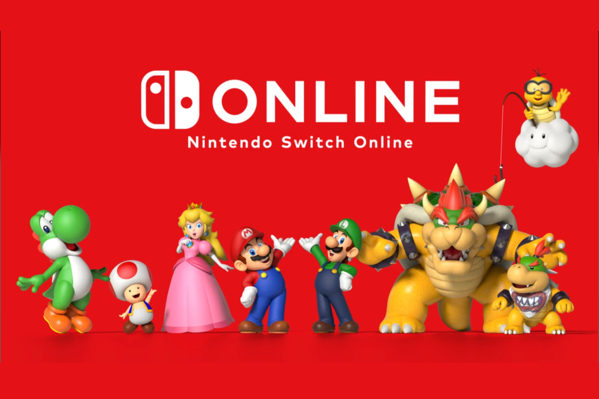
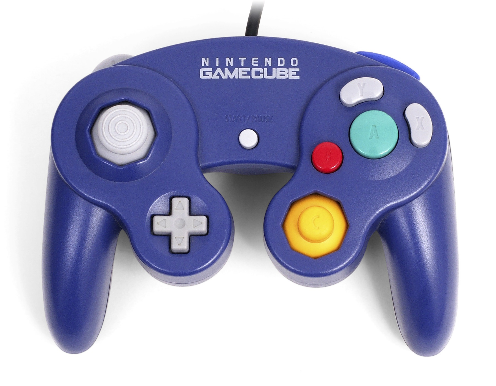

+++
title = "Attention, Nintendo promet de l'excitation pour le Swich Online"
date = 2024-10-15T11:47:32+01:00
draft = false
author = "Mickael"
tags = ["Actu"]
image = "https://nostick.fr/articles/vignettes/octobre/NSO.jpg"
+++

On accole rarement le qualificatif « *excitant* » au Switch Online. Le service en ligne de Nintendo n'a en effet rien de franchement sexy, c'est même perçu comme un mal nécessaire pour bon nombre de joueurs qui veulent jouer en ligne, s'adonner à des jeux old school ou acheter des manettes rétro. Le constructeur promet pourtant de l'« *excitation* » en 2025 pour les membres abonnés au NSO + Pack additionnel, dans un [courriel](https://www.gonintendo.com/contents/41530-nintendo-recognizes-3-years-of-switch-online-expansion-pack-says-stay-tuned-for) envoyé à des abonnés comblés.

 

Excitant comme de nouveaux jeux Megadrive ? La sélection de jeux Sega plafonne depuis des mois, sans espoir de nouveautés. Excitant comme le DLC de *Splatoon 3* qui pourrait être fourni « gratuitement » ? Erfff. L'« Octo Expansion » pour *Splatoon 2*, disponible sans frais supplémentaires avec l'abonnement, est bien sympathique, mais il faut posséder le jeu au préalable, et c'est la même chose pour les DLC d'*Animal Crossing* et de *Mario Kart 8* (bon, celui-là tout le monde l'a).

Excitant comme une amélioration de l'accès aux serveurs pour le jeu multi ? Ça, ça serait effectivement bienvenu ! Alors, une année 2025 excitante comme… des jeux GameCube ? Ah, peut-être bien ! La console manque en effet au tableau de chasse du NSO, et [plusieurs rumeurs](https://www.nintendolife.com/news/2024/10/rumour-nintendo-might-be-gearing-up-for-a-gamecube-controller-comeback) font état de la mise en chantier d'une manette GameCube pour le Switch Online.

Ce périphérique enrichirait un catalogue qui contient des manettes NES, SNS, Megadrive et N64. Nintendo pourrait réserver l'accès aux jeux GameCube à la Switch 2 : la Switch première du nom pourrait en effet avoir du mal à offrir la puissance nécessaire à l'émulation de cette console.

Le hic, c'est que Nintendo n'aime rien tant que porter (et vendre au prix fort) ses jeux GameCube sur la Switch : *Metroid Prime Remastered*, *Pikmin 1/2*, *Paper Mario*, *Super Mario Sunshine*… Il ne va plus rester beaucoup de jeux GameCube pour le futur NSO ! 