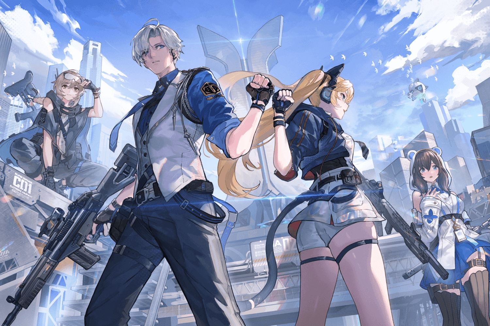

+++
title = "Strinova alterne entre les dimensions pour se démarquer"
date = 2024-10-15T09:30:32+01:00
draft = false
author = "Mickael"
tags = ["Actu"]
image = "https://nostick.fr/articles/vignettes/octobre/strinova.jpg"
+++

 

Lancer un *hero shooter* en 5v5 relève aujourd'hui soit de la folie furieuse, soit d'une foi de charbonnier dans son concept. Le studio iDreamSky a choisi la deuxième option pour *[Strinova](https://www.strinova.com)*, un jeu de tir à troisième personne, qui oppose 5 joueurs contre 5. On a déjà vu ça mille fois, nombreux sont les appelés, et bien peu sont finalement élus.

 

De prime abord, le titre a l'air voué au flop, mais *Strinova* mise sur une idée de gameplay amusante : les héros peuvent passer de la 3D classique à la… 2D (le processus dit de « stringification »). Un peu à l'image de *Zelda: A Link Between Worlds*, le joueur devient aussi fin que du papier, il peut alors s'envoler et même se coller aux murs. Il devient dès lors beaucoup plus difficile à viser ! Mais revers de la médaille, collé à un mur le champ de vision est aussi beaucoup plus restreint.

Il faudra donc alterner entre ces deux dimensions pour espérer remporter une bataille. Un mécanisme astucieux, mais il faudra voir s'il sera suffisant pour sortir *Strinova* du lot. Pour le reste, le jeu s'annonce en effet très classique. Les différents membres d'une équipe pourront choisir une des trois factions pour faire la chasse à des cristaux d'énergie : les P.U.S. veulent conserver le monde comme il est (ils jouent en défense), les ~~vieux cons de droitards~~ Scissors voudraient retourner dans un passé fantasmé (ils jouent en attaque), et les Urbino sont des mercenaires soi-disant neutres qui peuvent s'allier avec les ou avec les autres (défense ou attaque).

Autre mécanisme à prendre en compte, chaque perso possède deux capacités spéciales qui ont un impact sur la mobilité, la précision et la puissance du héros. À la fin de chaque match, les compteurs sont remis à zéro. Plusieurs modes seront proposés : Demolition, Escort, Team Deathmatch, ou encore un 7v7 parce que plus y a de fous… Le jeu sortira bientôt sur PC, mais avec une version consoles en 2025 et une mouture mobile pour plus tard encore. Pour le moment, iDreamSky enchaîne les bêtas fermées.