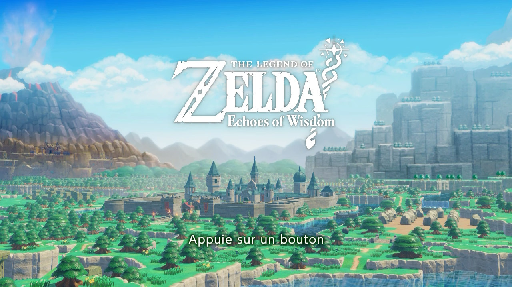

+++
title = "Test de Zelda: Echoes of Wisdom, un jeu trop sage"
date = 2024-10-15T10:47:32+01:00
draft = false
author = "Mickael"
tags = ["Test"]
type = "une"
image = "https://nostick.fr/articles/vignettes/octobre/zelda-echos-of-wisdom.jpg"
+++

**Depuis le temps qu'on attendait ça, Zelda est finalement l'héroïne d'un jeu qui porte son nom. Et ça n'est pas la seule originalité de cet *Echoes of Wisdom*… qui malheureusement n'en fait pas autant qu'on le voudrait.**

*The Legend of Zelda: Echoes of Wisdom* répare une injustice. Alors qu'elle joue un rôle central dans la saga de Nintendo, la princesse tutélaire n'a jamais été une protagoniste jouable[^1].  Cette fois, Zelda prend les choses en main et armé de sa sagesse, elle embarque dans une aventure au long cours qu'on aurait aimé plus palpitante.

## The Legend of Zelda: Echoes of Wisdom, ça parle de quoi ?

Allons bon, voilà que des failles sont apparues dans tout Hyrule, qui avalent les habitants et régurgitent des monstres menaçants. Habituellement, le boulot de régler ce genre de problème revient à Link, mais le héros étant momentanément absent, c'est Zelda qui doit prendre sa place !

 

La princesse ne sera pas seule pour autant dans cette aventure. Elle a en effet la capacité de reproduire des objets et des créatures qui lui seront bien utiles pour franchir les obstacles et triompher de l'adversité. Le tout en vue de dessus, comme il se doit dans tout bon Zelda…

## Comment ça se joue ?

Comme un Zelda en 2D… ou comme *Link's Awakening*. Ce n'est pas une surprise, le remake du jeu Game Boy sorti sur Switch en 2019 et *Echoes of Wisdom* sont le travail d'un seul et même studio, Grezzo. Qui cette fois, a eu [les coudées franches pour créer une aventure Zelda originale](https://nostick.fr/articles/2024/septembre/2409-echoes-of-wisdom-commence-par-zelda-maker/), à tel point que Nintendo est resté en arrière-plan. 

La grande surprise du jeu, c'est bien évidemment le changement de héros. Link étant absent contraint et forcé durant la très grande partie du jeu, c'est donc Zelda qui doit sauver Hyrule ! Franchement, il était temps que la princesse titulaire de la franchise prenne toute la lumière, elle le mérite. 

Et si Zelda n'a pas les mêmes atouts que son chevalier servant (bien que, on va y revenir), elle peut faire appel à des « échos », autrement dit des objets et des personnages enregistrés tout au long de l'aventure grâce à un sceptre magique. C'est Tri, une sorte de fée luciole, qui lui donne ce pouvoir et son rôle auprès de la princesse sera crucial.

Ces échos sont la clé qui va permettre à Zelda de triompher du mal qui ronge Hyrule. Ils ne sont pas gratuits pour autant : chacun a un coût représenté par des triangles dorés que Tri emporte derrière elle. Au fil des pérégrinations du duo, Tri gagnera des triangles supplémentaires, ce qui permettra en retour à Zelda de convoquer plus d'échos, ou des échos plus puissants.

Le jeu nous donne donc accès à une boîte à outils dans laquelle piocher pour résoudre les énigmes, franchir les obstacles… et taper sur les monstres à votre place ! Il est d'ailleurs assez amusant de trouver les échos à opposer aux créatures, suivant le bon vieux principe du chi-fou-mi. Mais Zelda n'est pas démunie pour autant. Elle peut aussi se transformer en « épéiste », en fait un écho de Link, dont l'équipement (épée, arc…) s'enrichit au fil de l'aventure.

L'épéiste ne reste pas très longtemps : une jauge limite en effet le temps disponible avec l'écho. Dans un sens, c'est tant mieux : après tout, on n'est pas là pour jouer avec Link, mais avec Zelda ! De plus, en dehors des boss, les moments où Link est absolument indispensable ne sont guère nombreux. 

## Qu'est-ce qui est bien ?

Cela fait des années que les fans réclamaient le retour d'un jeu Zelda en vue de haut. Ils ont été entendus : *Echoes of Wisdom* reprend la recette d'origine, avec toutefois une pincée de *Zelda II* — de nombreux passages sont à parcourir en 2D vue de côté. Le mélange, déjà à l'œuvre dans *Link's Awakening* bien sûr, est parfaitement fonctionnel et le passage de l'une à l'autre vue est rafraîchissant.

Le système des échos est amusant, c'est toujours un plaisir de trouver une solution à un puzzle (il y en a à chaque fois plusieurs) ou d'envoyer un Lynel tabasser des méchants ! Les échos permettant aussi d'explorer plus facilement Hyrule, que l'on peut découvrir à son rythme et comme on le souhaite, à la manière des derniers Zelda 3D. 

Tri apporte également un mécanisme de magnétisme avec des objets et de synchronisation avec leurs mouvements. On peut ainsi déplacer des montagnes, quasi-littéralement ! Ce pouvoir est utilisé de façon très intelligente dans les donjons (pas suffisamment à mon goût).

Si Hyrule et son monde ouvert contiennent pas mal de quêtes et de missions, une grande partie de l'aventure se déroule dans les failles et dans des donjons. Les failles sont au cœur du jeu, puisque Tri a pour mission de les refermer. Le monde extérieur s'y reflète, mais tout est figé et cassé, ce qui nécessite d'exploiter les échos de manière originale pour les explorer.

Quant aux donjons, ils sont la plupart du temps bien fichus (mention spéciale au temple de Firone) et astucieux. Les joueurs qui réclamaient le retour des donjons quelque peu délaissés avec les deux derniers Zelda 3D seront servis même s'il faut reconnaitre qu'en venir à bout est relativement facile, comme l'aventure en général dans *Echoes of Wisdom*.

Niveau graphique, sans trop de surprise le studio Grezzo conserve le style choupi/jouets en plastique de *Link's Awakening* qui plait à certains et pas à d'autres, mais les goûts et les couleurs… Il faut reconnaitre que tout y est très mignon, on a envie de serrer les monstres dans nos bras ! Le revers de la médaille, c'est que les enjeux de l'histoire — et ils sont importants mine de rien, on parle de fin du monde ! — sont planqués derrière cette couche de clinquant.

Si on ajoute à cette esthétique la facilité relative du jeu et la redondance de certains dialogues, *Echoes of Wisdom* pourrait donner l'impression d'être pour les plus jeunes. Les joueurs plus blasés qui passeront à côté en haussant les épaules louperont une histoire pas désagréable à suivre et des mécanismes inédits qui renouvellent la facture classique des Zelda. Il sera pourtant difficile de leur en vouloir car…

## Qu’est-ce qui est moins bien ?

… *Echoes of Wisdom* n'est pas un sans-faute malheureusement. Le principe des échos secoue la formule des Zelda et ça c'est très bien. Encore faut-il pouvoir les utiliser : Nintendo n'a rien trouvé de mieux que d'aligner les échos les uns derrière les autres dans une ligne qui devient rapidement très longue. Il y a bien quelques options de tri (par ordre de mémorisation, par coût, par type…), mais il n'y a pas de favoris ni de critères personnalisés.

Il faut toutefois reconnaitre qu'on prend rapidement l'habitude d'en utiliser quatre ou cinq sur la centaine que l'on peut enregistrer (sans compter les automates d'Igor qui arrivent trop tard et ne servent hélas pas à grand chose). L'exemple caricatural, c'est celui du lit : je pense que la moitié des puzzles du jeu peuvent être résolus avec cet écho, que l'on empile pour créer un escalier de fortune.

Et c'est sans compter son autre usage : Zelda peut s'y reposer en tout temps pour récupérer des cœurs (y compris pendant les combats de boss entre deux phases !). Voilà qui nous amène directement à un autre problème de gameplay : le système de frappés. Ici et là dans Hyrule, des marchands proposent de créer des frappés en mélangeant deux ingrédients. Des dizaines de recettes peuvent être trouvées de la sorte, qui permettent à la princesse de regagner des cœurs, de l'énergie pour l'épéiste, et d'autres capacités (nager plus longtemps, etc.).

Sur le papier, l'idée est bonne et je dois avouer que dans certaines batailles avec des boss un peu coriaces, j'ai dû avaler un ou deux frappés pour éviter de mourir bêtement. Mais la plupart du temps, les boissons ne servent pas à grand chose, si ce n'est à terminer une mission secondaire.

Dans le combat de fin, qui se déroule en plusieurs phases avec l'aide d'un allié, Zelda tient finalement un rôle de soutien qui détonne par rapport au reste du jeu. L'aventure se termine en effet avec une héroïne en retrait de l'action, alors qu'elle en a été le moteur principal. C'est d'autant plus étonnant que la toute dernière partie est intéressante, avec un boss hargneux et original.

Plus globalement, si j'ai apprécié explorer la carte d'Hyrule en long, en large et en travers, il faut reconnaitre qu'elle n'est pas spécialement grande. Une surprise, et une petite déception après *Tears of the Kingdom* qui proposait deux maps absolument immenses pour le prix d'une !

Zelda peut traverser Hyrule à pied assez rapidement, et le jeu donne en plus deux autres moyens d'accélérer la cadence : avec un canasson et des téléporteurs. C'est sûr, on évite de perdre du temps pour se rendre d'une quête à une autre, mais c'est peut-être trop d'options ?

Enfin, difficile de faire l'impasse sur les chutes de framerate du jeu. La Switch étant ce qu'elle est — une machine avec des composants vieux de dix ans —, la question des performances se pose immanquablement, mais les jeux de Nintendo parviennent souvent à faire des miracles : *Tears of the Kingdom* semble rouler sur une autre console ! 

Hélas, Nintendo n'est toujours pas parvenu à refiler la martingale à Grezzo : le studio n'a pas résolu ses problèmes de ralentissement. Très visibles dans *Link's Awakening*, ils le sont aussi *Echoes of Wisdom* (vous pouvez y jeter un œil dans cette éclairante [vidéo](https://www.youtube.com/watch?v=XhHFABnLfVg) de *Digital Foundry*). Néanmoins, les ralentissements surviennent surtout dans le monde ouvert ; les donjons, plus ramassés, se parcourent habituellement à 60 FPS. Une bonne partie du jeu s'y déroulant, c'est moins gênant. Mais bon, vivement la Switch 2…

## C'est oui ou c'est non ?

Qui aime bien châtie bien. Le nombre de trucs moins bien listés dans la précédente partie de ce test plomberait n'importe quel jeu et suffirait largement à justifier une retentissante recommandation négative. Malgré ces défauts, *Echoes of Wisdom* parvient à s'en sortir, d'abord parce qu'il s'agit d'un représentant plutôt sympa de la prestigieuse lignée des Zelda.

Et même de plusieurs lignées, puisqu'on y retrouve bien sûr la *vibe* des Zelda 2D, mais aussi celles des récents épisodes en 3D. La synthèse est intéressante, et retrouver des donjons dignes de ce nom fait plaisir. Entre les mécanismes des échos, de l'épéiste, et le magnétisme de Tri, c'est une sacrée boîte à jouets que Nintendo et Grezzo nous offrent ici. C'est presque trop : certaines manipulations servent une fois ou deux, et c'est tout (parfois on les oublie complètement).

Le plus gros problème d'*Echoes of Wisdom* finalement, c'est qu'il déboule après ces deux monstres que sont *Breath of the Wild* et *Tears of the Kingdom*, deux chefs d'œuvre qu'il sera bien difficile de dépasser. C'est pourquoi le chemin de traverse pris par Grezzo avec cet opus dédié à Zelda était aussi risqué qu'intéressant : puisqu'il est inutile de se battre sur le même terrain que cette nouvelle lignée, pourquoi ne pas revenir aux sources tout en injectant de nouveaux mécanismes ?

Le pari n'est malheureusement pas complètement réussi. Reste une aventure d'une bonne vingtaine d'heures avec pas mal de moments « eurêka ! » et l'impression d'être passé à côté d'une bonne idée.

*Le jeu a été testé sur Switch OLED.*

[^1]: À quelques exceptions près bien sûr, comme dans les opus sur CD-i (les tristement fameux *Zelda's Adventure* et *Zelda: The Wand Of Gamelon*), dans les spin-off *Hyrule Warriors* ou encore dans *Smash*.

 
