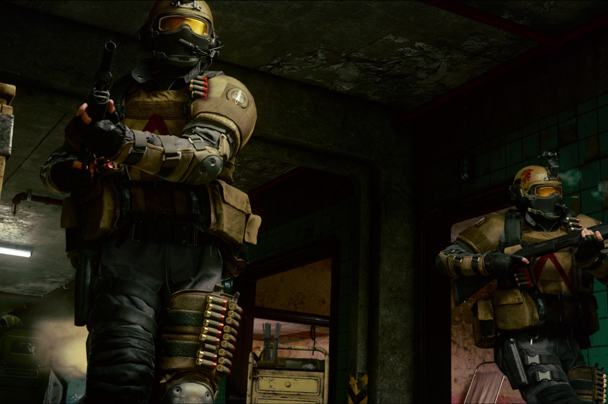

+++
title = "Plus de 100 Go pour Call of Duty: Black Ops 6"
date = 2024-10-16T08:04:32+01:00
draft = false
author = "Mickael"
tags = ["Actu"]
type = "telex"
+++

Tous les ans, c'est la même histoire : les fans de *Call Of* font le ménage dans leur PC et dans leur console pour installer le nouvel épisode. C'est que ça pèse lourd, ces bestiaux ! Et le *Black Ops 6* qui sort le 25 octobre (dans moins de dix jours donc) ne fera pas exception à la règle. Activision a [donné](https://www.callofduty.com/uk/en/blog/2024/10/call-of-duty-black-ops-6-pc-trailer-specs-preloading-intel) tout plein d'infos techniques sur le jeu et notamment l'espace disque nécessaire pour l'installer sur PC. Ce sera 102 Go.

 

Un beau bébé donc, mais trois fois moins lourd que ce que Microsoft avait annoncé il y a quelques mois (et dans la droite lignée des blockbusters actuels). On respire ! Pour ceux qui ont une petite connexion web, il est possible d'activer le pré-chargement à partir du 21 octobre. Rappelons que les joueurs qui ont au contraire une grosse connexion auront *[la possibilité de jouer à Black Ops 6 en streaming](https://nostick.fr/articles/2024/octobre/1410-call-of-game-pass-ultimate/)*, avec le service Xbox Cloud Gaming du Game Pass Ultimate.