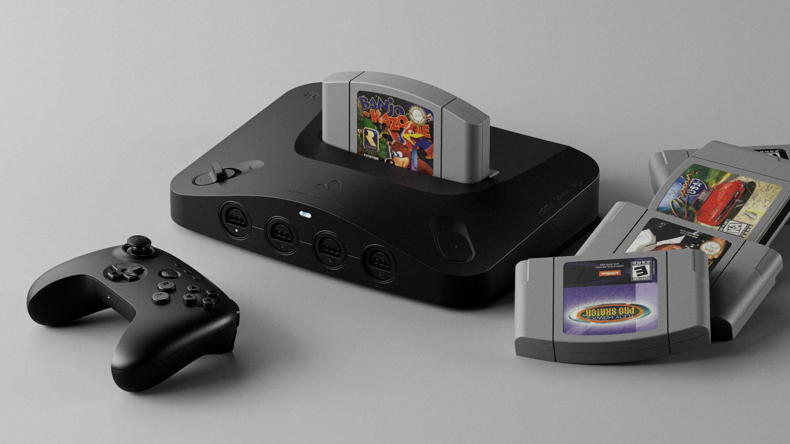
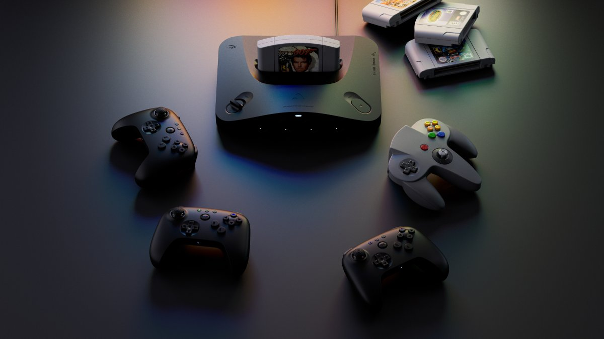

+++
title = "La Nintendo 64 4K d’Analogue sera lancée début 2025"
date = 2024-10-15T19:00:00+01:00
draft = false
author = "Félix"
tags = ["Actu"]
image = ""
+++

 

Cela fait maintenant un an qu’a été [annoncé](https://nostickreloaded.substack.com/p/la-nintendo-64-revient-des-joueurs?utm_source=publication-search) l’Analogue 3D, une version modernisée de la Nintendo 64 prenant en charge les cartouches d’origine et pouvant cracher les jeux en 4K. Bonne nouvelle si vous vous sentez de lâcher les 250 $ demandés (hors taxes et frais de port) : la machine [sera lancée](https://www.analogue.co/3D) au premier trimestre 2025, avec des précommandes [ouvrant le 21 octobre](https://store.analogue.co/). Analogue en a profité pour dévoiler de premières images, et il faut bien admettre que c’est joli :

 

 

La machine embarque 4 ports pour les manettes d’époque, mais accepte aussi les pads Bluetooth. On y trouve aussi un lecteur de carte SD et deux ports USB. Un OS maison est inclus avec des filtres pour retrouver les effets des vieux moniteurs CRT et éviter que tout ne fasse trop net sur votre TV Ultra 8K OLED qui prend tout le mur. Aucune manette n’est livrée dans la boîte, mais Analogue a bossé avec le spécialiste 8BitDo pour proposer son propre modèle vendu 40 $ qui fonctionnera également avec un PC ou une Switch.

Cette console est particulièrement intéressante étant donné qu’elle ne repose pas que sur une émulation logicielle : Analogue explique se baser sur un circuit intégré programmable (FPGA) afin d'émuler la machine de Nintendo au niveau hardware. L’entreprise vante une compatibilité avec 100 % des cartouches et ne promet « *aucune émulation* » même si en pratique ça reste un peu plus compliqué que cela : il y a bien un émulateur exécuté dans le FPGA. La Nintendo 64 est une console assez difficile à émuler avec son lot de bizarreries (les sauvegardes se faisaient sur un Controller Pack dans la manette), et même les solutions officielles de Nintendo sur le Switch Online [ont parfois du mal](https://twitter.com/stopskeletons/status/1452901471553351680). 