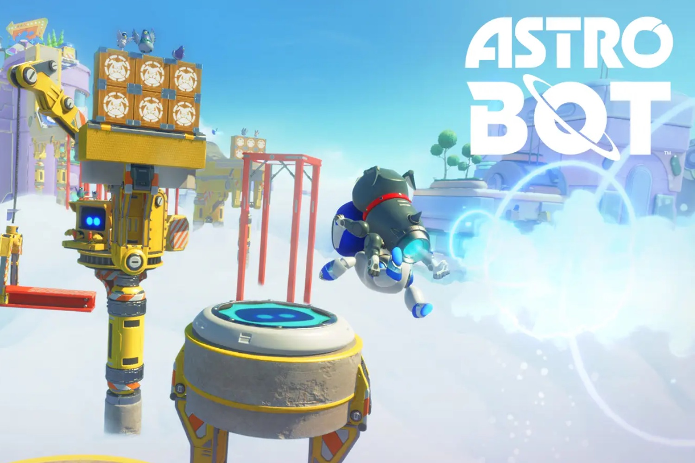

+++
title = "Les niveaux supplémentaires d'Astro Bot seront distribués au compte-goutte"
date = 2024-10-16T13:44:32+01:00
draft = false
author = "Mickael"
tags = ["Actu"]
type = "telex"
+++

Chose promise, chose due : PlayStation avait annoncé le premier DLC gratuit pour *Astro Bot* pour cet automne, nous y voilà ou presque. C'est le 17 octobre que le jeu de plateformes 3D aura droit à ses nouveaux niveaux speedrun — enfin, le premier niveau uniquement, « Building Speed », à pratiquer avec le chien Barkster dans le dos. 

 

Sony a en effet [décidé](https://blog.playstation.com/2024/10/16/astro-bot-new-speedrun-level-and-special-bots-out-tomorrow/) d'y aller au compte-goutte en distribuant les niveaux sur un rythme hebdomadaire ! Chaque semaine jusqu'au 14 novembre, les joueurs auront donc droit à un niveau supplémentaire, cinq en tout, avec deux bots à sauver pour chaque. Une méthode « à la Netflix » qui permet aussi à *Astro Bot* de rester dans l'actualité : après tout, les fêtes de Noël approchent et il s'agit de se rappeler au bon souvenir de tous.