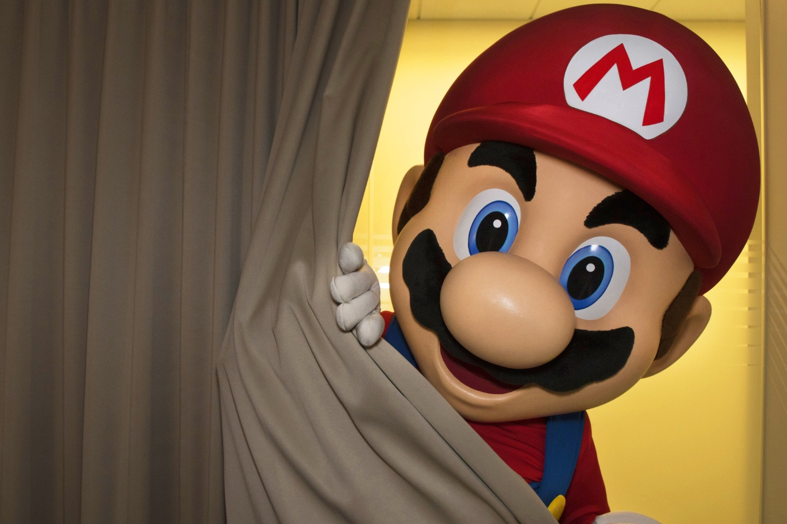

+++
title = "L'inquiétant Mario restera derrière son rideau pour la Switch 2"
date = 2024-10-16T09:28:32+01:00
draft = false
author = "Mickael"
tags = ["Actu"]
image = "https://nostick.fr/articles/vignettes/octobre/nintendo-nx.jpg"
+++

Histoire de faire monter la sauce autour du successeur de la Wii U — qu'on ne connaissait alors que sous le nom de code « NX » —, Nintendo avait eu la fine idée de partager une photo devenue célèbre… mais pas pour les bonnes raisons. Le 19 octobre 2016, Nintendo of America postait un [tweet](https://x.com/NintendoAmerica/status/788900063833493504) annonçant l'heure du tout premier trailer vidéo de la future console, accompagné d'une image de Mario derrière un rideau.

Il se dégage de cette photo une sensation de malaise si étrange qu'elle est devenue très rapidement un mème, au corps défendant de Nintendo qui préfère qu'on parle de ses jeux et de ses héros de manière positive. Alors que l'annonce de la Switch 2 — ou peu importe son nom — approche, Kit Ellis et Krysta Yang ont donné quelques détails sur cette histoire. 

Kit & Krysta sont bien connus dans la communauté Nintendo, ils ont animé pendant des années la très officielle Nintendo Minute ; depuis 2022, le duo s'occupe d'un podcast où il révèle de temps à autre quelques petits secrets de l'entreprise, et dans leur dernier épisode, les deux hôtes reviennent justement sur cet épisode resté fameux… et « *très controversé* », [convient](https://www.youtube.com/watch?v=xeYuGHAYke8&t=7051s) Krysta.

C'était l'ancien responsable des réseaux sociaux de Nintendo of America qui avait eu l'idée de la fameuse photo. La personne en question a « *commandé une séance photo avec le personnage en costume de Mario au bureau — ils ont en gros mis en scène le personnage de Mario en train de passer derrière le rideau* ». Elle admet que « *ça n'a pas très bien marché. Puis, bien sûr, ça a été détourné en mème et les gens étaient assez contrariés à ce sujet, honnêtement.* »

Kit déplore de son côté que rien n'avait été préparé pour accompagner l'annonce du trailer. « *Personne ne veut publier un tweet sans image, donc on était du genre "qu'est-ce qu'on peut faire ?"* ». Il y a quelque chose qui a dû manquer, « *parce que sinon, pourquoi prendraient-ils une photo de dernière minute de Mario sous la douche ?* ». L'image a aussi généré un tsunami de spéculations, et Nintendo déteste donner de fausses attentes. Pour la Switch 2, il en est sûr : « *Ça ne se reproduira pas* ». 