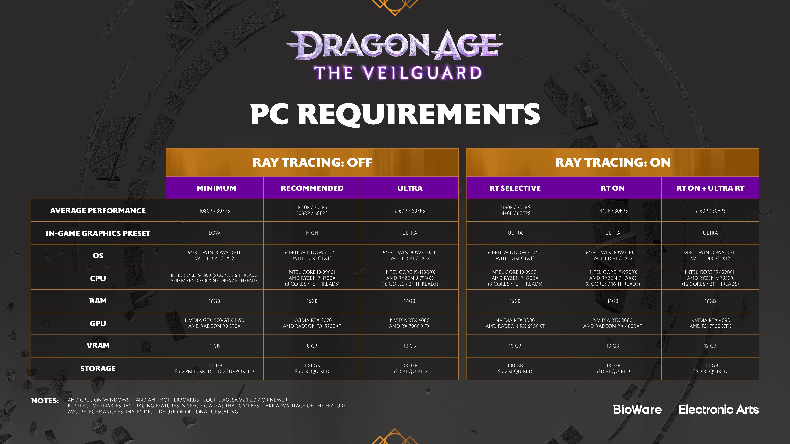

+++
title = "Pas de DRM pour Dragon Age: The Veilguard
date = 2024-10-16T08:47:32+01:00
draft = false
author = "Mickael"
tags = ["Actu"]
image = "https://nostick.fr/articles/vignettes/octobre/dragon-age-the-veilguard.jpg"
+++

*Dragon Age: The Veilguard* sera à n'en point douter le jeu de l'année. D'abord parce que le RPG de BioWare s'annonce super cool, mais surtout parce que sur PC, il n'aura pas aux pieds ces boulets de DRM ! Le développeur a [confirmé](https://www.ea.com/games/dragon-age/dragon-age-the-veilguard/news/specifications-spotlight?isLocalized=true) que ni Denuvo, ni aucun autre verrou logiciel de tierce partie ne plombera l'ambiance. 

Les joueurs ne pourront que se réjouir de l'absence de DRM qui peuvent dégrader les performances du jeu ainsi que celles du SSD. Si Denuvo a toujours affirmé le contraire, des experts ont pu constater que la présence du logiciel avait un impact non négligeable au moins sur les performances. La version craquée de *Resident Evil Village* [fonctionnait](https://www.youtube.com/watch?v=UXZGCwAJpbM) mieux que la version officielle (Capcom a ensuite serré quelques boulons)…

Par ailleurs, malgré la présence de DRM, un jeu a de grandes chances de se faire pirater à un moment ou à un autre, donc autant ne pas en mettre. Revers de la médaille, il ne sera pas possible de précharger le jeu avant son lancement le 31 octobre (à partir de 18h en France). Sur les consoles, il y a un préchargement possible, dès à présent sur Xbox, à compter du 29 octobre sur PS5.

BioWare a également publié les spécifications nécessaires pour profiter au mieux du jeu, avec ou sans ray-tracing. La config' minimale pour du 1080p et 30 FPS, avec les graphismes sur bas est un petit PC doté d'un Core i5-8400, 16 Go de RAM, une GTX 970, 4 Go de VRAM et 100 Go (SSD de préférence). À noter : *The Veilguard* est Steam Deck Verified ! Et le jeu sera optimisé PS5 Pro.