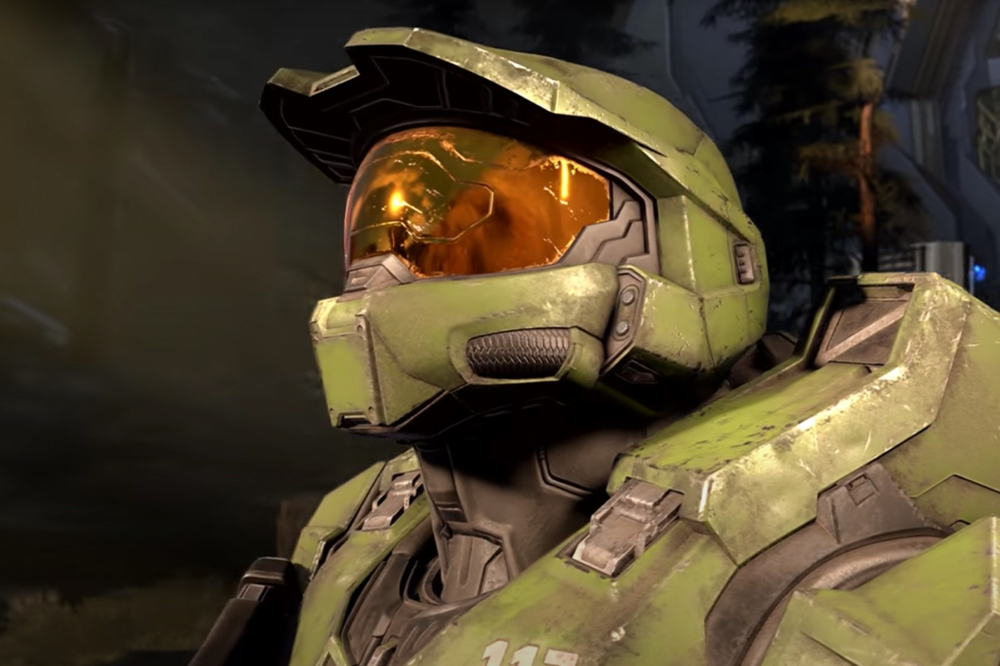

+++
title = "Un mode battle royale était bien en préparation pour Halo Infinite"
date = 2024-10-17T09:27:32+01:00
draft = false
author = "Mickael"
tags = ["Actu"]
image = "https://nostick.fr/articles/vignettes/octobre/halo3.jpg"
+++

*Halo* voulait se frotter au genre du *battle royale* depuis des années, et manifestement le projet était bien avancé quand Microsoft a finalement décidé d'arrêter les frais. En janvier, l'éditeur aurait [annulé](https://www.youtube.com/live/WoqACiE90EM?si=TEy7Fyc_Xi74AFUt) ce mode spécial destiné à enrichir *Halo Infinite*. Il manque encore pas mal de pièces dans ce puzzle — Microsoft n'ayant jamais rien confirmé —, mais les langues se délient peu à peu.

Mike Clopper, ancien directeur du design chez Certain Affinity, qui a maintenant le même poste chez Raven (un studio d'assistance pour *Call of Duty*), a [écrit](https://www.linkedin.com/in/mike-clopper-9300811/) dans son profil LinkedIn qu'il a supervisé une équipe de designers « *travaillant sur un mode battle royale pour Halo* ». Certain Affinity est un studio qui donne un coup de main à d'autres pour développer en coulisse des pans entiers de jeux. 

Depuis sa création en 2006, l'entreprise basée au Texas a par exemple planché sur plusieurs grosses franchises comme *Doom*, *Call of Duty* ou encore *Halo*, donc. Le travail sur le mode battle royale aurait commencé en 2020, et deux ans plus tard l'équipe comptait une centaine de personnes. À l'époque, Certain Affinity annonçait renforcer son partenariat avec 343 Industries, qui développe les jeux *Halo*.

On en était resté plus ou moins là de cette histoire, jusqu'à la révélation de Mike Clopper relevée par *[VGC](https://www.videogameschronicle.com/news/dev-claims-cancelled-halo-infinite-battle-royale-could-have-been-game-changing/)*. « *Je pense que [ce mode] aurait pu être un véritable atout pour la franchise. Nous avons adoré y jouer, et travailler dessus a été une expérience fantastique, malgré son annulation* », ajoute-t-il. Dommage, ça aurait pu être bien, même si le genre est bien représenté aujourd'hui.

 

343 a récemment changé de nom pour devenir Halo Studios, et dans la foulée a aussi décidé de changer de moteur graphique, [en jetant son dévolu sur l'Unreal Engine 5](https://nostick.fr/articles/2024/octobre/0710-halo-passe-a-lue5/). Cela devrait l'aider à recruter plus facilement des profils et surtout, à accélérer la cadence pour des contenus supplémentaires. Et peut-être, qui sait, un *battle royale*…