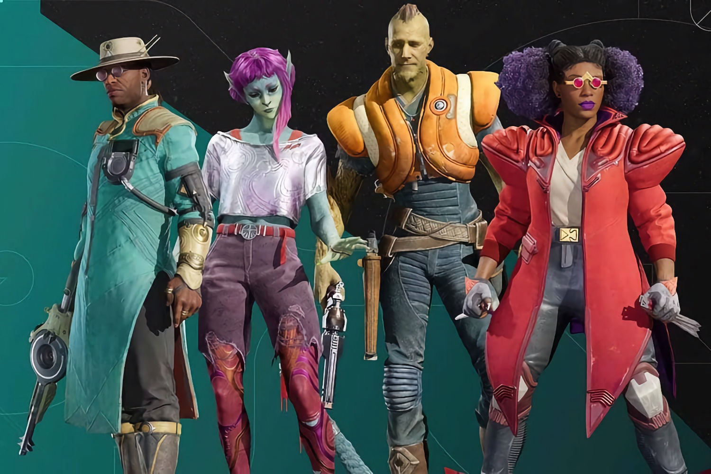

+++
title = "Tiens ? Concord bouge encore"
date = 2024-10-17T18:20:00+01:00
draft = false
author = "Félix"
tags = ["Actu"]
image = "https://nostick.fr/articles/2024/septembre/0309-sony-concord-debranche-serveurs-rembourse-joueurs/concord-end.jpg"
+++

 

*Concord* a beau avoir les deux pieds dans la tombe, le bougre s’accroche et gratte très fort le bois du cercueil. Le shooter multi de Sony endormi dans son sommeil à peine [deux semaines après son lancement](https://nostickreloaded.substack.com/i/148604269/la-grosse-info-de-la-semaine-concord-deux-petites-semaines-et-puis-sen-va) a reçu une dizaine de mises à jour sur Steam depuis le début du mois. Une activité étrange pour un jeu vendu [à 25 000 exemplaires](https://nostick.fr/articles/2024/aout/3108-concord-25000-copies-playstation/) rapidement débranché, remboursé et techniquement six pieds sous terre.

En passant une tête sur [la page SteamDB du jeu](https://steamdb.info/app/2443720/history/), on peut voir que *Concord* a reçu un paquet de mise à jour depuis sa fermeture, des updates ayant été envoyées régulièrement du 30 septembre au 10 octobre. Une d’entre elles a été postée pas plus tard qu’hier, et on y trouve plusieurs mots qui sentent bon comme « playtest », « pmtest » ou « sonyqae » (ce dernier étant sans doute lié aux équipes assurance qualité). Si on peut imaginer que les développeurs ont passé un coup de balai après la mise à mort du shooter sacré, cela ne justifie pas une telle activité sur une période aussi longue. 

Tout le travail sur *Concord* n’a pas été jeté à la benne, et on se doute bien que Sony va tenter de le réutiliser d’une manière ou d’une autre. Au moment [d’annoncer](https://nostick.fr/articles/2024/septembre/0309-sony-concord-debranche-serveurs-rembourse-joueurs/) la mise hors-ligne des serveurs, le consolier avait affirmé vouloir « *explorer d’autres options* » pour toucher les joueurs. L’hypothèse la plus probable est celle que Sony prépare un nouveau lancement en *free-to-play* afin de rentabiliser son projet. S’il est difficile d’avancer un chiffre exact, on sait que *Concord* a passé au moins 4 ans en cuisine et coûté des dizaines de millions de dollars. Le jeu est fini et jouable : relancer les serveurs et ajouter des microtransactions représenterait une goutte d’eau comparée au budget de développement et permettrait de mettre un peu de beurre dans les épinards.

Rien n’est sûr et il n’est pas impossible que cette agitation soit simplement liée à des bidouilles automatiques internes, mais les optimistes peuvent rêver. Reste à voir si ce potentiel nouveau départ gratuit suffirait à attirer les joueurs. Sony n’a fait quasiment aucune communication autour du titre, essayé de le vendre 40 balles avant de l’emmener derrière l’étable avec un fusil : il faudrait mettre un sacré coup de collier sur le marketing pour lui refaire une réputation. *Concord* n’est visiblement pas mauvais, mais n’a pas grand-chose pour se démarquer dans un secteur ultra-concurrentiel, même en étant accessible gratuitement. Le timing devra aussi être évalué, et il n’est pas impossible que Sony attende quelques mois avant de relancer le jeu en fanfare en essayant de faire oublier son faux départ. 
