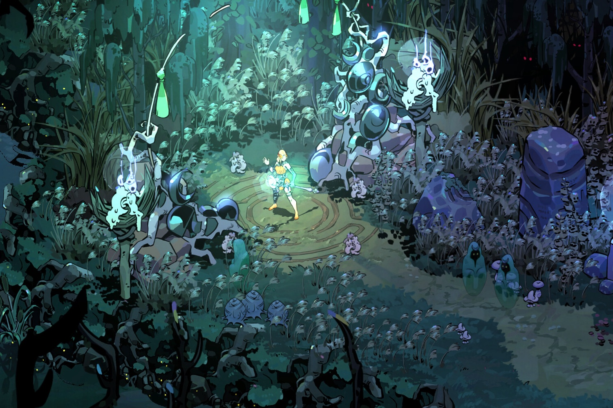

+++
title = "Hades II : une grosse mise à jour qui rapproche le jeu de sa version finale"
date = 2024-10-17T08:07:32+01:00
draft = false
author = "Mickael"
tags = ["Trailer"]
image = "https://nostick.fr/articles/vignettes/octobre/hades-II.jpg"
+++

*Hades II* est [en accès anticipé depuis le début de l'année](https://nostick.fr/articles/2024/mai/1005-hades-ii-divin-et-diabolique/), ce qui permet au studio Supergiant Games d'apporter des améliorations par petites touches… et aussi par grosses touches ! Le roguelite s'est ainsi offert avec la mise à jour « The Olympic » plusieurs nouveautés importantes, qui rapprochent le jeu de sa version finale prévue au début de l'année prochaine.

 

D'ailleurs, ça sent le début de la fin du développement pour cette première version, car la mise à jour complète finalement l'arsenal de Melinoé, l'héroïne qui doit mettre un terme aux agissements de Cronos. Elle a désormais a sa disposition une sixième et dernière arme, « Xint, le Black Coat », à l'allure de têtes chercheuses. Les autres armes ont reçu des améliorations dans tous les sens. Le dash est également beaucoup plus rapide et nerveux.

Il y a aussi une toute nouvelle région à explorer — l'Olympe, donc —, sur laquelle se terrent les Dieux. Deux familiers rejoignent le troupeau des animaux de compagnie (un chien et un piaf). Il sera possible de faire la fête avec Dionysos et de compléter la collection de nouveaux cosmétiques et décorations. 

Supergiant a également mis un visage et un corps sur des tas de personnages qui n'étaient jusqu'alors représentés que par des silhouettes, et ajouté aussi pas mal de nouvelles musiques. Oh, et une version pour Mac (les modèles avec puce Apple) est aussi au rendez-vous ! Les notes de version sont longues comme un jour sans Steam Deck, alors noyez-vous dedans à cette [adresse](https://store.steampowered.com/news/app/1145350/view/7057794870234137716).

