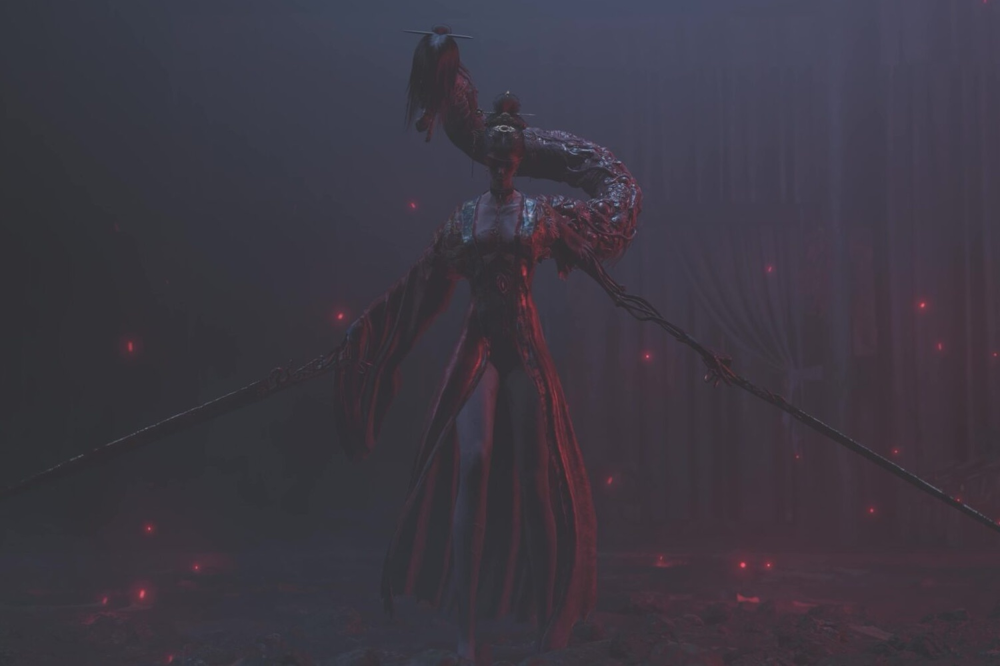
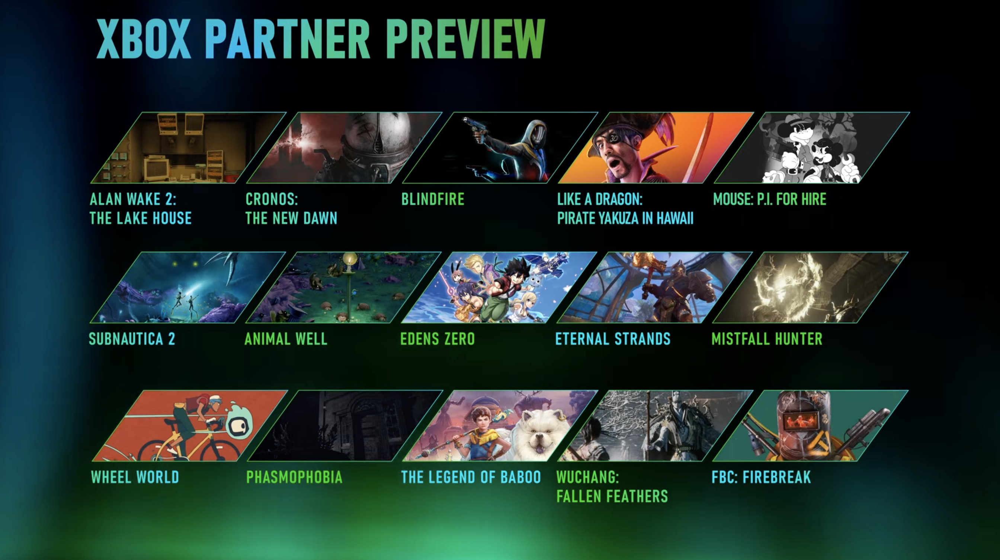

+++
title = "Firebreak, Wuchang, Subnautica 2 : un showcase solide chez Xbox"
date = 2024-10-17T10:47:32+01:00
draft = false
author = "Mickael"
tags = ["Actu"]
image = "https://nostick.fr/articles/vignettes/octobre/wushang.jpg"
+++

Ce qui est bien quand on s'attend à pas grand chose, c'est qu'on s'expose à être surpris en bien. C'est le cas pour ce Partner Preview de Xbox, qui en 25 minutes bien condensées a eu le temps de caler deux ou trois surprises sympa. Une sélection somme toute solide de jeux qui sortiront dans les prochains mois.

 

Remedy a fait feu de tout bois ce soir avec rien moins que deux annonces. Bon, la première n'a rien d'une surprise, il s'agit du 2e DLC d'*Alan Wake 2*, « The Lake House », qui sortira le 22 octobre. Cette fois, on ne rigole plus, l'ambiance est sinistre. On jouera dans la peau de l'agent Estevez qui devra explorer, devinez quoi, la maison sur le lac.

 

Le studio finlandais ne s'est pas arrêté en si bon chemin, puisqu'il a dévoilé les premières images et le gameplay de *FBC: Firebreak*, qui se trouve être non seulement un spin-off de *Control*, mais aussi le premier jeu multi de Remedy ! Ce FPS très très intéressant (mais sera-t-il accueilli par les fans ?) est programmé pour 2025.

 

Une des surprises du showcase a été *Cronos: The New Dawn*, nouveau jeu de la Bloober Team qui ne prend pas de vacances, après le remake de *Silent Hill 2*. On reste dans l'horreur, mais cette fois dans un TPS plus porté sur l'action, et dans une histoire de voyages dans le temps. Sortie annoncée en 2025.

 

Côté FPS et dans une ambiance complètement différente, *Mouse: P.I. for Hire* est un jeu de tir qui ressemble à un vieux cartoon Disney des années 30, en noir et blanc ! Plutôt sympa. Sortie prévue l'année prochaine. 

 

OK, le jeu n'est pas une nouveauté mais il n'empêche que son nouveau trailer a été une des sensations de la soirée : on parle bien sûr de *Wuchang: Fallen Feathers*, qui a comme un faux airs de *Stellar Blade* plus vénère, et avec des bouts de *Black Myth Wukong* dedans. Lancement prévu en 2025.

 

*Mistfall Hunter* est également un jeu de bourrin en vue à la troisième personne, mais qui penche davantage vers le RPG en PvPvE. Admirez moi ces graphismes de viking. Sortie annoncée en 2025, on peut déjà s'inscrire pour participer à la bêta sur PC.

 

La mer, c'est sale, les poissons font pipi dedans et y a des gros montres qui font peur. Vous ne me croyez pas ? Bon, pour le pipi je ne sais pas, mais les streums, c'est oui à en croire *Subnautica 2*, la suite de *Subnautica* et *Subnautica: Below Zero*. Le jeu sera à vivre en solo ou accompagné. 

 

Dans un genre complètement différent, *Wheel World* (anciennement *Ghost Bike*) nous invite à explorer un monde en cell-shading… à vélo. Pourquoi pas ! On se lance début 2025.

En vrac, notez la sortie aujourd'hui d'*Animal Well* sur Xbox et du shooter *Blindfire* en accès anticipé. *Phasmophobia*, le FPS d'horreur en co-op sera dispo le 29 octobre, ce qui tombe bien pour Halloween.