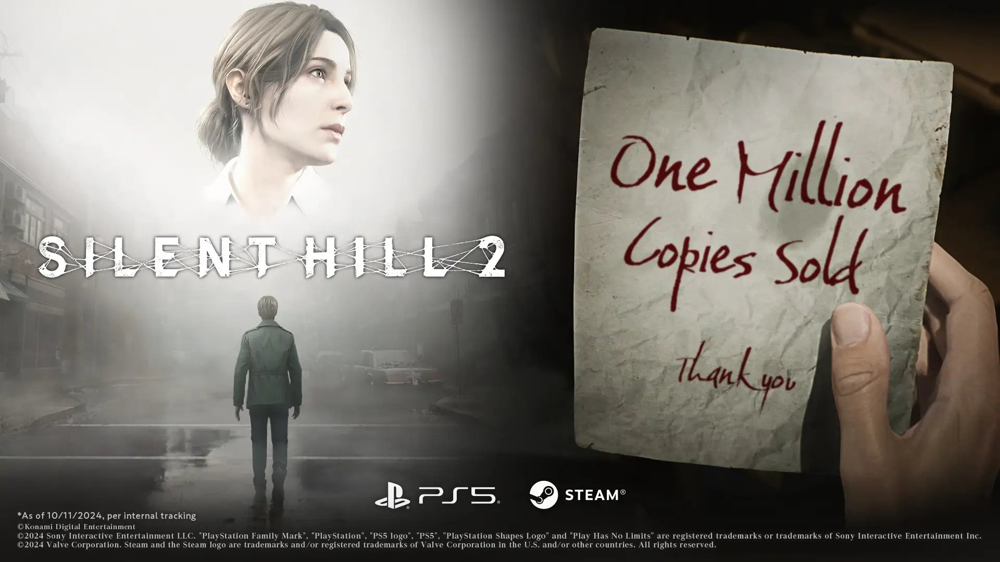

+++
title = "Konami a déjà vendu 1 million de Silent Hill 2 Remake"
date = 2024-10-17T08:29:32+01:00
draft = false
author = "Félix"
tags = ["Actu"]
type = "telex"
+++

Chic alors, le remake de *Silent Hill 2* se vend bien : Blooper et Konami ont [annoncé](https://prtimes.jp/main/html/rd/p/000001019.000050711.html) avoir dépassé le million de copies vendues pour ce jeu lancé la semaine dernière. Un joli chiffre qui comprend les livraisons mondiales et les ventes numériques pour PC et PS5 en date du 11 octobre.

Blooper a réussi à calmer les craintes des fans avec un remake fidèle et [salué par la critique](https://nostickreloaded.substack.com/i/150107234/du-brouillard-en-hd). Le studio avait assez peu de chances de se planter avec une refonte du deuxième opus, de loin le plus apprécié des joueurs et considéré comme un jeu culte. On a plus qu’à espérer qu’ils nous fassent un joli remake du premier (bien oublié jusqu’à présent) ou pourquoi pas du troisième, qui était également excellent.

