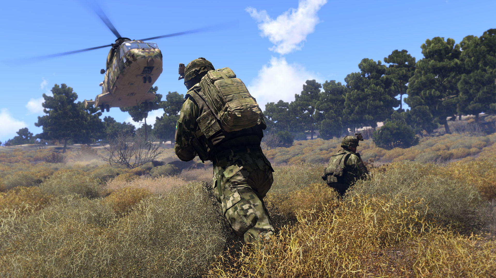

+++
title = "Arma 4 est officiellement annoncé… pour 2027"
date = 2024-10-18T10:44:32+01:00
draft = false
author = "Mickael"
tags = ["Actu"]
type = "telex"
+++

*Arma 3* reste un des meilleurs simulateurs militaires de tous les temps, mais il faut bien avouer que le jeu commence à accuser son grand âge : il est en effet sorti en 2013. Certes, Bohemia Interactive n'a cessé d'apporter des améliorations, des DLC et des spinoff (le précédent, *Arma Reforger*, remonte à l'an dernier), mais il était probablement temps d'envisager la suite. 

Ce qui fut fait, à l'occasion du [streaming d'un concert](https://www.youtube.com/live/cC-uT5rc9HQ?si=pmPXurDj1jAm0Ipu&t=6448) pour fêter les 25 ans de la franchise : un carton a annoncé mine de rien le lancement d'Arma 4… en 2027 ! Voici à quoi ça ressemblait :
 


C'est une manière comme une autre de prendre date même si la planète aura probablement sauté d'ici là avec tout le merdier actuel. Pour le reste, c'est tout ce que l'on sait de ce futur épisode alors voilà.