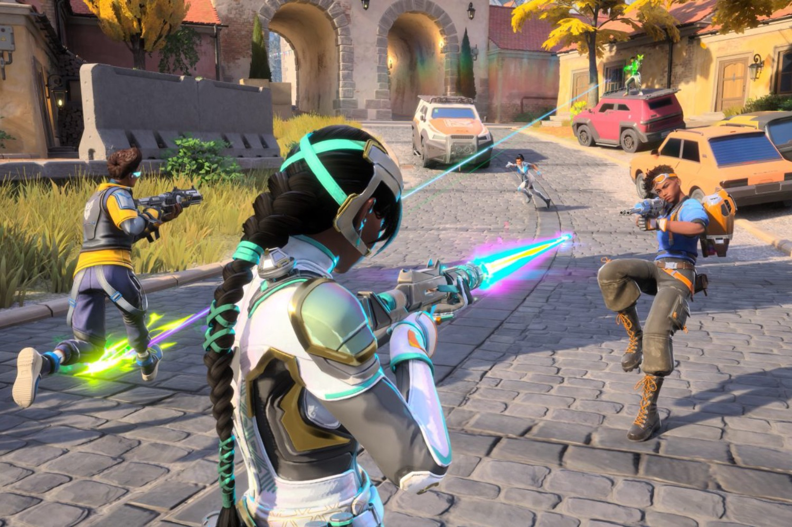

+++
title = "Ethos : on avait bien besoin d'un hero shooter de plus"
date = 2024-10-18T08:47:32+01:00
draft = false
author = "Mickael"
tags = ["Actu"]
image = "https://nostick.fr/articles/vignettes/octobre/ethos.jpg"
+++

La différence entre courage et suicide est ténue. Tenez, prenez 2K Games : l'éditeur se lance dans le *hero shooter* avec *Ethos*, un free to play en vue à la troisième personne. Oui, il faut le vouloir pour se lancer sur un marché qui ressemble à un eldorado de loin… et à un coupe-gorge de près. Mais bon, qui ne tente rien, hein.

 

Le projet *Ethos*, développé par le studio 31st Union, veut faire la différence avec des mécanismes de roguelite. Le héros qu'on se sera choisi évoluera à chaque partie, et aura accès à des améliorations d'équipements aléatoires. Un tireur d'élite pourra ainsi devenir un éclaireur spécialiste du corps à corps ou un loup solitaire. Chaque run sera aussi l'occasion de déverrouiller des « augmentations » pour améliorer les capacités de son perso.

Pas sûr que tout ça permette au jeu de vraiment sortir du lot, mais 2K semble y croire et c'est bien le plus important. Les amateurs qui se seraient lassés d'*Overwatch*, d'*Apex Legends* ou de *Valorant* peuvent dès à présent se lancer dans un [playtest](https://ethos.2k.com/playtest/) qui se poursuivra jusqu'au 20 octobre. Malheureusement, pour participer il faut se coltiner 30 minutes de stream Twitch d'un créateur partenaire avant de recevoir la clé Steam. On ignore quand le jeu sera proposé à tous (si jamais il y parvient).