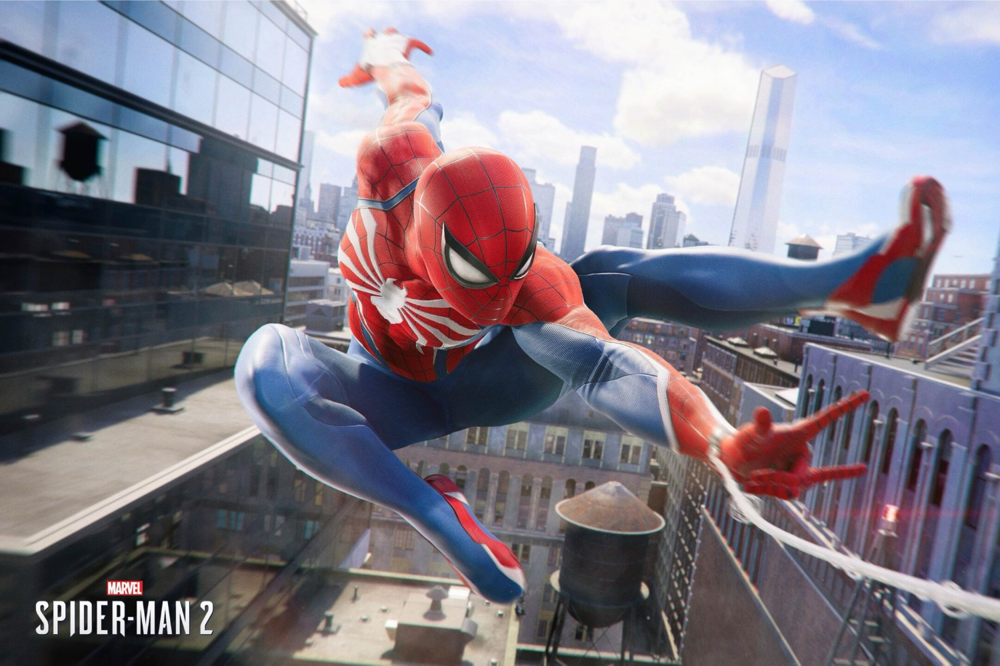

+++
title = "Après la PS5, Spider-Man 2 va tisser sa toile sur PC"
date = 2024-10-18T23:47:32+01:00
draft = false
author = "Mickael"
tags = ["Actu"]
image = "https://nostick.fr/articles/vignettes/octobre/spider-man-2.jpg"
+++

Il arrive que les grandes entreprises balaient les mauvaises nouvelles au vendredi soir, en espérant que personne ne remarque rien vu que tout le monde est en week-end. Difficile de dire si Sony a voulu enterrer son annonce du jour, mais toujours est-il qu'elle fera certainement plaisir aux joueurs PC adeptes de Spider-Man.

 

Car oui, un an après sa sortie en exclusivité sur PS5, *Marvel's Spider-Man 2* est [confirmé](https://blog.playstation.com/2024/10/18/marvels-spider-man-2-arrives-on-pc-january-2025/) pour PC ! Le blockbuster développé à l'origine par Insomniac, et porté sur PC par le studio Nixxes, sera disponible sur Steam et l'Epic Games Store le 30 janvier 2025. C'est le jeu au complet qui sera proposé : l'aventure de base bien sûr, mais aussi tous les DLC et le New Game Plus. Une édition Deluxe comportera des cosmétiques et costumes supplémentaires.

La version PC comprendra des options graphiques et de ray-tracing en plus, le support des écrans ultra-large, la prise en charge du combo clavier/souris, etc. Les développeurs de Nixxes font habituellement du très bon travail, on leur doit les portages PC de *Ratchet & Clank*, du premier *Spider-Man* et du spin-off *Miles Morales* (le studio est aussi derrière le remaster de *Horizon Zero Dawn*).

Les exclusivités PS5 le sont de moins en moins, Sony ayant pris la bonne habitude de les sortir sur PC, habituellement dans les deux années suivant leur sortie sur consoles. Tout récemment, on a eu droit à *God of War Ragnarok* et *Ghost of Tsushima*.