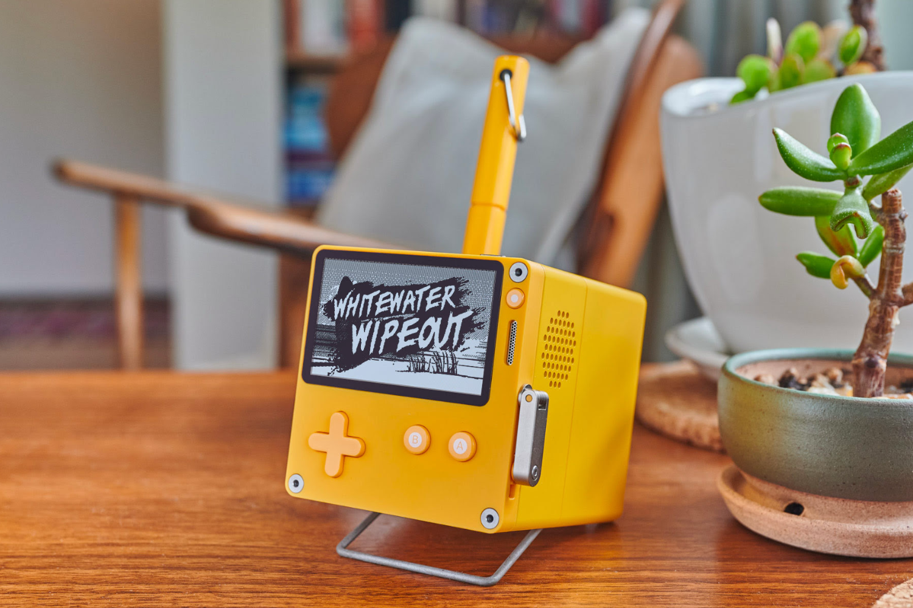

+++
title = "Stereo Dock : ça ne sent pas bon pour le petit dock de la Playdate"
date = 2024-10-18T20:00:00+01:00
draft = false
author = "Félix"
tags = ["Actu"]
image = "https://nostick.fr/articles/2024/octobre/1810-stero-dock-playdate-ca-sent-pas-bon/dock.png"
+++

 

Nos lecteurs fortunés ont peut-être [une Playdate](https://play.date) qui traine dans un tiroir, une bien jolie console qui mériterait d’être mise en valeur sur un bureau. Lors de sa présentation, Panic avait bien promis un très chouette dock jaune poussin servant à la fois de station de charge, d’enceinte Bluetooth et de porte-stylo. Dévoilé en 2021, il semblerait bien que celui-ci ne verra jamais le jour. Ou du moins pas avant un moment.

Le fondateur de Cabel Sasser a été interrogé à ce sujet [sur Threads](https://www.threads.net/@c64loadstar/post/DBOc-cuO2yh?hl=en), où il a expliqué que le projet s’était avéré « *incroyablement difficile pour de nombreuses raisons incroyablement stupides* ». Comme chacun le sait, « *Hardware is Hard* » et Panic a déjà eu bien du mal à accoucher de sa Playdate, née en plein milieu de la pandémie. La console est sortie 3 ans après sa présentation, et l’entreprise a ensuite mis de longs mois avant de rattraper le rythme des précommandes.

Le Stereo Dock, mort ou pas mort ? Aux dernières nouvelles, le projet était encore en développement [au mois d’avril](https://www.engadget.com/about/editors/jessica-conditt/), mais la situation a eu le temps d’évoluer. « *C’est un peu en pause en ce moment* » confie Cabel Sasser, avant d’ajouter « *toujours rêver de le faire* ». Une déclaration pas très encourageante qui, si elle ne ferme pas totalement la porte, indique que personne chez Panic ne planche dessus. La page de l’accessoire [est toujours en ligne](https://play.date/stereo-dock/) et les réponses du thread montre que le boss ne compte pas abandonner, mais à votre place, on ne se ferait pas trop d’espoir. C’est dommage, car ça aurait été très chouette avec certaines apps, par exemple avec [ce lecteur MP3](https://play.date/games/kicooya/) délicieusement rétro. On va continuer de croiser les doigts très forts.