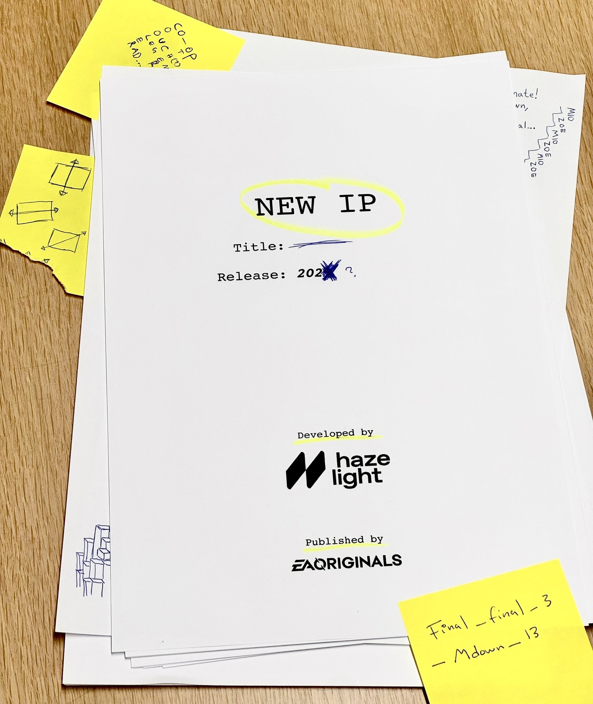

+++
title = "Le studio de It Takes Two prépare un nouveau jeu « S*** ******N »"
date = 2024-10-18T08:07:32+01:00
draft = false
author = "Mickael"
tags = ["Actu"]
image = "https://nostick.fr/articles/vignettes/octobre/it-takes-two.jpg"
+++

*It Takes Two* est un carton certifié : avec [20 millions](https://x.com/josef_fares/status/1846590174517514562) de copies vendues (!) depuis le lancement du jeu en 2021, on peut dire que le petit studio Hazelight a réussi son coup. Et ce qui est encore plus épatant, c'est que le titre continue de multiplier les convertis à vitesse grand V : en mars, le compteur était à 16 millions. Ce sont donc 4 millions de copies supplémentaires qui se sont ajoutées au total en six mois ! C'est plus que bien des jeux AAA dans toute leur carrière.

Mais bien sûr, on ne peut pas vivre éternellement sur un succès. C'est pourquoi le studio s'est lancé dans le développement d'un nouveau jeu, une « *nouvelle IP* » qui ne sera donc pas (probablement) une suite de *It Takes Two* mais quelque chose d'original. Le visuel [partagé](https://x.com/HazelightGames/status/1846929745016987890) par Hazelight précise aussi une date, très floue comme il se doit : 202- quelque chose, ce qui peut nous emmener jusqu'en 2029.

Dernier indice : ce jeu s'appellera *Sexy Unicorn*. Ou *Sweet Seduction*. Ah non attendez, ça sera *Spicy Temptation*. Bon OK, on ne connait pas le nom du titre, mais les développeurs donnent cet indice : « S*** ******N ». À vous de remplir les trous ! On ne devrait pas tarder à avoir des détails supplémentaires, Josef Fares le fondateur de Hazelight promettant des infos pour bientôt.