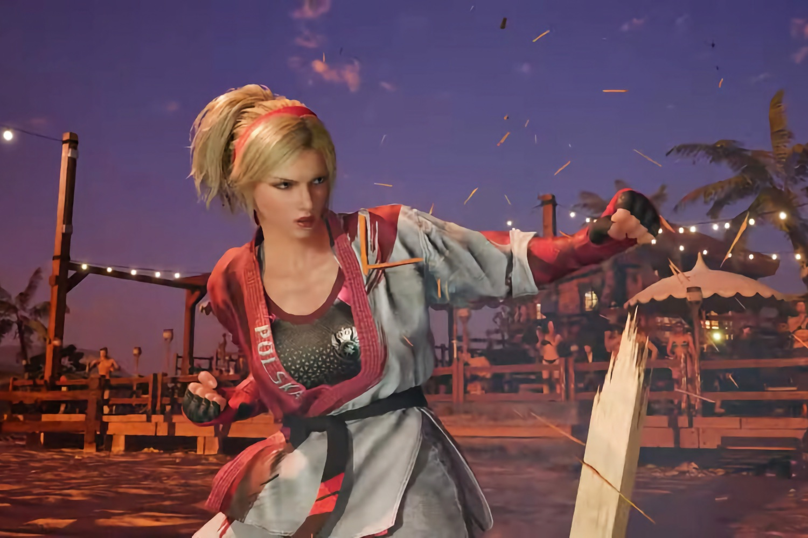
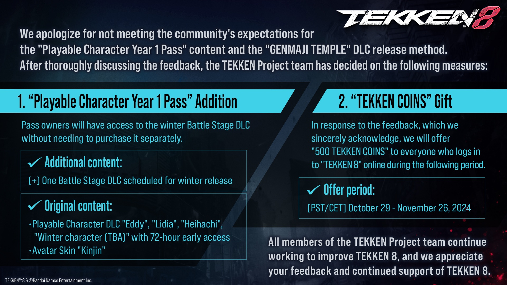

+++
title = "Tekken 8 fait une fleur aux joueurs fâchés par le stage payant"
date = 2024-10-18T03:23:32+01:00
draft = false
author = "Mickael"
tags = ["Actu"]
image = "https://nostick.fr/articles/vignettes/octobre/tekken-8-lidia.jpg"
+++

Après la cagade du temple Genmaji payant, la team Tekken a décidé de faire un geste pour regagner les faveurs des joueurs qui ont fait plonger *Tekken 8* dans dans la catégorie des jeux aux évaluations « très négatives » sur Steam. Rappelons rapidement l'histoire : le stage en question est payant (5 €), y compris pour ceux qui ont craqué pour le pass Year 1.

Ce fameux pass inclut 4 personnages jouables, mais pas de stage… normalement. Il se trouve que la première combattante, Lidia Sobieska, avait été livrée avec son propre niveau, sans frais supplémentaire. Un cadeau qui ne s'est pas renouvelé lors de l'arrivée de Heihachi Mishima, livré dans le season pass mais sans le stage Genmaji. [D'où la colère et l'incompréhension des fans.](https://nostick.fr/articles/2024/octobre/0210-tekken-8-stage-payant-mauvais-genre/)

Dans un [message](https://x.com/TEKKEN/status/1846914526530166812) sur ~~cette merde purulente de Twitter~~ les réseaux sociaux, Bandai Namco a donc pris deux mesures d'apaisement. La première, c'est que le stage payant qui était prévu pour cet hiver sera distribué gratuitement aux abonnés du pass. On comprend qu'il ne s'agira pas du temple Genmaji, il faudra donc l'acheter à part si on le veut.

La deuxième mesure, c'est 500 pièces Tekken à dépenser dans la boutique du jeu. Cette monnaie de singe permet d'acheter des cosmétiques (mais toujours pas ce foutu temple). Bref, c'est un moyen d'apaiser le courroux des joueurs, tout en faisant passer le message qu'à l'avenir, les stages seront bel et bien payants.