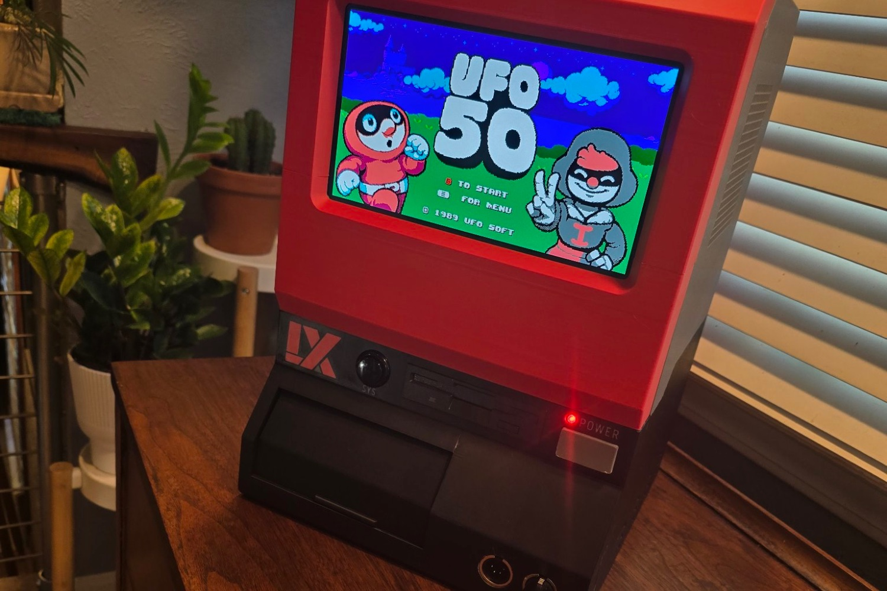

+++
title = "Évidemment que quelqu'un a recréé la console imaginaire de UFO 50"
date = 2024-10-18T12:47:32+01:00
draft = false
author = "Mickael"
tags = ["Actu"]
image = "https://nostick.fr/articles/vignettes/octobre/ufo-50.jpg"
+++

*[UFO 50](https://50games.fun)* est une collection assez incroyable de jeux rétro… qui n'ont jamais existé. Le studio Mossmouth s'est en effet mis en tête de développer 50 titres pour une console imaginaire des années 80, la LX. Et les jeux ne sont pas là pour la blague : chacun dans son genre (plateformes, shoot'em up, arcade, RPG…) offre une grosse durée de vie, en solo comme en multi, avec un univers et des graphismes uniques.



C'était trop tentant pour le bricoleur Luke the Maker, qui a décidé d'imprimer en 3D la fameuse LX avec sa manette, et de faire en sorte qu'il soit possible de jouer aux jeux d'*UFO 50* avec ! Tout fonctionne, « *même si c'est un désastre à l'intérieur* », ajoute-t-il. Il va maintenant s'appliquer à essayer de faire un peu de ménage sans tout casser.

Luke promet aussi de mettre en ligne les plans pour imprimer soi-même la console (ils seront vendus 5 ou 10 $ sur son site Etsy). Attention, il ne s'agit que de la coque, pour le reste il faudra fournir les composants internes. Un petit PC devrait suffire, le jeu est dispo sur [Steam](https://store.steampowered.com/app/1147860/UFO_50/) pour 25 € environ.