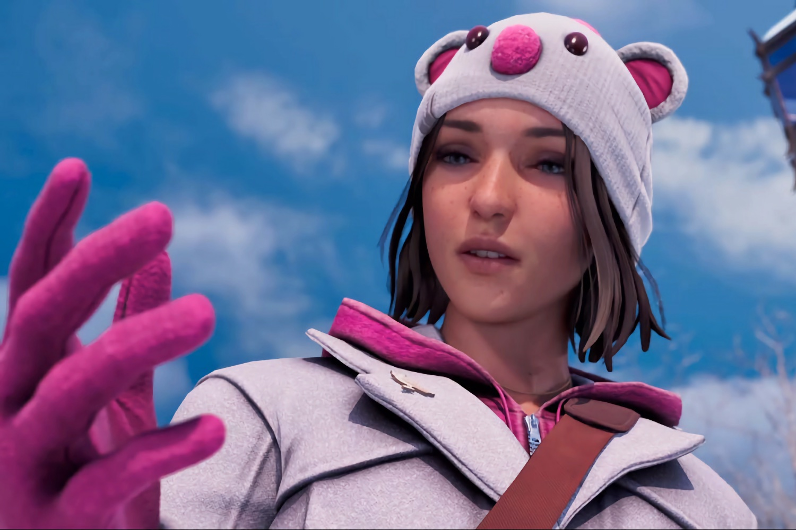
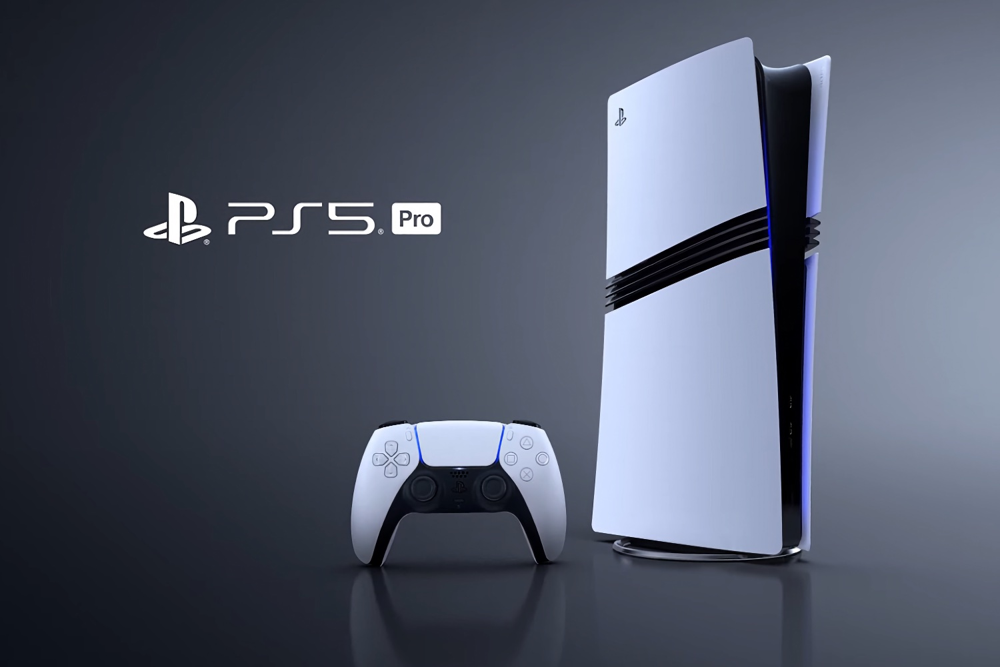
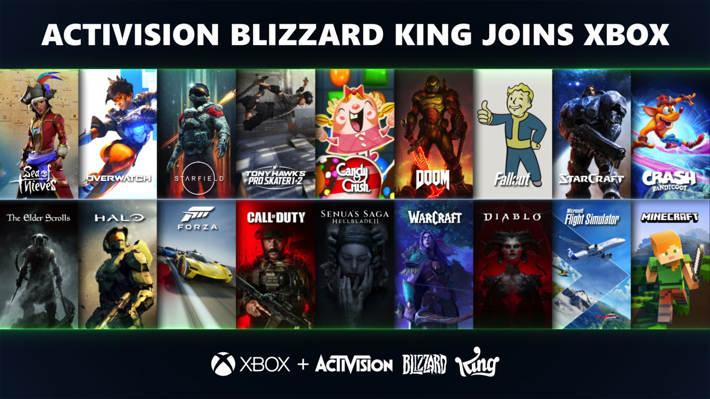
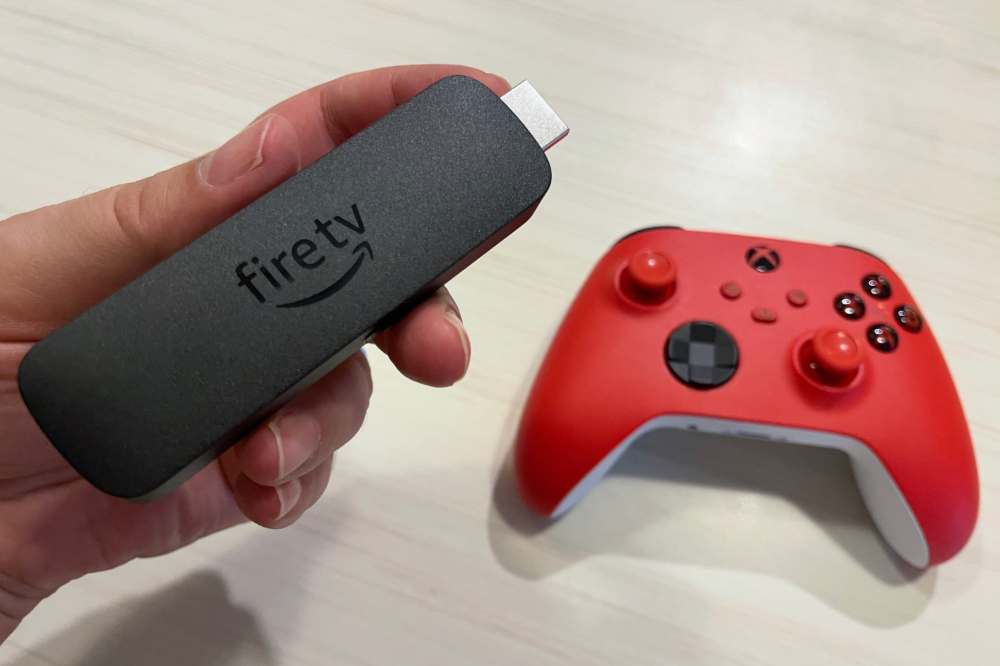

+++
title = "On vide le backlog de la semaine : Life is Strange, Atari, Xbox et Activision, PS5 Pro…"
date = 2024-10-19T06:45:01+01:00
draft = false
author = "Mickael"
tags = ["XXL"]
image = "https://nostick.fr/articles/2024/octobre/life-is-strange-max.jpg"
+++

L’actualité du jeu vidéo ne s’arrête pas à la poignée d’articles publiés sur *Nostick* ! Histoire de rattraper le retard accumulé, voici un retour rapide sur quelques unes des infos les plus importantes (ou insignifiantes) de la semaine.

## L'image de la semaine : juste un doigt d'Atari

Un doigt de whisky, mais oui pourquoi pas. Mais pas dans un verre de pauvre : un verre Atari ! L'éditeur mythique ne perd jamais une occasion de marchander son image de marque en mettant son logo sur n'importe quelle bêtise, pourvu que ça se vende. Et ce [set](https://atari.com/products/atari-joystick-decanter-set?_pos=4&_psq=drinks&_ss=e&_v=1.0) composé de deux verres de 300 ml, d'une carafe en forme de joystick CX-10 et d'un plateau a beau n'entretenir qu'un lien très lointain avec le jeu vidéo, bon dieu il a vraiment de l'allure.

En plus, comme le montre la dernière photo, ce set rend heureux (et probablement alcoolique). Que demander de plus pour 125 $ ?

## La citation de la semaine : la fin de la course aux performances

« *Nous en sommes à un stade de développement matériel que j’appelle "seuls les chiens peuvent percevoir la différence". Si vous jouez et que la lumière du soleil passe par la fenêtre pour illuminer votre téléviseur, vous ne verrez aucun effet de ray tracing. Tout doit être hyper optimal… Il faut avoir un écran 8K dans une pièce sombre pour observer ces détails. Nous nous battons pour des téraflops, et ce n’est pas là où il faut être. Nous devons nous concentrer sur le contenu. Augmenter les caractéristiques techniques des consoles ? Je pense que nous avons atteint un plafond* ».

Shawn Layden, l'ancien patron de la branche US de Sony Interactive Entertainment (SIE), a [estimé](https://www.videogameschronicle.com/news/former-playstation-exec-says-console-arms-race-has-plateaued/) durant une conférence à la Gamescom Asia que la course à l'échalote technique entre les constructeurs de consoles devait s'arrêter. « *Nous avons fait ça pendant 30 ans (…) Nous avons maintenant atteint un point critique où tout s'effondre, nous ne pouvons plus continuer à faire comme nous l'avons fait auparavant* ». Plutôt croustillant alors que Sony a récemment dévoilé la PS5 Pro qui a remis une pièce dans cette machine infernale.

« *La course est presque terminée, et vous savez qui a gagné ? AMD* », conclut-il. AMD fournit les processeurs des Xbox et des PlayStation… Dans toutes les ruées vers l'or, celui qui fait fortune c'est toujours le vendeur de pelles et de pioches.

## Le gros anniversaire de la semaine : il y a un an, Microsoft achetait Activision, et maintenant ?

Le 13 octobre 2023, il y a un un an et quelques jours, Microsoft signait finalement le chèque de 69 milliards de dollars pour s'offrir Activision Blizzard King. Une acquisition qui s'est déroulée dans la douleur, le projet — annoncée en janvier 2022 — étant passé sous les fourches caudines des régulateurs américain, européen et britannique.

Mais une fois l'encre séchée, que reste-t-il de ce deal un an plus tard ? Beaucoup de choses, et pas tellement finalement. Du point de vue de l'organisation, l'intégration des équipes et des studios d'ActiBlizz a coûté cher niveau social : il y a des redondances et des doublons. Et Xbox a la main lourde, [des milliers de postes ont été supprimés](https://nostick.fr/articles/2024/septembre/1209-microsoft-vire-650-personnes/), et des studios ont mis la clé sous la porte, [comme Arkane Austin et Tango Gameworks](https://nostick.fr/articles/2024/mai/0705-fin-de-partie-pour-arkane-austin-et-tango-gameworks/). Ce dernier a été repêché après coup par Krafton pour *[poursuivre l'aventure Hi-Fi Rush](https://nostick.fr/articles/2024/aout/1208-krafton-a-la-rescousse-de-tango/)*.

Après la folle dépense pour s'offrir ce qui était un des plus gros éditeurs de jeux vidéo au monde, Microsoft et ses actionnaires veulent maintenant revoir la couleur de leur argent. Et au plus vite ! C'est ce qui explique le retrait de plus en plus manifeste de la console Xbox, qui est en train de devenir une plateforme comme une autre pour les jeux des différents studios de la team green. 

Les exclusivités qui forgent l'identité de la console franchissent de plus en plus le Rubicon de la Switch et de la PS5. D'abord via une expérimentation avec des « petits » jeux qui se révèlent plein de promesses, à l'image de *Sea of Thieves*. Et maintenant, plus personne n'est épargné : *Indiana Jones et le Cercle ancien* passera à la casserole PlayStation au printemps prochain, *Doom: The Dark Ages* sera multiplat' dès son lancement… Et il y a tout lieu de croire que le passage de ~~343 Industries~~ [Halo Studios au moteur Unreal Engine 5](https://nostick.fr/articles/2024/octobre/0710-halo-passe-a-lue5/) télégraphie le portage de *Halo* sur PS5. Tout un symbole !

Cette acquisition a été le révélateur du mal qui ronge Xbox depuis trop longtemps : sa position intenable sur le marché des consoles. La Xbox ne se vend pas, [ou si peu](https://nostick.fr/articles/2024/mai/1505-bonjour-tristesse-chez-xbox/), et Microsoft a manifestement décidé de passer l'activité matos par pertes et profits. Non seulement [les budgets marketing ont fondu](https://nostick.fr/articles/2024/juillet/2207-xbox-europe-aumone-pub/), mais encore le constructeur n'entrera pas dans la bagarre (un peu vaine ?) du rafraîchissement « pro » de la mi-génération [contrairement à Sony](https://nostick.fr/articles/2024/septembre/1009-enfin-une-ps5-pour-les-pro/). C'est tout juste si on a droit à une [version blanche et sans lecteur Blu-Ray](https://nostick.fr/articles/2024/juin/0906-microsoft-revoit-sa-gamme-xbox/) de la Series X.

Microsoft préfère mettre le paquet sur le Game Pass et le Xbox Cloud Gaming, qui prend une place de plus en plus stratégique. Et pour cause : il suffit de s'abonner au service pour accéder à des centaines de jeux en streaming, depuis n'importe quel appareil. Comme une clé Fire TV d'Amazon, qui a l'avantage d'être très abordable. Quand on joue dans le cloud, pas besoin d'une machine de guerre sous la télé ([et pas besoin de Xbox !](https://nostick.fr/articles/2024/juillet/1707-xbox-probleme/)). Le pire, [c'est que ça marche rudement bien](https://nostick.fr/articles/2024/juillet/2907-xbox-cloud-gaming-fire-tv-stick-test/).

Pour les joueurs, l'heure n'est pas non plus à la fête. Oh, le Game Pass a bien accueilli une poignée de jeux ActiBlizz, mais ils se comptent sur les doigts d'une main à deux doigts. *Diablo 4* a été un gros morceau en mars dernier, puis *Call of Duty: Modern Warfare III* cet été. Et *Black Ops 6* déboulera le 25 octobre bien sûr, en compagnie des deux premiers *StarCraft*. On ne peut pas dire que l'abondance soit au rendez-vous !

Ce qui n'a pas empêché Microsoft d'[augmenter les prix de son service](https://nostick.fr/articles/2024/juillet/0907-game-pass-xbox-bordel-hausse-prix/) : le Game Pass Ultimate coûte désormais 17,99 €, soit 3 € de plus qu'auparavant. Et une nouvelle formule Standard pour les consoleux fait son apparition au prix de 12,99 €, avec l'accès au multi… mais pas aux jeux « day one ». La pilule est difficile à avaler, surtout au rythme actuel d'ajout de jeux Activision Blizzard dans le Game Pass ! On se croirait devant le Switch Online à attendre l'arrivée des jeux rétro de Nintendo, c'est dire.

Au bout du compte, cette année a marqué la transition de Xbox vers un modèle de développement et de distribution de jeux pour un maximum de plateformes afin d'engranger un maximum de revenus (et donc de profits). Quitte à reléguer les consoles maison dans un coin. Une transition difficile ? Sans aucun doute. Mais inéluctable ? Ça en a tout l'air.

## Les andouilles de la semaine : l'accès anticipé de la mort pour Life is Strange

Un jeu narratif comme *Life is Strange: Double Exposure* devrait se tenir le plus éloigné possible de la tendance actuelle aux accès anticipés contre monnaie sonnante et trébuchante. Le titre développé par Deck Nine et publié par Square Enix, nouveau volet de la saga au long cours initiée par le studio français Don't Nod, sortira le 29 octobre sur PC et consoles.

 

Mais les joueurs ayant craqué pour l'édition Ultimate ont d'ores et déjà accès aux deux premiers chapitres du jeu, qui en compte cinq en tout. Puisque l'on parle là des fans, il est plus que probable qu'ils aient terminé cette entrée en matière avant la sortie du titre au complet. Et le problème, c'est que les spoilers risquent de déferler sur les réseaux sociaux et les forums (c'est déjà le cas à l'heure où ces lignes sont écrites), pénalisant ainsi tous ceux qui voudront se lancer dans l'aventure le jour dit.

Ce problème est d'ailleurs le même pour d'autres jeux comme *Starfield* ou *Star Wars Outlaws*. Mais ces deux jeux n'avaient eu droit qu'à deux ou trois jours d'accès anticipé, contrairement à *Life is Strange*. Ici, on parle de deux semaines… Les éditeurs ont beau demander aux joueurs de ne pas spoiler leurs jeux, c'est une position bien hypocrite de leur part — car ce sont aussi eux qui commercialisent à gros prix ces accès anticipés. 

## On n'a pas eu le temps cette semaine mais on pense à eux

 

 

Le remake de *Dragon Quest III HD-2D* déboule sur toutes les plateformes le 14 novembre et évidemment, tous les amateurs de RPG à l'ancienne sont aux taquets. Histoire de les faire patienter, Square Enix a mitonné deux vidéos pour Nintendo et PlayStation montrant du gameplay et quelques unes des fonctions du jeu. Les deux précédents volets ont eux aussi droit à des remakes HD-2D qui sortiront en 2025.

 

Mine de rien, les jeux James Bond ne sont pas si nombreux. Et cela fait quelques années qu'on n'y a pas eu droit. IO Interactive a fait monter la sauce cette semaine autour de son projet annoncé fin 2020 (avec la vidéo ci-dessus). Le développement va bon train et des détails seront bientôt [donnés](https://www.ign.com/articles/project-007-io-interactive-young-bond-for-gamers-trilogy) par le studio. Il y a de quoi être emballé : IO est en effet responsable de *Hitman*, qui a des liens au moins spirituels avec la franchise Bond.

## osef

La production de la série Amazon *God of War*, qui a démarré en 2022, [repart](https://variety.com/2024/tv/news/god-of-war-tv-series-showrunner-exec-producers-exit-amazon-1236181302/) de zéro dans une nouvelle « *direction créative* » (comprendre : avec moins de budget).

## Dans le reste de l'actu déchaînée

- Chez Game Freak, les fuites c'est pas chic. Le développeur des jeux Pokémon a été la cible d'une grosse fuite de données qui révèle deux ou trois petites choses. [C'est à découvrir par ici](https://nostick.fr/articles/2024/octobre/1310-fuite-game-freak-gen-10-switch-2-mmo-pokemon/).
- *Astro Bot* est le carton PS5 de la rentrée : le jeu de plateformes 3D multiplie les ventes en Europe et aux États-Unis. [On s'en réjouit dans cette actu](https://nostick.fr/articles/2024/octobre/1410-astro-bot-carton-europe/).
- L'exploration spatiale dans tous les sens, c'est la promesse de *Beyond Astra*, un nouveau 4X conçu par un développeur français ! [À découvrir par là](https://nostick.fr/articles/2024/octobre/1410-beyond-astra-4x-explorer-nouveaux-mondes/).
- Oh la la quelle surprise, le remaster de la deuxième trilogie *Tomb Raider* sortira l'année prochaine. [Soyez surpris avec nous](https://nostick.fr/articles/2024/octobre/1410-tomb-raider-remaster-deuxieme-trilogie/).
- En attendant un nouveau film, voici déjà un nouveau jeu Tron ! Avec *Tron: Catalyst*, Disney s'essaie au mix entre *Hades* et *Deathloop*. [Et pourquoi pas ?](https://nostick.fr/articles/2024/octobre/1410-baston-boucles-temporelles-tron-catalyst/)
- On n'y échappera pas, *Destiny* va se décliner en version mobile avec *Destiny Rising*. [Premiers détails dans cette actu](https://nostick.fr/articles/2024/octobre/1410-destiny-rising-novembre/).
- Nintendo n'aime pas trop les émulateurs, sauf quand ça l'arrange. Le musée du constructeur utilise en effet des émulateurs dans certains de ses stands… [Pas bravo](https://nostick.fr/articles/2024/octobre/1510-musee-nintendo-emulateur-pc/).
- *Strinova* veut se faire une place au chaud dans le secteur des shooter 5v5. Bon courage… Mais le jeu a deux ou trois arguments pour lui, [alors pourquoi pas ?](https://nostick.fr/articles/2024/octobre/1510-strinova-dimensions-demarquer/)
- Un gros test publié cette semaine sur *Nostick* : *The Legend of Zelda: Echoes of Wisdom* ! Un nouveau Zelda, surtout avec Zelda comme héroïne, ça n'arrive pas tous les jours, mais le jeu n'est pas aussi bon qu'on aurait pu l'espérer. [C'est à lire par ici](https://nostick.fr/articles/2024/octobre/1510-test-legend-of-zelda-echoes-of-wisdom-jeu-trop-sage/).
- 2025 sera une année « *excitante* » pour le Nintendo Switch Online ! Oui, on a du mal à y croire, et vu que c'est Nintendo qui le dit, mieux vaut se méfier. [C'est dans cette actu](https://nostick.fr/articles/2024/octobre/1510-nintendo-excitation-switch-online/).
- Le carton monumental de *Balatro* ne pouvait qu'attirer les cloneurs de tout poil. Mais certains font plus que copier, et la petite sélection de jeux compilée [dans cette actu](https://nostick.fr/articles/2024/octobre/1510-blackjack-mahjong-les-developpeurs-sinspirent-de-balatro/) vaut le coup d'œil.
- *Dragon Age: The Veilguard* s'annonce bien. Et même encore mieux que ça, puisque le prochain RPG de BioWare n'aura aucun DRM ! [C'est à lire dans cette actu](https://nostick.fr/articles/2024/octobre/1610-pas-drm-dragon-age-the-veilguard/).
- Le Mario flippant qui sort du rideau ne sera certainement pas de la partie pour la présentation de la Switch 2 ! [On vous dit pourquoi ici](https://nostick.fr/articles/2024/octobre/1610-mario-rideau-switch-2/).
- *XDefiant* n'est toujours pas mort ! Le shooter d'Ubisoft continue sur sa lancée, malgré les rumeurs qui annonce la clé sous la porte. [Mais le jeu peut-il tenir longtemps ?](https://nostick.fr/articles/2024/octobre/1610-xdefiant-melodrame-ubisoft/)
- La meilleure N64 n'a pas été construite par Nintendo, mais par Analogue, qui va lancer sa néo-console rétro début 2025. [Mais gare au prix…](https://nostick.fr/articles/2024/octobre/1610-nintendo-4k-analogue-debut-2025/)
- *Hades II*, toujours en accès anticipé sur Steam, a reçu une grosse mise à jour qui rapproche le roguelite de sa version finale. [Découvrez les nouveautés dans cette actu](https://nostick.fr/articles/2024/octobre/1710-hades-ii-grosse-mise-jour/).
- *Halo Infinite* devait bien accueillir un mode battle royale, annulé en début d'année par Microsoft. Dommage : [ça aurait pu être bien](https://nostick.fr/articles/2024/octobre/1710-halo-infinite-battle-royale/).
- Coup dur pour le studio et éditeur français Don't Nod (*Life is Strange*, *Banishers*…), qui a lancé une restructuration à cause de mauvais résultats. 69 postes sont menacés. [À lire par ici](https://nostick.fr/articles/2024/octobre/1710-dont-nod-banishers-life-is-strange-plonge/).
- Attention, ne regardez pas, mais *Concord* bouge encore ! Le défunt shooter de PlayStation reçoit des mises à jour régulières… [mais que se passe-t-il ?](https://nostick.fr/articles/2024/octobre/1710-concord-bouge-encore/)
- Le petit showcase organisé cette semaine par Xbox a été l'occasion de faire monter la sauce autour de plusieurs jeux franchement intéressants. [On fait le décompte par ici](https://nostick.fr/articles/2024/octobre/1710-partner-showcase-xbox-octore/).
- L'équipe de *Tekken 8* a fait une fleur aux joueurs en leur offrant des babioles histoire de les calmer. [Découvrez pourquoi dans cette actu](https://nostick.fr/articles/2024/octobre/1810-tekken-8-fleur-joueurs-faches-stage-payant/).
- Le studio Hazelight, créateur de *It Takes Two*, est de retour aux affaires avec un nouveau jeu mystérieux. [On vous dit ce qu'on sait par ici](https://nostick.fr/articles/2024/octobre/1810-studio-it-takes-two-nouveau-jeu/).
- 2K se lance dans le grand bain du hero shooter avec *Ethos*, qui va tout faire pour essayer de sortir du lot. [Bon courage](https://nostick.fr/articles/2024/octobre/1810-ethos-hero-shooter-plus-2k/).
- Les jeux de la vraie-fausse compile *UFO 50* ont inspiré un bricoleur qui a recréé la console imaginaire pour laquelle ces jeux ont été développés (soi-disant). [Et ça fait envie !](https://nostick.fr/articles/2024/octobre/1810-ufo-50-console-lx-impression-3d/)